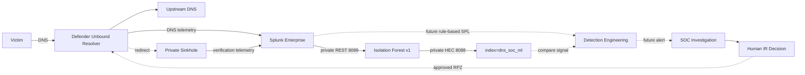
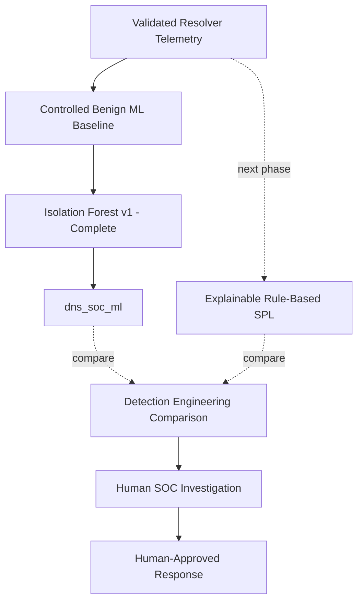

<a id="top"></a>


<div align="center">


<br/>


**A defender-controlled DNS case study where the infrastructure and Isolation Forest ML layer are complete, while explainable Detection Engineering and the official human SOC/IR exercise remain the next stages.**

[🏗️ Infrastructure](https://github.com/DNSentinel-Lab/DNS-Lab-Infrastructure) · [🔎 Scenario 01](https://github.com/DNSentinel-Lab/Scenario-01-DNS-Recon) · [**🧬 Scenario 02**](https://github.com/DNSentinel-Lab/Scenario-02-DGA) · [🔄 Scenario 03](https://github.com/DNSentinel-Lab/Scenario-03-Fast-Flux) · [🛰️ Scenario 04](https://github.com/DNSentinel-Lab/Scenario-04-DNS-Tunneling)

</div>


## 🎯 Mission Brief

| Field | Scenario record |
|---|---|
| **Mission** | Generate harmless DGA-like / high-NXDOMAIN DNS activity and separate unusual behavior from ordinary DNS failure noise |
| **Status** | 🟢 Defender DNS infrastructure + Machine Learning Engineering complete; Detection Engineering / official exercise pending |
| **MITRE ATT&CK** | `T1568.002 — Dynamic Resolution: Domain Generation Algorithms` |
| **Cyber Kill Chain** | Command & Control |
| **Defender path** | Victim → team-controlled Unbound resolver → Splunk |
| **ML result path** | `dns_soc_dns` → private REST → `dns-soc-ml` → Isolation Forest → private HEC → `dns_soc_ml` |
| **Detection approach** | Future explainable SPL will be compared with the implemented ML anomaly signal |
| **Response path** | Human-approved RPZ / private sinkhole with before/after verification |

### What this scenario is designed to prove

The goal is not “NXDOMAIN = malicious.” The scenario is designed to show whether the team can understand normal DNS behavior, identify generated-domain patterns with explainable detection logic, use ML as a second opinion, validate AI assistance later, and prove a human-approved containment result.

The completed ML phase has already shown that the project can learn from its own resolver evidence and return anomaly results to Splunk without turning ML into an automatic verdict.


## 🏗️ Scenario Architecture



> ML and LLM remain deliberately separate. The completed ML component scores unusual DNS behavior; the shared LLM will later explain stable alert evidence to a human analyst. Neither authorizes containment.


## 🔄 SOC Lifecycle & Implementation Reality

| Stage | State |
|---|---|
| **Infrastructure** | ✅ Complete |
| **ML Engineering** | ✅ Complete — Musfira |
| **Official Scenario Baseline / Simulation** | ⚪ Pending |
| **Detection Engineering** | ⚪ Next |
| **Dashboard / Alert** | ⚪ Pending |
| **AI Scenario Integration** | ⚪ Pending |
| **SOC / IR Exercise** | ⚪ Pending |
| **ML Documentation / Evidence** | ✅ Complete |
| **Official Response Verification / Final Scenario Record** | ⚪ Pending |

> [!IMPORTANT]
> The controlled benign and DGA runs used to engineer the ML model are **ML engineering ground truth**, not the official information-separated Scenario 02 exercise. ✅ means supported by implemented evidence; ⚪ means future work and is not presented as complete.

## 🖼️ ML Evidence Highlights

<table>
<tr>
<td width="33%"><br/><sub><b>Feature engineering:</b> 32 one-minute benign behavior windows.</sub></td>
<td width="33%"><br/><sub><b>Controlled DGA:</b> all 6 evaluation windows classified anomalous.</sub></td>
<td width="33%"><br/><sub><b>Closed loop:</b> ML results returned to `dns_soc_ml`.</sub></td>
</tr>
</table>

Full implementation evidence is under [`screenshots/ml/`](screenshots/ml/) and the technical story is in [`ml/ML-ENGINEERING.md`](ml/ML-ENGINEERING.md).


## 🧠 Rule-Based Detection vs Machine Learning



| Component | Project role | State |
|---|---|---|
| **Splunk SPL** | Primary explainable hunting/detection logic | ⚪ Detection Engineering next |
| **Isolation Forest v1** | Additional anomaly signal from 1-minute DNS behavior | ✅ Implemented |
| **LLM / shared AI bridge** | Later explanation/enrichment of stable alert evidence | ⚪ Scenario profile pending |
| **Human SOC / IR** | Final security judgement and response authorization | ⚪ Official exercise pending |

The ML implementation is intentionally a **second opinion**, not the final detection. It learned from controlled benign DNS windows, classified all six controlled DGA evaluation windows as anomalous, and wrote those results back to Splunk. It also flagged some held-out benign windows, which is exactly why the later rule-based and human investigation layers remain necessary.

[🧠 ML Workspace](ml/README.md) · [📖 Musfira's ML Engineering Story](ml/ML-ENGINEERING.md) · [🧾 ML Validation Record](evidence/ml-engineering-validation.md)

## 🎯 Objective

Generate harmless controlled DNS requests that resemble domain-generation behavior and determine whether the SOC can identify the pattern without treating every NXDOMAIN response as malicious.

## 🏗️ Infrastructure Dependency — Complete

The permanent defender-DNS platform is ready in the shared [DNS Lab Infrastructure](https://github.com/DNSentinel-Lab/DNS-Lab-Infrastructure) repository:

```text
dns-soc-victim01    10.50.30.20
        |
        | DNS
        v
dns-soc-resolver01  10.50.30.10
        |  Unbound + query/reply logging + RPZ
        |
        +--> AWS VPC Resolver 10.50.0.2 -> normal DNS
        |
        +--> Splunk -> index=dns_soc_dns
        |
        +--> approved RPZ response -> 10.50.30.30
                                   -> dns-soc-sinkhole01 / Nginx
                                   -> Splunk
```

The three EC2 roles are private and separate. Infrastructure validation has already proven normal DNS, real NXDOMAIN, resolver telemetry, RPZ safe-match logging, one controlled redirect to the private sinkhole, and final reset to disabled enforcement.

That infrastructure test is **not** the Scenario 02 incident-response exercise.

## 📡 Trusted Telemetry Already Available

### Team-controlled resolver

```text
index      = dns_soc_dns
host       = dns-soc-resolver01
source     = /var/log/dns-soc/unbound.log
sourcetype = unbound:dns
```

Validated fields:

```text
event_type
client_ip
qname
qtype
rcode
response_time
cache_flag
response_size
```

`transport` is not directly present in the current Unbound text log and is not invented. RPZ events are searchable in raw resolver telemetry; a normalized `rpz_action` field has not been claimed yet.

### Private sinkhole

```text
index      = dns_soc_web
host       = dns-soc-sinkhole01
source     = /var/log/nginx/access.log
sourcetype = nginx:access
```

### Machine Learning result source

```text
index      = dns_soc_ml
host       = dns-soc-ml
source     = isolation-forest
sourcetype = dns_soc:ml:iforest
model      = dns_iforest_v1
scenario   = scenario_02_dga
```

The ML result events preserve the model prediction together with the DNS behavior features used for the score.

The shared AWS telemetry and shared AI bridge remain available when they add real investigation value.

## 🧠 Machine Learning Engineering — Complete

Scenario 02 now has a working Isolation Forest v1 implementation built by [**Musfira Zafar**](https://github.com/MUSFIRA-ZAFAR).

```text
Controlled benign DNS
      ↓
32 one-minute feature windows
      ↓
24 training + 8 held-out benign
      ↓
Isolation Forest v1
      ↓
controlled DGA run
      ↓
6 DGA feature windows
      ↓
6 / 6 classified ANOMALY
      ↓
HEC write-back
      ↓
index=dns_soc_ml
```

Implemented model parameters:

```text
n_estimators  = 200
contamination = 0.10
random_state  = 42
```

Implemented features:

```text
query_count
unique_qnames
nxdomain_count
nxdomain_ratio
avg_qname_length
max_qname_length
unique_tlds
a_count
aaaa_count
```

The held-out benign check also produced `2 / 8` anomalous windows. That limitation is kept visible: ML means **unusual**, not automatically malicious.

The runtime model file was generated as `/app/dns_iforest_v1.joblib` but is not committed. Reproducible Python, SPL, dependency versions and the artifact policy are preserved under [`ml/`](ml/).

## 🔎 Detection Focus — Next Phase

The next Detection Engineering phase will use the real resolver dataset and the completed ML signal to develop an explainable DGA rule around evidence such as:

- NXDOMAIN count **and ratio** over time;
- unique generated-name count;
- query rate by client/window;
- label/domain length and generated-name behavior;
- repeated client behavior and time pattern;
- query-type behavior where useful;
- ML result as a separate supporting signal, not a replacement for SPL.

No final rule threshold is locked yet. The Detection Engineer must derive it from the actual scenario baseline and controlled Detection Engineering tests.

## 📊 Dashboard — Pending

The future dashboard should use the validated resolver fields and later detection logic to lead the analyst from summary → behavior → ML context → raw evidence.

Likely analyst questions include:

- how many DNS queries occurred;
- how high was the NXDOMAIN ratio;
- how many unique names were generated;
- which client produced the behavior;
- what did the rule-based detection conclude;
- what did Isolation Forest score for the same window;
- what changed after approved containment.

No final Scenario 02 dashboard artifact exists yet. See [`dashboard/README.md`](dashboard/README.md).

## 👥 Team

| Role | Member | Current Scenario 02 contribution |
|---|---|---|
| **Project Lead / Adversary Operator** | [Musfira](https://github.com/MUSFIRA-ZAFAR) | Scenario lead; also completed the Scenario 02 ML Engineering implementation |
| **SOC Analyst / Threat Hunter** | [Sonia](https://github.com/sonia11mansha415) | Official Scenario 02 analyst work pending |
| **Detection Engineer / AI Integrator** | [Lubaba](https://github.com/lubaba1513-pixel) | **Next phase:** baseline, dashboard, SPL detection, validation, alert and Scenario 02 AI mapping |
| **IR / Defender** | [Abdul-Rehman](https://github.com/abdul4rehman215) | Official response / containment decision pending |

## 🧭 Current Execution Order

```text
Defender DNS infrastructure                         ✅ Complete
      ↓
Machine Learning Engineering                       ✅ Complete — Musfira
      ↓
Detection Engineering                              ← NEXT — Lubaba
      ↓
Official normal baseline / hunting / detection
      ↓
Controlled information-separated Scenario 02 run
      ↓
Benign / false-positive validation + alert
      ↓
Scenario 02 profile through shared AI bridge
      ↓
Human SOC investigation
      ↓
Human-approved RPZ containment
      ↓
Sinkhole before/after verification
      ↓
Reset + lessons learned + final scenario record
```

The ML controlled-DGA run is not reused as the official adversary exercise ground truth. It remains engineering evidence for the model.

## 🗂️ Repository Navigation

```text
.
├── README.md
├── SCENARIO-RUNBOOK.md
├── dashboard/                # future Scenario 02 dashboard engineering
├── spl/                      # future Detection Engineering SPL lifecycle
├── ml/                       # completed Isolation Forest implementation
│   ├── README.md
│   ├── ML-ENGINEERING.md
│   ├── model/
│   ├── generators/
│   ├── docker/
│   ├── scripts/
│   ├── spl/
│   └── artifacts/
├── ai/                       # Scenario 02 profile after stable detection fields
├── ir/                       # official human response/verification later
├── evidence/                 # ML validation now; official scenario evidence later
└── screenshots/
    └── ml/                   # curated ML core/setup/troubleshooting evidence
```

The ML-specific SPL under `ml/spl/` supports data inventory, feature engineering and ML-result validation. The root `spl/` directory remains reserved for later Detection Engineering:

```text
baseline.spl
hunting.spl
detection.spl
validation.spl
```

## 🔗 Shared Project References

- [DNS Lab Infrastructure](https://github.com/DNSentinel-Lab/DNS-Lab-Infrastructure)
- [Scenario 02 defender DNS implementation](https://github.com/DNSentinel-Lab/DNS-Lab-Infrastructure/blob/main/02-aws-build/08-scenario-02-defender-dns.md)
- [Scenario 02 resolver/sinkhole Splunk onboarding](https://github.com/DNSentinel-Lab/DNS-Lab-Infrastructure/blob/main/03-splunk-build/07-scenario-02-dns-onboarding.md)
- [Scenario documentation standard](https://github.com/DNSentinel-Lab/DNS-Lab-Infrastructure/blob/main/00-project-design/scenario-documentation-standard.md)

## ✅ Completion Condition

**Machine Learning Engineering is complete. The Scenario 02 case is not.**

The full scenario closes only when the team can reproduce and defend:

**Official Simulation → Telemetry → Rule-Based Detection → Alert → ML Comparison → AI Assistance → Human Investigation → Response → Verification → Lessons Learned.**

The completed ML engineering phase is now one input to that future chain, not a substitute for it.


## 🧠 Security Engineering Skills Demonstrated / In Scope

| Skill area | Scenario evidence / state |
|---|---|
| **DNS Analysis** | Real Unbound resolver telemetry, NXDOMAIN behavior and DGA-style qname patterns |
| **ML Data Engineering** | Known-benign ground truth, one-minute aggregation and nine explainable DNS features |
| **Machine Learning** | Isolation Forest training, holdout evaluation, controlled DGA scoring and result persistence |
| **Splunk Integration** | Restricted REST read path, field-visibility troubleshooting, dedicated HEC result path and `dns_soc_ml` |
| **Docker / Linux Troubleshooting** | Safe Compose validation and dependency/platform diagnosis without destroying working services |
| **Detection Engineering** | ⏳ Next — evidence-based baseline, hunting, detection, validation and alert logic |
| **SOC / IR** | ⏳ Future — human validation, RPZ approval and official before/after containment evidence |
| **AI-Assisted SOC** | ⏳ Future Scenario 02 profile; LLM remains separate from ML and advisory |


## 📚 Documentation Model

This scenario repository is a **case/execution layer** built on the shared [DNS Lab Infrastructure](https://github.com/DNSentinel-Lab/DNS-Lab-Infrastructure). It intentionally separates:

- **Infrastructure** — reusable resolver, victim, sinkhole and Splunk data paths;
- **ML Engineering** — controlled training/evaluation work documented here;
- **Official simulation / ground truth** — future information-separated adversary run;
- **Detection Engineering** — future baseline, dashboard, hunting, tuned detection and validation;
- **SOC investigation** — future defender-visible evidence and human disposition;
- **IR / containment** — future independently justified response and verification;
- **Evidence** — screenshots and structured artifacts that prove only completed claims.

> [!NOTE]
> Planned work stays labelled as planned. This repository does not create fake screenshots, fake Detection Engineering SPL, fake ML metrics, fake AI output or fake incident outcomes to make the full scenario look complete.

<div align="center">

### DNSentinel Lab
**Build the telemetry. Learn the baseline. Prove the detection. Investigate the evidence. Verify the response.**

[🏗️ Infrastructure](https://github.com/DNSentinel-Lab/DNS-Lab-Infrastructure) · [🔎 Scenario 01](https://github.com/DNSentinel-Lab/Scenario-01-DNS-Recon) · [**🧬 Scenario 02**](https://github.com/DNSentinel-Lab/Scenario-02-DGA) · [🔄 Scenario 03](https://github.com/DNSentinel-Lab/Scenario-03-Fast-Flux) · [🛰️ Scenario 04](https://github.com/DNSentinel-Lab/Scenario-04-DNS-Tunneling)

[⬆ Back to top](#top)

</div>


