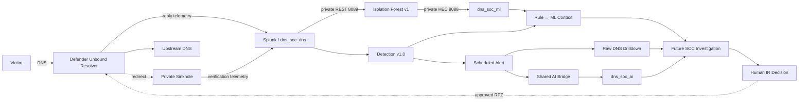
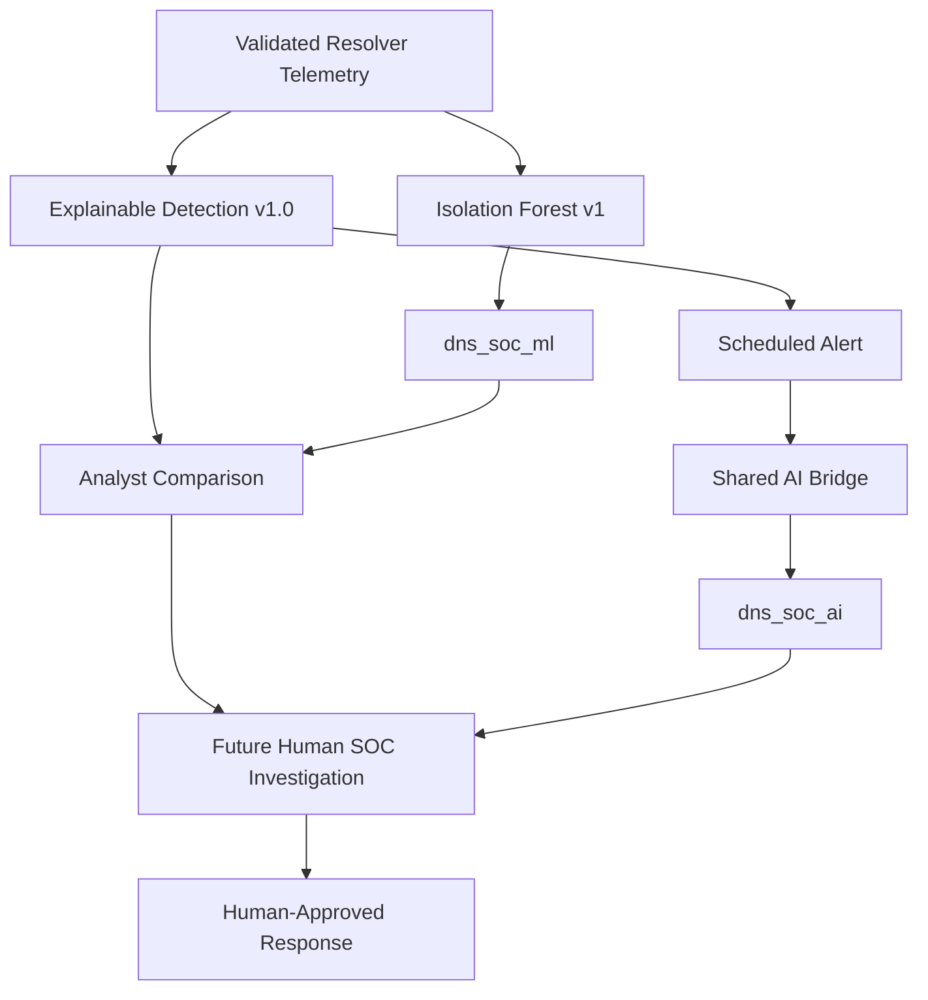

<a id="top"></a>


<div align="center">


<br/>


**A defender-controlled DNS case study with Infrastructure, Isolation Forest ML, explainable Detection v1.0, Dashboard Studio, scheduled alerting and Scenario 02 AI evidence integration complete — now ready for the official information-separated SOC/IR exercise.**

[🏗️ Infrastructure](https://github.com/DNSentinel-Lab/DNS-Lab-Infrastructure) · [🔎 Scenario 01](https://github.com/DNSentinel-Lab/Scenario-01-DNS-Recon) · [**🧬 Scenario 02**](https://github.com/DNSentinel-Lab/Scenario-02-DGA) · [🔄 Scenario 03](https://github.com/DNSentinel-Lab/Scenario-03-Fast-Flux) · [🛰️ Scenario 04](https://github.com/DNSentinel-Lab/Scenario-04-DNS-Tunneling)

</div>


## 🎯 Mission Brief

| Field | Scenario record |
|---|---|
| **Mission** | Generate harmless DGA-like / high-NXDOMAIN DNS activity and separate unusual behavior from ordinary DNS failure noise |
| **Engineering status** | 🟢 Infrastructure + ML Engineering + Detection Engineering + Dashboard/Alert + Scenario AI integration complete |
| **Official exercise** | ⏳ Adversary → SOC → IR → containment/verification pending |
| **MITRE ATT&CK** | `T1568.002 — Dynamic Resolution: Domain Generation Algorithms` |
| **Cyber Kill Chain** | Command & Control |
| **Defender path** | Victim → team-controlled Unbound resolver → Splunk |
| **ML result path** | `dns_soc_dns` → private REST → `dns-soc-ml` → Isolation Forest → private HEC → `dns_soc_ml` |
| **Detection v1.0** | `query_count>=20 AND unique_qnames>=15 AND nxdomain_ratio>=0.75` in 1-minute/client reply-side windows |
| **AI path** | Scheduled alert → shared internal bridge → OpenAI → HEC → `dns_soc_ai` → human validation |
| **Response path** | Future human-approved RPZ / private sinkhole with before/after verification |

### What this scenario is designed to prove

The goal is not “NXDOMAIN = malicious.” The engineering completed so far proves that the team can establish a real resolver baseline, compare explainable rule logic with ML, operationalize the rule as a scheduled alert, preserve raw DNS evidence, and pass a stable Scenario 02 evidence contract through the shared AI bridge.

The next phase tests whether the **frozen** engineering survives a fresh information-separated adversary run and supports independent human SOC and IR decisions.

## 🏗️ Scenario Architecture



> ML, Detection v1.0 and the LLM remain separate layers. ML scores unusual behavior, the rule creates an explainable detection lead, and the shared AI bridge summarizes stable evidence. None of them authorizes containment.

## 🔄 SOC Lifecycle & Implementation Reality

| Stage | State |
|---|---|
| **Infrastructure** | ✅ Complete |
| **ML Engineering** | ✅ Complete — Musfira |
| **Detection Engineering** | ✅ Complete — Lubaba |
| **Dashboard Studio** | ✅ Complete — Lubaba |
| **Scheduled Alert** | ✅ Complete — Lubaba |
| **Scenario 02 AI Integration** | ✅ Complete — `dga_nxdomain_v1` |
| **Detection / ML / AI Documentation & Evidence** | ✅ Complete |
| **Official Adversary Execution** | ⏳ Next — Musfira |
| **Independent SOC Investigation** | ⏳ Pending — Sonia |
| **Independent IR / Containment** | ⏳ Pending — Abdul-Rehman |
| **Official Response Verification / Final Scenario Record** | ⏳ Pending |

> [!IMPORTANT]
> Controlled benign and DGA traffic used for ML and Detection Engineering are **engineering validation evidence**, not the official information-separated Scenario 02 attack. The full scenario remains open until the adversary/SOC/IR/verification chain is complete.

## 🖼️ ML Evidence Highlights

<table>
<tr>
<td width="33%"><br/><sub><b>Feature engineering:</b> 32 one-minute benign behavior windows.</sub></td>
<td width="33%"><br/><sub><b>Controlled DGA:</b> all 6 evaluation windows classified anomalous.</sub></td>
<td width="33%"><br/><sub><b>Closed loop:</b> ML results returned to `dns_soc_ml`.</sub></td>
</tr>
</table>

Full implementation evidence is under [`screenshots/ml/`](screenshots/ml/) and the technical story is in [`ml/ML-ENGINEERING.md`](ml/ML-ENGINEERING.md).

## 🖼️ Detection Engineering Evidence Highlights

<table>
<tr>
<td width="33%"><br/><sub><b>Investigation surface:</b> final Dashboard Studio view for DGA/high-NXDOMAIN behavior.</sub></td>
<td width="33%"><br/><sub><b>Independent signals:</b> frozen rule and Isolation Forest agree on six historical controlled DGA windows.</sub></td>
<td width="33%"><br/><sub><b>Evidence check:</b> AI core DNS metrics match a separate raw resolver aggregation exactly.</sub></td>
</tr>
</table>

[🚦 Detection Engineering Workspace](detection-engineering/README.md) · [📖 Lubaba's Engineering Story](detection-engineering/DETECTION-ENGINEERING.md) · [✅ Validation Record](detection-engineering/detection-engineering-validation.md)


## 🧠 Rule-Based Detection vs Machine Learning



| Component | Project role | State |
|---|---|---|
| **Splunk Detection v1.0** | Primary explainable rule-based security lead | ✅ Implemented / validated |
| **Isolation Forest v1** | Independent anomaly signal from 1-minute DNS behavior | ✅ Implemented |
| **Rule ↔ ML comparison** | Supporting agreement/disagreement context | ✅ Validated on historical controlled DGA |
| **LLM / shared AI bridge** | Structured explanation/enrichment of stable alert evidence | ✅ Scenario 02 mapping validated |
| **Human SOC / IR** | Final security judgement and response authorization | ⏳ Official exercise pending |

The rule does not depend on ML to fire. Historical controlled DGA produced **6/6 Rule DETECT + ML ANOMALY** agreement, while the ML phase also preserved benign anomalies (`2/8` held-out benign windows), so disagreement remains a valid investigation signal.

[🧠 ML Workspace](ml/README.md) · [🚦 Detection Engineering](detection-engineering/README.md) · [🤖 Scenario AI Mapping](ai/scenario-02-ai-mapping.md)

## 🎯 Objective

Generate harmless controlled DNS requests that resemble domain-generation behavior and determine whether the SOC can identify the pattern without treating every NXDOMAIN response as malicious.

## 🏗️ Infrastructure Dependency — Complete

The permanent defender-DNS platform is ready in the shared [DNS Lab Infrastructure](https://github.com/DNSentinel-Lab/DNS-Lab-Infrastructure) repository:

```text
dns-soc-victim01    10.50.30.20
        |
        | DNS
        v
dns-soc-resolver01  10.50.30.10
        |  Unbound + query/reply logging + RPZ
        |
        +--> AWS VPC Resolver 10.50.0.2 -> normal DNS
        |
        +--> Splunk -> index=dns_soc_dns
        |
        +--> approved RPZ response -> 10.50.30.30
                                   -> dns-soc-sinkhole01 / Nginx
                                   -> Splunk
```

The three EC2 roles are private and separate. Infrastructure validation has already proven normal DNS, real NXDOMAIN, resolver telemetry, RPZ safe-match logging, one controlled redirect to the private sinkhole, and final reset to disabled enforcement.

That infrastructure test is **not** the Scenario 02 incident-response exercise.

## 📡 Trusted Telemetry Already Available

### Team-controlled resolver

```text
index      = dns_soc_dns
host       = dns-soc-resolver01
source     = /var/log/dns-soc/unbound.log
sourcetype = unbound:dns
```

Validated fields:

```text
event_type
client_ip
qname
qtype
rcode
response_time
cache_flag
response_size
```

`transport` is not directly present in the current Unbound text log and is not invented. RPZ events are searchable in raw resolver telemetry; a normalized `rpz_action` field has not been claimed yet.

### Private sinkhole

```text
index      = dns_soc_web
host       = dns-soc-sinkhole01
source     = /var/log/nginx/access.log
sourcetype = nginx:access
```

### Machine Learning result source

```text
index      = dns_soc_ml
host       = dns-soc-ml
source     = isolation-forest
sourcetype = dns_soc:ml:iforest
model      = dns_iforest_v1
scenario   = scenario_02_dga
```

The ML result events preserve the model prediction together with the DNS behavior features used for the score.

The shared AWS telemetry and shared AI bridge remain available when they add real investigation value.

## 🧠 Machine Learning Engineering — Complete

Scenario 02 now has a working Isolation Forest v1 implementation built by [**Musfira Zafar**](https://github.com/MUSFIRA-ZAFAR).

```text
Controlled benign DNS
      ↓
32 one-minute feature windows
      ↓
24 training + 8 held-out benign
      ↓
Isolation Forest v1
      ↓
controlled DGA run
      ↓
6 DGA feature windows
      ↓
6 / 6 classified ANOMALY
      ↓
HEC write-back
      ↓
index=dns_soc_ml
```

Implemented model parameters:

```text
n_estimators  = 200
contamination = 0.10
random_state  = 42
```

Implemented features:

```text
query_count
unique_qnames
nxdomain_count
nxdomain_ratio
avg_qname_length
max_qname_length
unique_tlds
a_count
aaaa_count
```

The held-out benign check also produced `2 / 8` anomalous windows. That limitation is kept visible: ML means **unusual**, not automatically malicious.

The runtime model file was generated as `/app/dns_iforest_v1.joblib` but is not committed. Reproducible Python, SPL, dependency versions and the artifact policy are preserved under [`ml/`](ml/).

## 🚦 Detection Engineering — Complete

**Detection Engineer / AI Integrator:** [Lubaba](https://github.com/lubaba1513-pixel)

Lubaba completed the end-to-end rule-based Detection Engineering path using real Unbound resolver evidence:

```text
reply-side semantics
→ ingestion timing
→ 32-window clean baseline
→ Dashboard Studio
→ threshold-free hunting
→ fresh controlled DGA validation
→ benign / false-positive challenges
→ Detection v1.0
→ validation SPL
→ Rule ↔ ML comparison
→ scheduled alert
→ raw-event drilldown
→ Scenario 02 AI evidence contract
→ AI-vs-raw final validation
```

### Final rule

```text
1 minute / client_ip / event_type="reply"

query_count >= 20
AND unique_qnames >= 15
AND nxdomain_ratio >= 0.75
```

The clean baseline reached maximums of `14` queries, `10` unique qnames and `0.50` NXDOMAIN ratio. Fresh controlled DGA crossed the candidate in **6/6** one-minute windows. A legitimate-name burst reached **23 queries / 23 unique names / 0.0 NXDOMAIN ratio** and stayed below the full rule.

[📖 Lubaba's Detection Engineering Story](detection-engineering/DETECTION-ENGINEERING.md) · [✅ Validation Record](detection-engineering/detection-engineering-validation.md) · [🔎 SPL Workspace](spl/README.md)

## 📊 Dashboard Studio — Complete

**Scenario 02 — DGA + High NXDOMAIN Investigation** is implemented and validated in Splunk Dashboard Studio.

```text
5 global inputs
13 visualizations
16 data sources/searches
```

The dashboard brings together resolver volume, NXDOMAIN behavior, unique names, qname-length context, raw DNS evidence and ML supporting context without treating ML as a verdict.


The actual deployed JSON is preserved at [`dashboard/scenario-02-dga-investigation-dashboard.json`](dashboard/scenario-02-dga-investigation-dashboard.json).

[📊 Dashboard Workspace](dashboard/README.md)

## 👥 Team

| Role | Member | Current Scenario 02 contribution |
|---|---|---|
| **Project Lead / Adversary Operator** | [Musfira](https://github.com/MUSFIRA-ZAFAR) | Scenario lead; completed the Scenario 02 ML Engineering implementation; official adversary execution is next |
| **SOC Analyst / Threat Hunter** | [Sonia](https://github.com/sonia11mansha415) | Official independent Scenario 02 SOC investigation pending |
| **Detection Engineer / AI Integrator** | [Lubaba](https://github.com/lubaba1513-pixel) | **Completed:** resolver analytics, clean baseline, Dashboard Studio, hunting, Detection v1.0, benign validation, scheduled alert, Rule↔ML comparison and Scenario 02 AI evidence integration |
| **IR / Defender** | [Abdul-Rehman](https://github.com/abdul4rehman215) | Official independent IR / containment decision pending |

## 🧭 Current Execution Order

```text
Defender DNS infrastructure                         ✅ Complete
      ↓
Machine Learning Engineering                       ✅ Complete — Musfira
      ↓
Detection Engineering + Dashboard + Alert          ✅ Complete — Lubaba
      ↓
Scenario 02 AI evidence integration                ✅ Complete — Lubaba
      ↓
────────────────────────────────────────────────────────────
OFFICIAL INFORMATION-SEPARATED SCENARIO EXECUTION  ← NEXT
────────────────────────────────────────────────────────────
      ↓
Fresh adversary ground truth                       Musfira
      ↓
Frozen Detection v1.0 + ML + AI assistance
      ↓
Independent SOC investigation                      Sonia
      ↓
Independent IR decision                            Abdul-Rehman
      ↓
Human-approved RPZ / sinkhole if warranted
      ↓
Before/after verification + safe reset
      ↓
Ground-truth reveal + final scenario record
```

Engineering validation traffic is not reused as the official attacker ground truth.

## 🗂️ Repository Navigation

```text
.
├── README.md
├── SCENARIO-RUNBOOK.md
├── detection-engineering/      # Lubaba's completed flagship engineering story
├── dashboard/                  # validated Dashboard Studio JSON + analyst guide
├── spl/                        # baseline, hunts, Detection v1.0, validation, alert
│   └── engineering-validation/ # exact supporting test/correlation SPL
├── ml/                         # Musfira's completed Isolation Forest implementation
├── ai/                         # validated dga_nxdomain_v1 evidence mapping
├── ir/                         # official human response/verification still pending
├── evidence/                   # ML + Detection Engineering acceptance records
└── screenshots/
    ├── ml/                     # curated ML evidence
    └── detection-engineering/  # curated DE evidence + selected troubleshooting
```

The repository keeps ML and rule-based Detection Engineering as separate workspaces so their responsibilities and evidence remain easy to audit.

## 🔗 Shared Project References

- [DNS Lab Infrastructure](https://github.com/DNSentinel-Lab/DNS-Lab-Infrastructure)
- [Scenario 02 defender DNS implementation](https://github.com/DNSentinel-Lab/DNS-Lab-Infrastructure/blob/main/02-aws-build/08-scenario-02-defender-dns.md)
- [Scenario 02 resolver/sinkhole Splunk onboarding](https://github.com/DNSentinel-Lab/DNS-Lab-Infrastructure/blob/main/03-splunk-build/07-scenario-02-dns-onboarding.md)
- [Scenario documentation standard](https://github.com/DNSentinel-Lab/DNS-Lab-Infrastructure/blob/main/00-project-design/scenario-documentation-standard.md)

## ✅ Completion Condition

**Engineering readiness is complete. The full Scenario 02 case is not.**

Completed engineering chain:

```text
Infrastructure
→ ML Engineering
→ Detection Engineering
→ Dashboard
→ Scheduled Alert
→ Rule ↔ ML Context
→ Scenario AI Evidence Path
```

The full scenario closes only after the team can defend:

**Official Simulation → Telemetry → Frozen Detection → Alert → ML Comparison → AI Assistance → Independent Human Investigation → Human-Approved Response → Verification → Ground-Truth Comparison → Lessons Learned.**

## 🧠 Security Engineering Skills Demonstrated / In Scope

| Skill area | Scenario evidence / state |
|---|---|
| **DNS Analysis** | Real Unbound resolver telemetry, reply-side transaction semantics, NXDOMAIN behavior and DGA-style qname patterns |
| **ML Data Engineering** | Known-benign ground truth, one-minute aggregation and nine explainable ML features — Musfira |
| **Machine Learning** | Isolation Forest training, holdout evaluation, controlled DGA scoring and HEC result persistence — Musfira |
| **Detection Engineering** | Clean rule baseline, hunting, evidence-based thresholds, v1.0 production SPL and reusable validation — Lubaba |
| **Dashboard Engineering** | 5-input / 13-visualization Dashboard Studio investigation surface — Lubaba |
| **False-Positive Engineering** | Ordinary DNS, limited NXDOMAIN, cache-aware burst analysis and high-volume/high-unique legitimate-name validation — Lubaba |
| **Detection + ML Correlation** | Historical Rule DETECT ↔ ML ANOMALY comparison with corrected `window_time` semantics — Lubaba |
| **Operational Alerting** | Measured-latency scheduler design, real trigger history and analyst-ready evidence row — Lubaba |
| **AI-Assisted SOC Integration** | `dga_nxdomain_v1`, generic shared bridge reuse, schema troubleshooting, `dns_soc_ai` return and AI-vs-raw verification — Lubaba |
| **SOC / IR** | ⏳ Official independent investigation, RPZ approval and before/after containment evidence still pending |

## 📚 Documentation Model

This scenario repository is the **case/execution layer** built on the shared [DNS Lab Infrastructure](https://github.com/DNSentinel-Lab/DNS-Lab-Infrastructure). It now separates:

- **Infrastructure** — reusable resolver, victim, sinkhole, Splunk and shared AI paths;
- **ML Engineering** — Musfira's completed Isolation Forest implementation and controlled evaluation;
- **Detection Engineering** — Lubaba's completed baseline, dashboard, hunting, rule, validation, alert and AI evidence integration;
- **Official simulation / ground truth** — next information-separated adversary run;
- **SOC investigation** — future defender-visible evidence and Sonia's independent disposition;
- **IR / containment** — future independently justified response and verification;
- **Evidence** — curated screenshots and structured artifacts that prove only completed claims.

> [!NOTE]
> Planned is planned; implemented is implemented. The repository does not convert engineering validation traffic into official attack evidence, ML/AI output into a verdict, or future response work into a completed claim.

