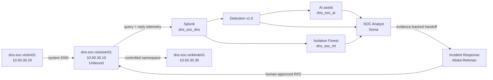

<a id="top"></a>


<div align="center">


<br/>


**A completed, evidence-driven DNS case file that follows controlled DGA/high-NXDOMAIN behavior from telemetry and Detection v1.0 through SOC investigation, human-approved IR containment, verification, and safe reset.**

[🏗️ Infrastructure](https://github.com/DNSentinel-Lab/DNS-Lab-Infrastructure) · [🔎 Scenario 01](https://github.com/DNSentinel-Lab/Scenario-01-DNS-Recon) · [**🧬 Scenario 02**](https://github.com/DNSentinel-Lab/Scenario-02-DGA) · [🔄 Scenario 03](https://github.com/DNSentinel-Lab/Scenario-03-Fast-Flux) · [🛰️ Scenario 04](https://github.com/DNSentinel-Lab/Scenario-04-DNS-Tunneling)

</div>


# 🧬 DNSentinel Scenario 02 — DGA + High NXDOMAIN

Scenario 02 is a completed, evidence-backed DNS defense exercise built around **fresh DGA-style name generation, sustained NXDOMAIN behavior, live Splunk detection, Isolation Forest anomaly scoring, AI-assisted triage, independent SOC investigation, and human-approved DNS sinkhole containment**.

The exercise used real DNS requests through the lab's normal resolver path. Operator ground truth was kept separate from the SOC Analyst and Incident Responder until their decisions were recorded. The exercise focused on DGA/high-NXDOMAIN DNS behavior and did not claim malware or endpoint compromise.

> **Core question:** can the defender detect and investigate generated-looking DNS behavior, preserve attribution limits, choose a proportionate response, and prove that the response changed the network outcome?

---

## 🏁 Scenario 02 Closeout Snapshot

| 🔎 Detection | 🧠 ML | 🤖 AI | 🕵️ SOC | 🛡️ IR | 🎯 Response |
|---|---|---|---|---|---|
| Detection v1.0 fired across five consecutive one-minute windows | Five corresponding windows available as `ANOMALY` second-opinion evidence | Structured summary reviewed against raw DNS | `INCONCLUSIVE — escalation warranted` | Independent validation completed | Narrow RPZ redirect to `10.50.30.30` verified, then safely reset |

<div align="center">

**418 replies · 409 unique qnames · 408 NXDOMAIN · 97.61% NXDOMAIN**

`NXDOMAIN → RPZ → 10.50.30.30 → Safe Reset → NXDOMAIN`

</div>

---

## 🚦 Final Status

| Stage | Status | Owner |
|---|---|---|
| Defender DNS infrastructure | ✅ Complete | Project team |
| ML Engineering | ✅ Complete | Musfira |
| Detection Engineering + Dashboard + AI integration | ✅ Complete | Lubaba |
| Official DGA execution | ✅ Complete | Musfira |
| SOC investigation | ✅ Complete | Sonia |
| SOC → IR handoff | ✅ Complete | Sonia |
| Independent IR validation | ✅ Complete | Abdul-Rehman |
| Human containment approval | ✅ Complete | Abdul-Rehman |
| RPZ sinkhole containment | ✅ Validated | Abdul-Rehman |
| Normal-DNS safety check | ✅ Passed | Abdul-Rehman |
| Safe RPZ reset | ✅ Complete | Abdul-Rehman |
| Ground-truth comparison | ✅ Complete | Team closeout |

---

## 🏗️ Scenario Architecture



The response path was deliberately narrow: **the observed Scenario 02 namespace was redirected; the victim IP was not globally blocked.**

---

## 🎬 What Actually Happened

### 🧊 1. The Environment Was Frozen Before the Run

Musfira completed a compact pre-flight check covering victim health, UTC readiness, the configured resolver path, the deployed DGA generator, RPZ safe state, and private ground-truth readiness. Detection v1.0, ML, and the response policy were not tuned for the live run.

### 🧬 2. One Fresh Official DGA Run Was Executed

The pre-deployed generator ran unchanged on `dns-soc-victim01`:

```text
Generator: /opt/dns-soc-ml-generators/dga_dns.py
SHA256:   1dc0ce32d964cd2e70981e502e341d6b4ee66934cc79ea188e69bd4e3f8f51c4
Start:    2026-08-26T06:37:10.787620+00:00
End:      2026-08-26T06:42:11.129575+00:00
Exit:     0
```


The controlled namespace was:

```text
<generated-label>.dga-test.soclab.abdul4rehman215.tech
```

The operator did not inspect Splunk, Detection v1.0, ML, AI, or the dashboard to steer the outcome.

### 🚨 3. The Frozen Detection Surfaced Five Consecutive Windows

Detection v1.0 remained unchanged:

```text
query_count >= 20
unique_qnames >= 15
nxdomain_ratio >= 0.75
```

During the official window, it matched five consecutive one-minute client windows from `06:37` through `06:41 UTC`.


### 🔎 4. Sonia Rebuilt the Case from Raw DNS

Sonia did not treat the alert as a verdict. She moved back into raw Unbound replies, measured the qname pattern, compared the same client with its historical baseline, checked recurrence, scoped the affected client, reviewed ML only as a second opinion, and challenged the AI summary against Splunk evidence.

The exact investigated five-minute window contained:

| Metric | Result |
|---|---:|
| DNS replies | **418** |
| Unique qnames | **409** |
| NXDOMAIN replies | **408** |
| NXDOMAIN ratio | **97.61%** |
| Resolver-visible client | **10.50.30.20** |
| Detection windows | **5 consecutive minutes** |
| ML result | **5 / 5 ANOMALY** |


Her final disposition was deliberately cautious:

> **INCONCLUSIVE — escalation warranted**

The DNS behavior was real and highly abnormal, but DNS did not prove a process, malware identity, endpoint compromise, user identity, malicious intent, or authorization status.

### 🛡️ 5. Incident Response Independently Reproduced the Evidence

Abdul-Rehman did not simply accept the SOC handoff. IR independently reproduced the core counts, the five one-minute windows, the generated-looking qname structure, the one-client resolver-visible scope, historical recurrence, and the absence of useful process-attribution telemetry.

This produced an IR classification of:

> **Confirmed recurrent abnormal DGA-like / high-NXDOMAIN DNS behavior.**

The attribution limits remained intact.

### 🎯 6. Human-Approved RPZ Containment Changed the DNS Outcome

IR selected one defensible qname already observed in resolver telemetry:

```text
ywvuacnec7gmul193uc.dga-test.soclab.abdul4rehman215.tech
```

Before containment, the resolver returned `NXDOMAIN`.

<p align="center"></p>

After explicit human approval, the Scenario 02 wildcard was enforced through Unbound RPZ. The **same qname** then returned:

```text
NOERROR
A 10.50.30.30
```

<p align="center"></p>

The sinkhole returned HTTP `200`, unrelated AWS DNS continued resolving normally, and Splunk preserved the before/after `NXDOMAIN → NOERROR` change.

### ♻️ 7. The Resolver Was Returned to Its Safe State

Containment was not considered complete until RPZ was restored to the documented safe/non-enforcing state. The selected qname returned to `NXDOMAIN`, Unbound remained healthy, and normal DNS continued to resolve.

**Final IR status:** **CLOSED — controlled containment validated and safe reset completed.**

---

## 🧠 Detection, ML, AI & Human Judgement

Scenario 02 deliberately uses different evidence layers for different jobs:

| Layer | Job | What it does **not** do |
|---|---|---|
| Detection v1.0 | Explainable production trigger | Does not prove malware |
| Isolation Forest | Anomaly second opinion | Does not decide incident disposition |
| AI | Summarizes structured evidence | Does not authorize containment |
| SOC Analyst | Investigates and interprets evidence | Does not invent missing attribution |
| Incident Response | Validates risk and executes approved response | Does not treat an alert as approval |

The live ML scorer also demonstrated an important limitation: benign bursts can be anomalous. That is why ML remains supporting evidence rather than the primary verdict.

---

## 🧭 MITRE ATT&CK & Network Context

| Framework | Mapping |
|---|---|
| MITRE ATT&CK | `T1568.002 — Dynamic Resolution: Domain Generation Algorithms` |
| Cyber Kill Chain context | Command & Control behavior context |
| Network focus | DNS query/reply behavior, client timing, qname uniqueness, NXDOMAIN rate, resolver policy |

The mapping describes the **DGA behavior under study**. The repository does not extend that mapping into unsupported endpoint or malware attribution.

---

## 👥 Team Contributions

| Role | Contributor | Scenario 02 contribution |
|---|---|---|
| Project Lead / Adversary + ML Engineer | **Musfira** | Prepared the run boundary, executed fresh DGA behavior without defender feedback, preserved ground truth, and engineered the Isolation Forest support path |
| Detection Engineer / AI Integrator | **Lubaba** | Baselined resolver behavior, built Detection v1.0, Dashboard Studio investigation views, validation searches, scheduled alerting, and the Scenario 02 AI evidence contract |
| SOC Analyst | **Sonia** | Reconstructed the alert from raw DNS, measured and baselined the behavior, scoped recurrence, validated ML/AI, documented 5W1H, and produced the IR handoff |
| Incident Responder / Defender | **Abdul-Rehman** | Independently reproduced the evidence, preserved attribution limits, executed approved RPZ containment, verified the sinkhole and normal DNS, and restored the resolver safely |

---

## 🗂️ Repository Guide

| Area | Start here |
|---|---|
| Full scenario in one document | [`SCENARIO-02-EXECUTION.md`](SCENARIO-02-EXECUTION.md) |
| Full operational runbook | [`SCENARIO-RUNBOOK.md`](SCENARIO-RUNBOOK.md) |
| ML Engineering | [`ml/ML-ENGINEERING.md`](ml/ML-ENGINEERING.md) |
| Live ML operations | [`ml/operations/README.md`](ml/operations/README.md) |
| Detection Engineering | [`detection-engineering/DETECTION-ENGINEERING.md`](detection-engineering/DETECTION-ENGINEERING.md) |
| Adversary / operator story | [`attacker/PROJECT-LEAD-ADVERSARY.md`](attacker/PROJECT-LEAD-ADVERSARY.md) |
| SOC investigation | [`soc/SOC-ANALYST-INVESTIGATION.md`](soc/SOC-ANALYST-INVESTIGATION.md) |
| SOC → IR handoff | [`soc/SOC-TO-IR-HANDOFF.md`](soc/SOC-TO-IR-HANDOFF.md) |
| Incident Response | [`ir/INCIDENT-RESPONSE.md`](ir/INCIDENT-RESPONSE.md) |
| IR final report | [`ir/IR-FINAL-REPORT.md`](ir/IR-FINAL-REPORT.md) |
| Final ground-truth comparison | [`exercise/final-comparison.md`](exercise/final-comparison.md) |
| Master evidence map | [`evidence/README.md`](evidence/README.md) |

---

## ✅ Completion Gate

Scenario 02 is complete because the repository now preserves the full chain:

```text
Fresh operator activity
→ real resolver telemetry
→ frozen detection
→ ML / AI assistance
→ independent SOC investigation
→ evidence-backed IR handoff
→ independent IR validation
→ explicit human approval
→ RPZ containment
→ sinkhole / normal-DNS / Splunk verification
→ safe reset
→ final ground-truth comparison
```

The strongest outcome is not simply that an alert fired. It is that **each role reached its conclusion from the evidence available to that role, and the final response was technically verified before the environment was restored.**


<div align="center">

**Build the telemetry. Detect the behavior. Investigate the evidence. Verify the response.**

[🏗️ Infrastructure](https://github.com/DNSentinel-Lab/DNS-Lab-Infrastructure) · [🔎 SOC Workspace](soc/README.md) · [🛡️ IR Workspace](ir/README.md) · [🧾 Evidence Center](evidence/README.md) · [🎭 Final Comparison](exercise/final-comparison.md) · [⬆ Back to top](#top)

<sub>DNSentinel Lab · Scenario 02 · Evidence-first DNS security engineering</sub>

</div>


