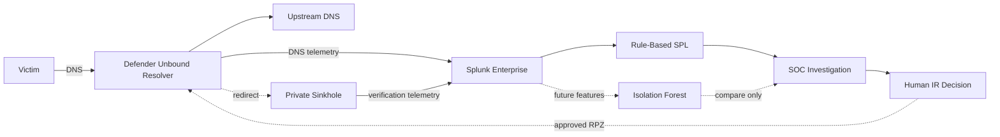
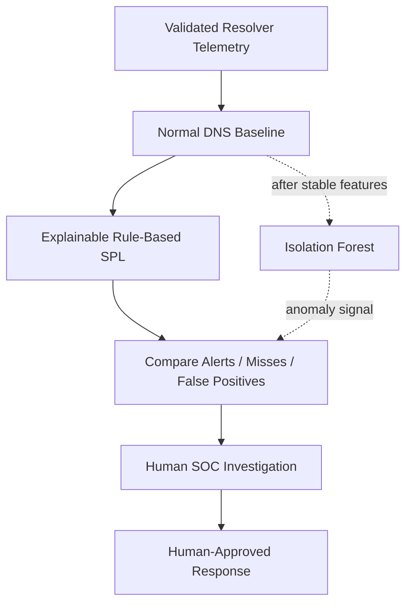

<a id="top"></a>


<div align="center">


<br/>


**A defender-controlled DNS scenario designed to compare explainable Splunk detection with optional anomaly detection while keeping AI assistance and human security judgement clearly separated.**

[🏗️ Infrastructure](https://github.com/DNSentinel-Lab/DNS-Lab-Infrastructure) · [🔎 Scenario 01](https://github.com/DNSentinel-Lab/Scenario-01-DNS-Recon) · [**🧬 Scenario 02**](https://github.com/DNSentinel-Lab/Scenario-02-DGA) · [🔄 Scenario 03](https://github.com/DNSentinel-Lab/Scenario-03-Fast-Flux) · [🛰️ Scenario 04](https://github.com/DNSentinel-Lab/Scenario-04-DNS-Tunneling)

</div>


## 🎯 Mission Brief

| Field | Scenario record |
|---|---|
| **Mission** | Generate harmless DGA-like / high-NXDOMAIN DNS activity and separate abnormal behavior from ordinary DNS failure noise |
| **Status** | 🟡 Defender DNS infrastructure ready; scenario execution, Detection Engineering and ML not started |
| **MITRE ATT&CK** | `T1568.002 — Dynamic Resolution: Domain Generation Algorithms` |
| **Cyber Kill Chain** | Command & Control |
| **Defender path** | Victim → team-controlled Unbound resolver → Splunk |
| **Detection approach** | Rule-based SPL first; Isolation Forest comparison only after stable baseline/detection |
| **Response path** | Human-approved RPZ / private sinkhole with before/after verification |

### What this scenario is designed to prove

The goal is not “NXDOMAIN = malicious.” The scenario is designed to show whether the team can baseline real DNS behavior, identify generated-domain patterns with explainable SPL, compare those results with anomaly detection, validate AI assistance, and prove a human-approved containment result.


## 🏗️ Scenario Architecture



> ML and LLM are deliberately separate: ML is planned to help identify anomalies; the LLM remains analyst assistance after a stable alert exists.


## 🔄 SOC Lifecycle & Implementation Reality

| Stage | State |
|---|---|
| **Infrastructure** | ✅ |
| **Baseline** | ⚪ |
| **Simulate** | ⚪ |
| **Detect** | ⚪ |
| **ML Compare** | ⚪ |
| **SOC/IR** | ⚪ |
| **Verify** | ⚪ |
| **Document** | 🟡 |

> [!IMPORTANT]
> ✅ means supported by implemented project evidence. 🟡 means design/infrastructure/documentation exists but the scenario stage is not complete. ⚪ means planned and is **not presented as implemented**.


## 🧠 Rule-Based Detection vs Machine Learning



| Component | Intended role |
|---|---|
| **Splunk SPL** | Primary explainable detection and hunting logic |
| **Isolation Forest** | Optional anomaly signal for comparison after the baseline is stable |
| **LLM / shared AI bridge** | Explains/enriches a stable alert for the analyst |
| **Human SOC / IR** | Final security judgement and response authorization |

No ML result is claimed yet. The existing [`ml/README.md`](ml/README.md) remains the approved design record until implementation evidence exists.


## 🎯 Objective

Generate harmless controlled DNS requests that resemble domain-generation behavior and determine whether the SOC can identify the pattern without treating every NXDOMAIN response as malicious.

## 🏗️ Infrastructure Dependency — Complete

The permanent defender-DNS platform is ready in the shared [DNS Lab Infrastructure](https://github.com/DNSentinel-Lab/DNS-Lab-Infrastructure) repository:

```text
dns-soc-victim01    10.50.30.20
        |
        | DNS
        v
dns-soc-resolver01  10.50.30.10
        |  Unbound + query/reply logging + RPZ
        |
        +--> AWS VPC Resolver 10.50.0.2 -> normal DNS
        |
        +--> Splunk -> index=dns_soc_dns
        |
        +--> approved RPZ response -> 10.50.30.30
                                   -> dns-soc-sinkhole01 / Nginx
                                   -> Splunk
```

The three EC2 roles are private and separate. Scenario 02 infrastructure validation has already proven normal DNS, real NXDOMAIN, resolver telemetry, RPZ safe-match logging, one controlled redirect to the private sinkhole, and final reset to disabled enforcement.

That infrastructure test is **not** the Scenario 02 incident-response exercise. This repository still has to produce the DGA behavior, detection, alert, AI-assisted analysis, human decision and response evidence.

## 📡 Trusted Telemetry Already Available

### 👥 Team-controlled resolver

```text
index      = dns_soc_dns
host       = dns-soc-resolver01
source     = /var/log/dns-soc/unbound.log
sourcetype = unbound:dns
```

Validated fields:

```text
event_type
client_ip
qname
qtype
rcode
response_time
cache_flag
response_size
```

`transport` is not directly present in the current Unbound text log and is not invented. RPZ events are searchable in raw resolver telemetry; a normalized `rpz_action` field has not been claimed yet.

### Private sinkhole

```text
index      = dns_soc_web
host       = dns-soc-sinkhole01
source     = /var/log/nginx/access.log
sourcetype = nginx:access
```

The shared AWS telemetry and shared AI bridge also remain available when they add real investigation value.

## 🔎 Detection Focus — Future Work

- NXDOMAIN count **and ratio** over time;
- unique generated-name count;
- query rate by client/window;
- label length and randomness/entropy features derived from real `qname` values;
- repeated client behavior and time pattern;
- query-type diversity where useful;
- normal baseline versus controlled generated-domain activity;
- sinkhole before/after evidence after human-approved response.

No final threshold is locked yet. Thresholds must come from the real baseline and controlled DGA/high-NXDOMAIN simulation.

## 🧠 ML Plan — Approved, Not Implemented

Scenario 02 is the project scenario selected for an optional anomaly-detection comparison after rule-based detection works.

Planned design:

```text
Normal DNS baseline
      +
Rule-based Splunk DGA detection
      +
Isolation Forest anomaly score
      |
      v
Compare detections, misses and false positives
```

The first model is planned as **Isolation Forest** using Python, pandas/numpy and scikit-learn. Deep learning is not required.

ML stays separate from the existing LLM:

```text
Machine Learning = helps identify abnormal DNS behavior
LLM              = explains/enriches a stable alert for the analyst
```

No additional EC2 is planned. A future lightweight `dns-soc-ml` component can run separately on the existing Splunk EC2. The exact Splunk-to-ML transport is still TBD and must not be invented before implementation.

See [`ml/README.md`](ml/README.md).

## 📊 Planned Dashboard

The future dashboard should use the validated resolver fields and lead the analyst from summary -> behavior -> correlation -> raw evidence:

- shared time range plus client, query-type and response-code filters;
- total queries, NXDOMAIN count/ratio, unique names and active clients;
- DNS/NXDOMAIN behavior over time;
- top generated names and label-length/randomness views;
- client/resolver context;
- before/after containment verification;
- analyst-ready investigation table.

See [`dashboard/README.md`](dashboard/README.md).

## 👥 Team

| Role | Member |
|---|---|
| Project Lead / Attack Simulation | Musfira |
| SOC Analyst | Sonia |
| Detection Engineer | Lubaba |
| IR / Defender | Abdul-Rehman |

## 🧭 Planned Execution Order

```text
Infrastructure ready
      ↓
Normal DNS baseline
      ↓
Controlled DGA / high-NXDOMAIN generation
      ↓
Dashboard + hunting
      ↓
Rule-based detection + tuning
      ↓
Optional Isolation Forest comparison
      ↓
Benign / false-positive validation
      ↓
Scheduled alert
      ↓
Scenario 02 profile through shared AI bridge
      ↓
Human SOC investigation
      ↓
Human-approved RPZ containment
      ↓
Sinkhole before/after verification
      ↓
Reset + lessons learned
```

## 🗂️ Repository Navigation

```text
.
├── README.md
├── SCENARIO-RUNBOOK.md
├── dashboard/                # dashboard plan; final export only after tested
├── spl/                      # real baseline/hunting/detection/validation SPL later
├── ml/                       # approved Isolation Forest plan; no model yet
├── ai/                       # Scenario 02 profile only after stable detection fields
├── ir/                       # human decision/containment/verification later
├── evidence/                 # scenario ground truth/evidence later
└── screenshots/              # scenario execution screenshots later
```

Infrastructure screenshots and configuration live in the shared infrastructure repository and are not duplicated here.

## 🔗 Shared Project References

- [DNS Lab Infrastructure](https://github.com/DNSentinel-Lab/DNS-Lab-Infrastructure)
- [Scenario 02 defender DNS implementation](https://github.com/DNSentinel-Lab/DNS-Lab-Infrastructure/blob/main/02-aws-build/08-scenario-02-defender-dns.md)
- [Scenario 02 resolver/sinkhole Splunk onboarding](https://github.com/DNSentinel-Lab/DNS-Lab-Infrastructure/blob/main/03-splunk-build/07-scenario-02-dns-onboarding.md)
- [Scenario documentation standard](https://github.com/DNSentinel-Lab/DNS-Lab-Infrastructure/blob/main/00-project-design/scenario-documentation-standard.md)

## ✅ Completion Condition

This scenario is complete only when the team can reproduce and defend the full chain:

**Simulation → Telemetry → Detection → Alert → AI Assistance → Human Investigation → Response → Verification → Lessons Learned.**

Infrastructure readiness alone does not satisfy that condition.


## 🧠 Security Engineering Skills in Scope

| Skill area | Scenario evidence / design focus |
|---|---|
| **DNS Analysis** | NXDOMAIN ratio, generated-name breadth, query rate and resolver fields |
| **Detection Engineering** | Evidence-based baseline, hunting and rule tuning |
| **Feature Engineering** | Label length/randomness/entropy features only from real qname values |
| **Machine Learning** | Isolation Forest comparison planned after rule-based detection |
| **SOC / IR** | Human validation, RPZ approval and before/after sinkhole evidence |
| **AI-Assisted SOC** | LLM separated from ML and kept advisory |


## 📚 Documentation Model

This scenario repository is a **case/execution layer** built on the shared [DNS Lab Infrastructure](https://github.com/DNSentinel-Lab/DNS-Lab-Infrastructure). It intentionally separates:

- **Design / prerequisites** — what must exist before the exercise;
- **Simulation / ground truth** — what the authorized operator actually generated;
- **Detection Engineering** — baseline, hunting, tuned detection and validation;
- **SOC investigation** — defender-visible evidence and human disposition;
- **IR / containment** — independently justified response and verification;
- **Evidence** — screenshots and structured artifacts that prove the final claims.

> [!NOTE]
> Planned work stays labelled as planned. This repository does not create fake screenshots, fake SPL results, fake ML metrics or fake incident outcomes to make a scenario look complete.

<div align="center">

### DNSentinel Lab
**Build the telemetry. Prove the detection. Investigate the evidence. Verify the response.**

[🏗️ Infrastructure](https://github.com/DNSentinel-Lab/DNS-Lab-Infrastructure) · [🔎 Scenario 01](https://github.com/DNSentinel-Lab/Scenario-01-DNS-Recon) · [**🧬 Scenario 02**](https://github.com/DNSentinel-Lab/Scenario-02-DGA) · [🔄 Scenario 03](https://github.com/DNSentinel-Lab/Scenario-03-Fast-Flux) · [🛰️ Scenario 04](https://github.com/DNSentinel-Lab/Scenario-04-DNS-Tunneling)

[⬆ Back to top](#top)

</div>


