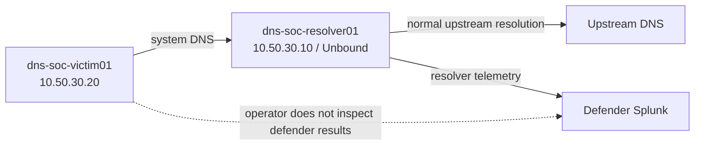
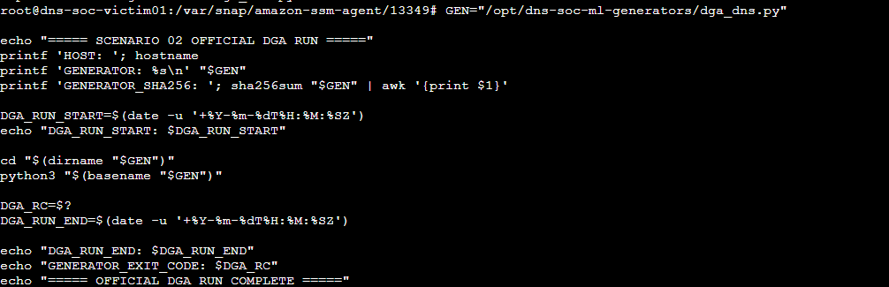
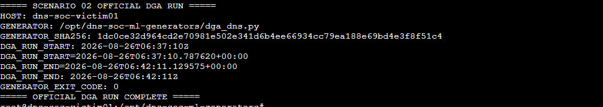

<a id="top"></a>

> 🧭 [Scenario 02](../README.md) › [Adversary / Operator](README.md) › **Project Lead / Adversary — Scenario 02 DGA + High NXDOMAIN**

<div align="center">

  

</div>


# 🧬 Project Lead / Adversary — Scenario 02 DGA + High NXDOMAIN

**Role owner:** [Musfira](https://github.com/MUSFIRA-ZAFAR)  
**Scenario:** DGA + High NXDOMAIN  
**MITRE ATT&CK:** `T1568.002 — Dynamic Resolution: Domain Generation Algorithms`  
**Cyber Kill Chain:** Command & Control

This document records the Project Lead / Adversary Operator side of Scenario 02: how the official DGA run was isolated from defender knowledge, what the controlled generator did, what evidence was preserved, and where the adversary role intentionally stopped.

The official run used **real DNS traffic through the lab's normal resolver path** and remained scoped to controlled DGA/high-NXDOMAIN behavior.

## 🎯 1. Role objective

The adversary/operator role had two responsibilities:

1. generate one fresh DGA-style DNS pattern from the internal victim using the already-existing generator;
2. preserve private ground truth without using defender telemetry to steer the run.

The path was:



Unlike Scenario 01, there was no requirement for an external Kali attacker. Scenario 02 represents **DGA-style dynamic DNS behavior on an internal endpoint** rather than initial-access activity.

## 🎭 2. Information separation

Before execution, the Project Lead kept private:

```text
victim identity
exact generator path
script hash
exact command
UTC start and end
generated namespace
operator notes
attacker-side screenshots
```

The SOC Analyst and Incident Responder were not given these facts in advance.

The operator also did **not** use Splunk, the DGA dashboard, `dns_soc_ml`, scheduled-alert history or `dga_nxdomain_v1` AI output to decide whether to extend, repeat or modify the run.

## 🛡️ 3. Pre-flight — freeze the environment before traffic

Before the official run, Musfira verified the victim was healthy, UTC/time was ready, the host still used `dns-soc-resolver01` through its normal system DNS path, the pre-deployed generator was present, RPZ remained safe/non-enforcing, and private ground-truth capture was ready.

The pre-flight deliberately changed none of the production logic: Detection v1.0, ML, AI, and RPZ policy stayed frozen.

## 📌 3. Controlled generator

The official generator was the pre-deployed Python file:

```text
/opt/dns-soc-ml-generators/dga_dns.py
```

The repository implementation uses:

```text
runtime: 300 seconds
query type: A
label length: 14–28 characters
label alphabet: lowercase letters + digits
namespace: <generated-label>.dga-test.soclab.abdul4rehman215.tech
resolver method: resolvectl query
inter-query sleep: random 0.4–1.0 seconds
```

The script intentionally suppresses normal `resolvectl` output. It prints only its own UTC run-start and run-end markers.

This matters for evidence interpretation: the attacker-side terminal proves **what generator ran and when**, while exact DNS event counts and individual generated labels are defender/resolver-side evidence and were not inspected during the information-separated operator phase.

## 🎬 4. Official execution

The official execution occurred on `dns-soc-victim01`.

The wrapper recorded:

- host identity;
- generator path;
- SHA256 hash;
- wrapper UTC start;
- generator's own UTC start;
- generator's own UTC end;
- wrapper UTC end;
- process exit code.



The fresh run was allowed to finish naturally. It was **not** restarted, accelerated or extended to guarantee a detection.



### 🪪 Official run identity

```text
host: dns-soc-victim01
generator: /opt/dns-soc-ml-generators/dga_dns.py
sha256: 1dc0ce32d964cd2e70981e502e341d6b4ee66934cc79ea188e69bd4e3f8f51c4
wrapper start: 2026-08-26T06:37:10Z
generator start: 2026-08-26T06:37:10.787620+00:00
generator end: 2026-08-26T06:42:11.129575+00:00
wrapper end: 2026-08-26T06:42:11Z
exit code: 0
```

The generator therefore ran for approximately five minutes and exited cleanly.

## 🚨 5. Why the run was not tuned to the detection

Detection v1.0 already existed and was frozen before the official exercise.

The adversary objective was **not**:

```text
Generate enough traffic to cross the production threshold.
```

It was:

```text
Generate the pre-designed DGA-style behavior naturally through the victim's normal DNS path.
```

This preserves the point of an information-separated exercise. If the frozen detection catches the run, that is evidence of coverage. If it misses, that is a legitimate detection-gap result. The operator does not repair the outcome during live execution.

## 🔎 6. Scope boundary

Allowed:

- execute the already-deployed controlled DGA generator on `dns-soc-victim01`;
- use the project-owned `dga-test.soclab.abdul4rehman215.tech` namespace;
- generate normal DNS A queries through the configured system resolver;
- preserve private operator timing/hash/command evidence;
- stop after the one official run.

Not part of this adversary phase:

- modifying Detection v1.0;
- changing the Isolation Forest model;
- changing RPZ or sinkhole policy;
- checking defender alerts or dashboards;
- malware execution;
- exploitation or credential attacks;
- persistence;
- DNS cache poisoning;
- denial of service;
- unrelated Internet targets.

## 📌 7. Ground-truth discipline

The clean official run is separate from earlier command-path troubleshooting.

Two failed wrapper attempts occurred before the correct generator path was used. In both cases Python returned exit code `2` and the generator did not execute. Those attempts are not part of the official DGA activity window and are not included as final scenario evidence.

The official ground-truth window begins only when the correct script actually started:

```text
2026-08-26T06:37:10.787620Z
→
2026-08-26T06:42:11.129575Z
```

## 🧾 8. Evidence limitations

The attacker-side record intentionally does **not** claim:

- exact DNS query count;
- exact NXDOMAIN count/ratio;
- defender alert status;
- Isolation Forest result;
- AI result;
- SOC disposition;
- IR containment result.

Those facts belong to defender evidence and should be added only during the final attacker-versus-defender comparison after the reveal gate.

Because the generator suppresses per-query output, individual generated labels were also not captured attacker-side. The controlled suffix and label-generation logic are documented from the pre-deployed source code; exact names should be taken from preserved resolver evidence only after information separation is no longer required.

## 💡 9. Adversary lessons

- Scenario realism came from **fresh traffic + strict information separation**, not from hiding how the lab is engineered.
- DGA behavior can originate from an internal endpoint even when there is no external attacker machine participating in the DNS path.
- A clean operator record should prove identity, code version, timing and completion without relying on the SIEM.
- Detection thresholds should not become attacker instructions.
- Engineering validation traffic and the official exercise run must remain clearly separated.
- A defender-side sinkhole is a response mechanism; it is not part of the attack itself.

## 🗂️ 10. Related files

- [`SCENARIO-02-ADVERSARY-PLAYBOOK.md`](SCENARIO-02-ADVERSARY-PLAYBOOK.md) — controlled DGA execution sequence and scope boundary
- [`ground-truth-template.md`](ground-truth-template.md) — completed private operator record
- [`../SCENARIO-RUNBOOK.md`](../SCENARIO-RUNBOOK.md) — complete Scenario 02 engineering/exercise runbook
- [`../ml/generators/dga_dns.py`](../ml/generators/dga_dns.py) — generator source used by the scenario
- [`scripts/official-dga-run-wrapper.sh`](scripts/official-dga-run-wrapper.sh) — wrapper used to preserve host/hash/timing/exit evidence
- [`../exercise/final-comparison.md`](../exercise/final-comparison.md) — defender results added only after the reveal gate


<div align="center">

**DNSentinel Scenario 02 · Evidence before verdict · Humans before automation**

[🏠 Scenario Home](../README.md) · [🧬 Adversary / Operator](README.md) · [⬆ Back to top](#top)

</div>


