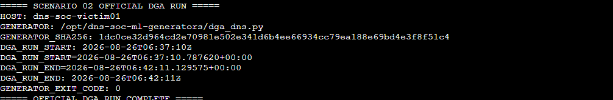

<a id="top"></a>

> 🧭 [Scenario 02](../README.md) › [Adversary / Operator](README.md) › **Scenario 02 — Completed Private Adversary Ground Truth**

<div align="center">

  

</div>


# 🎭 Scenario 02 — Completed Private Adversary Ground Truth

> This record is attacker/controller ground truth. During the information-separated exercise it must remain private from the SOC Analyst and Incident Responder until the defender decision/reveal gate is reached.

## 🎭 Exercise identity

| Field | Value |
|---|---|
| Exercise date | 2026-08-26 |
| Operator | Musfira |
| Scenario | DGA + High NXDOMAIN |
| Source asset | `dns-soc-victim01` |
| Source private IP | `10.50.30.20` |
| Resolver | `dns-soc-resolver01` / `10.50.30.10` |
| Generator | `/opt/dns-soc-ml-generators/dga_dns.py` |
| Controlled namespace | `dga-test.soclab.abdul4rehman215.tech` |
| Scenario mapping | `T1568.002 — Dynamic Resolution: Domain Generation Algorithms` |
| Cyber Kill Chain | Command & Control |
| External attacker requirement | None for this scenario |

## 🎬 Official run timing

| Field | UTC time |
|---|---|
| Wrapper start | `2026-08-26T06:37:10Z` |
| Generator start | `2026-08-26T06:37:10.787620+00:00` |
| Generator end | `2026-08-26T06:42:11.129575+00:00` |
| Wrapper end | `2026-08-26T06:42:11Z` |
| Approximate generator duration | ~300.34 seconds |
| Exit code | `0` |

## 🪪 Generator identity

| Field | Value |
|---|---|
| SHA256 | `1dc0ce32d964cd2e70981e502e341d6b4ee66934cc79ea188e69bd4e3f8f51c4` |
| Runtime setting | 300 seconds |
| Sleep range | 0.4–1.0 seconds |
| Query type | A |
| Generated label length | 14–28 characters |
| Label characters | lowercase ASCII letters + digits |
| Resolver method | `resolvectl query -t A` |

## 📌 Exact official wrapper command

```bash
GEN="/opt/dns-soc-ml-generators/dga_dns.py"

echo "===== SCENARIO 02 OFFICIAL DGA RUN ====="
printf 'HOST: '; hostname
printf 'GENERATOR: %s\n' "$GEN"
printf 'GENERATOR_SHA256: '; sha256sum "$GEN" | awk '{print $1}'

DGA_RUN_START=$(date -u '+%Y-%m-%dT%H:%M:%SZ')
echo "DGA_RUN_START: $DGA_RUN_START"

cd "$(dirname "$GEN")"
python3 "$(basename "$GEN")"

DGA_RC=$?
DGA_RUN_END=$(date -u '+%Y-%m-%dT%H:%M:%SZ')

echo "DGA_RUN_END: $DGA_RUN_END"
echo "GENERATOR_EXIT_CODE: $DGA_RC"
echo "===== OFFICIAL DGA RUN COMPLETE ====="
```

## 📌 Ground-truth behavior summary

- **Source endpoint:** `dns-soc-victim01`.
- **DNS path:** victim system DNS → `dns-soc-resolver01` → normal upstream resolution.
- **Behavior:** repeated A-record lookups for newly generated labels under the controlled DGA test suffix.
- **Namespace pattern:** `<14–28 char lowercase-alphanumeric label>.dga-test.soclab.abdul4rehman215.tech`.
- **Run length:** approximately five minutes.
- **Generator completion:** successful (`exit code 0`).
- **Traffic shaping to detection threshold:** none.
- **ML modification:** none.
- **Detection v1.0 modification:** none.
- **RPZ modification during adversary execution:** none.
- **Defender-result inspection during adversary execution:** none.

## 🔎 Query samples / counts

The generator intentionally redirects `resolvectl` stdout/stderr to `/dev/null`, so individual generated qnames were not printed in the attacker terminal.

During the information-separated operator phase, the attacker did **not** inspect resolver/Splunk telemetry to recover:

```text
exact query count
exact unique-qname count
exact NXDOMAIN count/ratio
individual generated names
alert result
ML result
AI result
```

These are defender-side observations and should be populated in a later final-comparison artifact only after the reveal gate.

## 🧾 Official evidence

### 🎬 Evidence A01 — execution command


Shows the exact wrapper used to capture host, generator path, SHA256, UTC timing and exit status.

### 🧾 Evidence A02 — successful completion


Shows:

```text
HOST: dns-soc-victim01
GENERATOR: /opt/dns-soc-ml-generators/dga_dns.py
GENERATOR_SHA256: 1dc0ce32d964cd2e70981e502e341d6b4ee66934cc79ea188e69bd4e3f8f51c4
DGA_RUN_START: 2026-08-26T06:37:10Z
DGA_RUN_START=2026-08-26T06:37:10.787620+00:00
DGA_RUN_END=2026-08-26T06:42:11.129575+00:00
DGA_RUN_END: 2026-08-26T06:42:11Z
GENERATOR_EXIT_CODE: 0
```

### 🧾 Evidence A03 — compact ground-truth summary



A compact crop of the official terminal result for quick reference.

## 💡 Pre-official troubleshooting note

Before the successful official run, two wrapper attempts used incorrect/nonexistent generator paths and returned Python exit code `2`.

Those attempts:

- did not execute [`dga_dns.py`](../ml/generators/dga_dns.py);
- did not constitute the official DGA run;
- are troubleshooting-only artifacts;
- are excluded from the official activity window and final evidence set.

The correct deployed path was verified as:

```text
/opt/dns-soc-ml-generators/dga_dns.py
```

## 🎭 Reveal checklist

Use this section when the final defender comparison is completed:

- [x] SOC disposition recorded before ground-truth reveal
- [x] AI output validated by the SOC before ground-truth reveal
- [x] IR handoff/decision recorded if escalation occurred
- [x] Detection v1.0 was not modified during the official adversary run
- [x] ML was not modified during the official adversary run
- [x] RPZ was not changed by the adversary/operator
- [x] Operator did not inspect defender results during the run
- [x] Final attacker ↔ telemetry ↔ SOC ↔ IR comparison completed after reveal

## 🧾 Related evidence / files

- [`PROJECT-LEAD-ADVERSARY.md`](PROJECT-LEAD-ADVERSARY.md)
- [`SCENARIO-02-ADVERSARY-PLAYBOOK.md`](SCENARIO-02-ADVERSARY-PLAYBOOK.md)
- [`../SCENARIO-RUNBOOK.md`](../SCENARIO-RUNBOOK.md)
- [`../ml/generators/dga_dns.py`](../ml/generators/dga_dns.py)

---

<div align="center">

[🏠 Scenario Home](../README.md) · [📁 Attacker](README.md) · [⬆ Back to top](#top)

<sub>DNSentinel Lab · Evidence-first DNS security engineering</sub>

</div>


## 🎭 Final reveal artifact

The completed cross-role comparison is preserved in [`../exercise/final-comparison.md`](../exercise/final-comparison.md).


<div align="center">

**DNSentinel Scenario 02 · Evidence before verdict · Humans before automation**

[🏠 Scenario Home](../README.md) · [🧬 Adversary / Operator](README.md) · [⬆ Back to top](#top)

</div>


