<a id="top"></a>

# Scenario 02 — Detection Engineering

**DGA + High NXDOMAIN**  
**Detection Engineer / AI Integrator:** [Lubaba](https://github.com/lubaba1513-pixel)  
**Status:** **✅ Detection Engineering complete**  
**Primary MITRE ATT&CK:** `T1568.002 — Dynamic Resolution: Domain Generation Algorithms`  
**Production detection:** `Scenario 02 - Possible DGA / High NXDOMAIN` · `v1.0`

This document records how Scenario 02 moved from trusted defender DNS telemetry to a validated, scheduled, analyst-ready and AI-assisted detection capability.

The work is documented as an engineering story rather than a terminal transcript:

```text
question → observation → decision → action → validation → lesson
```

> [!IMPORTANT]
> The benign and DGA traffic used here was **Detection Engineering validation traffic**. It was intentionally separate from the later official information-separated Scenario 02 adversary/SOC/IR exercise.

---

## 1. Engineering finish line

Detection Engineering was considered ready only after this complete chain worked:

```text
real Unbound resolver events
    → field and transaction semantics
    → ingestion timing
    → clean rule baseline
    → investigation dashboard
    → threshold-free hunting
    → candidate detection
    → fresh controlled DGA validation
    → benign / false-positive challenges
    → Detection v1.0
    → reusable validation SPL
    → rule ↔ ML comparison
    → scheduled alert
    → analyst evidence contract
    → raw-event drilldown
    → Scenario 02 AI evidence mapping
    → webhook / OpenAI / HEC validation
    → AI facts checked against raw DNS
```

The finish line was deliberately larger than “make an SPL query return one row.”

---

## 2. Start with resolver semantics, not a rule

### The question

Which resolver events represent one real DNS transaction, and which fields can the detection safely trust?

### What Lubaba validated

The primary Scenario 02 source was already onboarded:

```text
index=dns_soc_dns
host=dns-soc-resolver01
sourcetype=unbound:dns
```

Useful live fields included:

```text
event_type
client_ip
qname
qtype
rcode
response_time
cache_flag
response_size
```

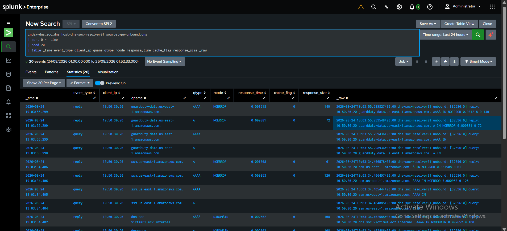

*The rule was built from the live Unbound field model rather than from a planned schema.*

### Query vs reply

Unbound generated both query-side and reply-side events. Counting both would turn one DNS transaction into two analytical events.

The detection therefore standardized on:

```text
event_type="reply"
```

The reply event also carries the final DNS outcome, including `rcode`, which is central to the high-NXDOMAIN behavior being measured.

### Lesson

**The analytical unit must match the security behavior.** A clean rule begins by defining what one event actually means.

---

## 3. Measure ingestion before scheduling

### The question

How long does a resolver event take to travel through:

```text
Unbound → Universal Forwarder → Splunk
```

### Measurement

Fresh reply-side DNS telemetry produced this sample:

| Measurement | Result |
|---|---:|
| Reply events | 64 |
| Minimum | `-0.863 s` |
| Median | `2.389 s` |
| Average | `4.304 s` |
| p95 | `9.195 s` |
| Maximum | `9.196 s` |

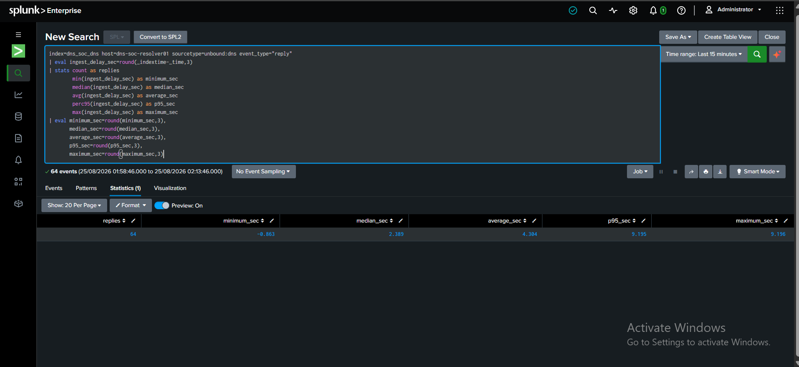

The tiny negative minimum was treated as timestamp/index-time precision around zero rather than as true negative delivery.

### Why it mattered

The result showed that Scenario 02's Unbound → UF → Splunk path was much faster than the Route 53/Kinesis path used in Scenario 01. That later justified a different scheduled-alert window rather than copying the earlier scenario's timing.

### Lesson

**Scheduled detection timing is a data-pipeline decision, not a reusable magic number.**

---

## 4. Build an independent Detection Engineering baseline

The ML phase already had benign training data, but Lubaba did not treat the ML baseline as a substitute for rule engineering.

### Clean periods

Two known-clean benign raw-DNS periods were reused only as trusted time ranges:

```text
2026-08-24 07:46:46Z → 08:01:49Z
2026-08-24 08:16:22Z → 08:31:28Z
```

From raw `dns_soc_dns` reply events, Lubaba independently created **32 one-minute/client Detection Engineering windows**.

### Baseline summary

| Metric | Median | p95 | Maximum |
|---|---:|---:|---:|
| Query count | 6 | 12.45 | 14 |
| Unique qnames | 5 | 8.45 | 10 |
| Unique-qname ratio | 0.80 | ~1.00 | 1.00 |
| NXDOMAIN count | 1 | 3 | 5 |
| NXDOMAIN ratio | 0.125 | 0.344 | 0.50 |
| Average qname length | 19.16 | 26.65 | 28.00 |
| Maximum qname length | 38 | 45 | 45 |
| Distinct qtypes | 2 | 2 | 2 |
| Average response time | ~0.0055 s | ~0.0199 s | ~0.0279 s |

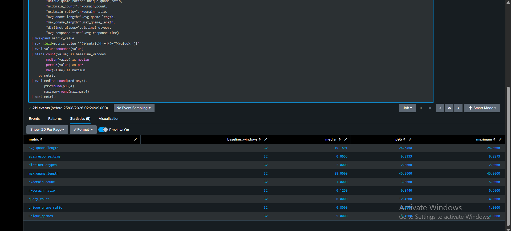

### The important finding

Normal DNS already demonstrated several features that could look suspicious in isolation:

```text
NXDOMAIN exists in benign traffic
unique_qname_ratio can reach 1.00
qname length can reach 45 characters
A and AAAA behavior is normal
```

Therefore:

```text
NXDOMAIN alone           ≠ DGA
high uniqueness alone   ≠ DGA
long qname alone         ≠ DGA
```

### Lesson

**The baseline did more than provide numbers. It ruled out simplistic detections before they reached alerting.**

The reproducible baseline searches are preserved in [`../spl/baseline.spl`](../spl/baseline.spl).

---

## 5. Engineer the investigation surface

Before freezing the final rule, Lubaba built the analyst-facing view that Sonia will later use during the official exercise.

### Final dashboard

**Scenario 02 — DGA + High NXDOMAIN Investigation**

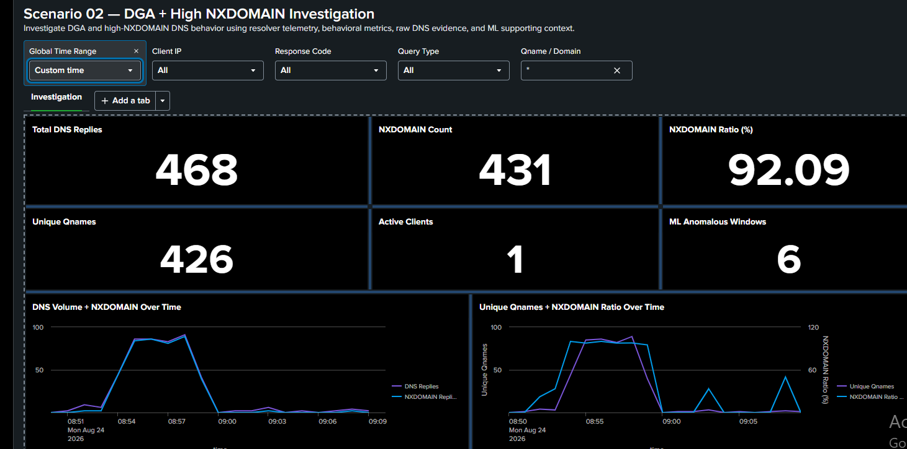

The deployed Splunk Dashboard Studio artifact contains:

```text
5 global inputs
13 visualizations
16 data sources / searches
```

### Global controls

- Global Time Range
- Client IP
- Response Code
- Query Type
- Qname / Domain

### SOC summary

- Total DNS Replies
- NXDOMAIN Count
- NXDOMAIN Ratio
- Unique Qnames
- Active Clients
- ML Anomalous Windows

### Behavior views

- DNS Volume + NXDOMAIN Over Time
- Unique Qnames + NXDOMAIN Ratio Over Time
- Average + Maximum Qname Length Over Time
- Query-Type Distribution

### Investigation views

- Top NXDOMAIN Names
- Raw DNS Investigation
- ML Window Context — Supporting Signal

The exported implementation is preserved in [`../dashboard/scenario-02-dga-investigation-dashboard.json`](../dashboard/scenario-02-dga-investigation-dashboard.json).

### Why the dashboard mattered

Every panel was tied to an analyst question:

```text
Is one client querying unusually fast?
Are most lookups failing?
Are most requested names unique?
Are names structurally longer than normal?
Does the ML model also consider the minute unusual?
Which exact DNS requests produced the pattern?
```

The dashboard was considered complete when those questions could be answered reliably. It was not redesigned later simply to prove more work had occurred.

### Lesson

**An investigation surface is complete when it answers the analyst's questions, not when it contains the maximum number of panels.**

---

## 6. Hunt before detecting

Lubaba kept the hunting layer deliberately small.

### Hunt 1 — one-minute/client behavior

The first hunt exposed the behavior without a threshold:

```text
query_count
unique_qnames
unique_qname_ratio
nxdomain_count
nxdomain_ratio
avg_qname_length
max_qname_length
distinct_qtypes
qtypes
response_codes
qname_samples
```

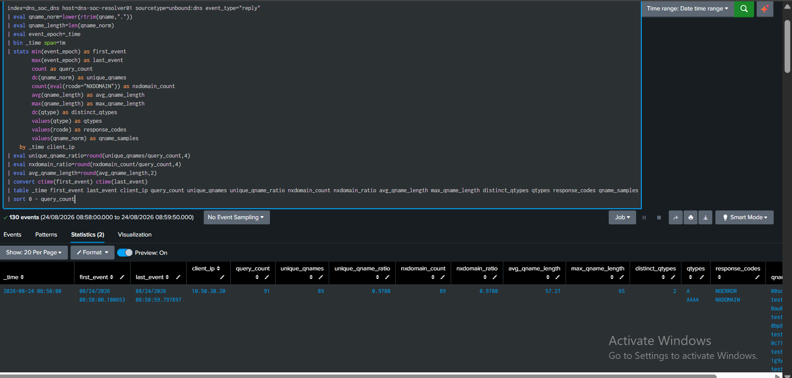

### Hunt 2 — raw resolver pivot

The second hunt returned the exact reply events behind a client/time window:

```text
_time
client_ip
qname
qtype
rcode
response_time
cache_flag
response_size
```

### Why both were needed

```text
behavior summary → explains the shape
raw DNS pivot    → proves the events
```

The final hunts are preserved in [`../spl/hunting.spl`](../spl/hunting.spl).

---

## 7. Form a simple behavioral hypothesis

The evidence pointed toward a combined pattern:

```text
same client
+ one-minute window
+ elevated DNS transaction volume
+ many unique qnames
+ high NXDOMAIN behavior
→ possible DGA / high-NXDOMAIN activity
```

Qname length and query-type behavior remained useful investigation context, but the rule was intentionally kept smaller than the full list of available features.

Entropy was not forced into v1.0 simply because it could be calculated.

### Lesson

**The strongest v1 rule is often the smallest explainable combination that survives testing.**

---

## 8. Choose a provisional boundary from the observed gap

The clean baseline maximums were:

```text
query_count       = 14
unique_qnames     = 10
nxdomain_ratio    = 0.50
```

Historical controlled DGA behavior sat far above that range, with one-minute query counts roughly `38–91` and NXDOMAIN ratios around `0.976–1.000`.

The candidate rule was therefore positioned at:

```text
query_count >= 20
AND unique_qnames >= 15
AND nxdomain_ratio >= 0.75
```

These values were still provisional. The rule had to survive a new positive run and benign challenges before it could become v1.0.

---

## 9. Fresh positive validation — prove the rule sees new DGA behavior

Lubaba reused the existing controlled DGA generator on `dns-soc-victim01` instead of inventing a second generator.

The generator produced harmless random labels only under the project-owned namespace:

```text
<random-label>.dga-test.soclab.abdul4rehman215.tech
```

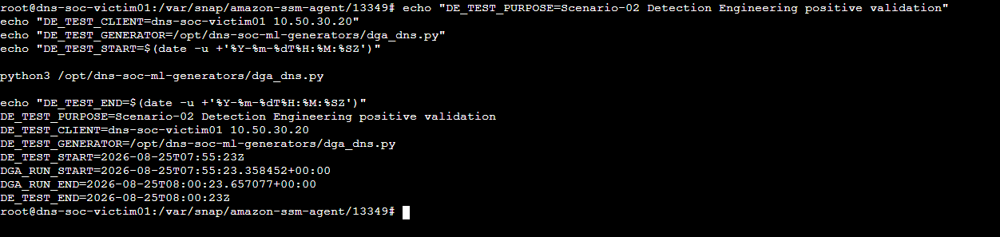

The unchanged candidate rule detected **all six** one-minute windows from the fresh controlled run.

Observed fresh DGA behavior included approximately:

```text
query_count        ≈ 30–94
unique_qnames      ≈ 30–91
unique_qname_ratio ≈ 0.9681–1.0000
nxdomain_ratio     ≈ 0.9574–1.0000
avg_qname_length   ≈ 56.97–59.80
max_qname_length   = 65
```

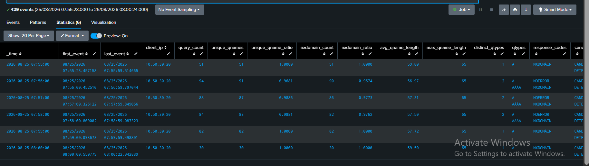

### Result

**Positive validation: PASS — 6/6 fresh controlled DGA windows crossed the candidate rule.**

---

## 10. Challenge the same rule with benign traffic

The next question was not “can it detect DGA?” but:

> **Does it simply detect DNS, NXDOMAIN or volume?**

Lubaba kept the candidate rule unchanged while testing several benign patterns.

### Ordinary DNS

Known resolvable names with normal pauses stayed below the full candidate boundary.

### Limited benign NXDOMAIN

A small number of failed lookups also stayed below the rule.

### Repeated normal-name burst — an unexpected testing lesson

A high-volume repeated-name attempt did not create as much resolver-visible telemetry as the generator activity suggested. Client/resolver caching reduced what reached the sensor.

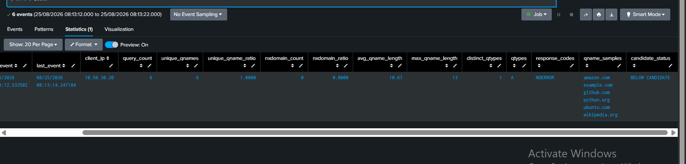

The test itself therefore needed improvement before it could be used as strong evidence.

### Unique legitimate-name burst

A better benign challenge used many distinct legitimate names so resolver-visible activity was actually produced.

The window reached:

```text
query_count       = 23
unique_qnames     = 23
nxdomain_ratio    = 0.0
```

Even with high volume and high uniqueness, it stayed **below the full DGA rule** because the high-NXDOMAIN condition was absent.

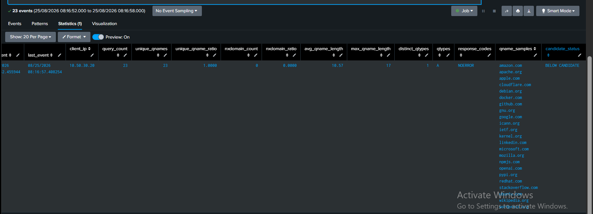

### Lesson

**Validate what the sensor observed, not merely what the traffic generator attempted.**

This testing also proved why the final rule combines multiple behavior dimensions instead of trusting volume or uniqueness by itself.

---

## 11. Freeze Detection v1.0

No validation result demonstrated a need to keep moving the candidate thresholds.

The provisional boundary was therefore frozen as:

```text
Scenario 02 - Possible DGA / High NXDOMAIN
Detection version: 1.0
Severity: medium
MITRE: T1568.002

query_count >= 20
AND unique_qnames >= 15
AND nxdomain_ratio >= 0.75
```

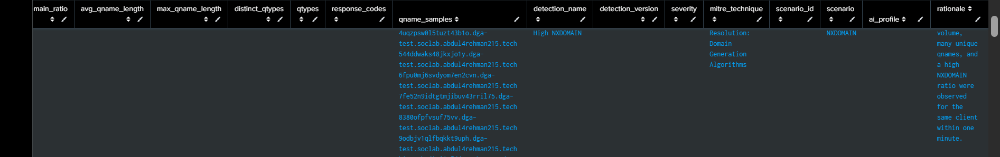

The final rule returns one analyst-ready row per detected client/minute rather than raw-event spam.

The canonical SPL is preserved in [`../spl/detection.spl`](../spl/detection.spl).

---

## 12. Preserve a reusable validation view

Production `detection.spl` answers:

> Which windows should alert?

`validation.spl` answers:

> Why did this window detect or stay below the rule?

It applies the same frozen v1.0 boundary but keeps both outcomes visible:

```text
WOULD DETECT
BELOW THRESHOLD
```

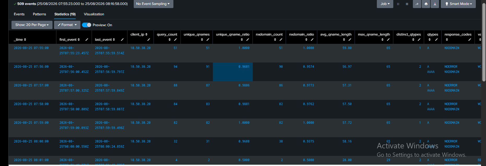

This is useful for regression checks and future tuning because below-threshold evidence is not hidden.

See [`../spl/validation.spl`](../spl/validation.spl).

---

## 13. Compare the explainable rule with the existing ML model

Scenario 02 already had Musfira's Isolation Forest v1 implementation in `dns_soc_ml`.

Lubaba did **not** retrain or redesign it.

### The first correlation problem

The initial historical comparison found the rule rows but not the corresponding ML rows.

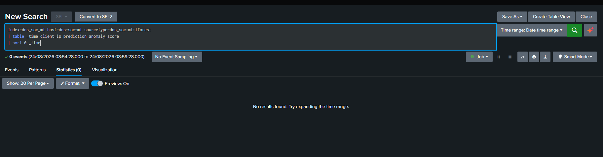

The reason was semantic time: the model result's Splunk `_time` was not the same concept as the DNS behavior minute it described.

The ML event already carried:

```text
window_time
```

The final comparison explicitly parsed that field and aligned both datasets by the one-minute behavior window.

### Final comparison

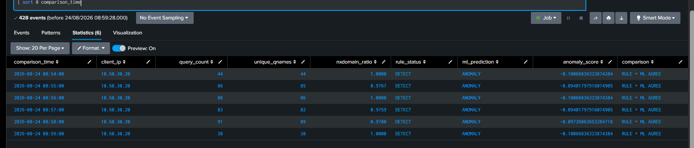

For the six historical controlled DGA windows:

```text
Rule = DETECT
ML   = ANOMALY
6/6  = RULE + ML AGREE
```

The raw Isolation Forest `anomaly_score` was preserved without reinterpreting it. Negative values on those anomaly rows were expected from the existing model implementation.

### Why ML remained supporting context

The ML engineering phase had also produced:

```text
8 held-out benign windows
2 predicted ANOMALY
```

So rule/ML disagreement remains possible and useful. Agreement is stronger context, not an automatic compromise verdict.

### Lesson

**Correlate derived analytics by the event/window time they describe, not blindly by index time.**

---

## 14. Operationalize the rule as a scheduled alert

A working search still was not an operational detection.

Lubaba converted Detection v1.0 into a scheduled Splunk alert.

### Final schedule

```text
Name:         Scenario 02 - Possible DGA / High NXDOMAIN
Schedule:     * * * * *
Earliest:     -2m@m
Latest:       -1m@m
Trigger:      Number of Results > 0
Trigger mode: Once
Severity:     Medium
Actions:      Triggered Alerts + Webhook
```

### Why the time range is different from Scenario 01

Resolver ingestion validation measured p95 at roughly **9.2 seconds**.

Searching the previous completed minute gives the data far more time than that to arrive while avoiding a larger overlapping lookback that could repeatedly inspect the same window.

### Real trigger validation

A fresh 45-second DGA validation began at `2026-08-25T09:09:34Z`. The scheduled alert later evaluated the previous completed minute and produced a real result for approximately `09:09–09:10 UTC`:

```text
client_ip          = 10.50.30.20
query_count        = 41
unique_qnames      = 37
unique_qname_ratio = 0.9024
nxdomain_count     = 36
nxdomain_ratio     = 0.8780
```

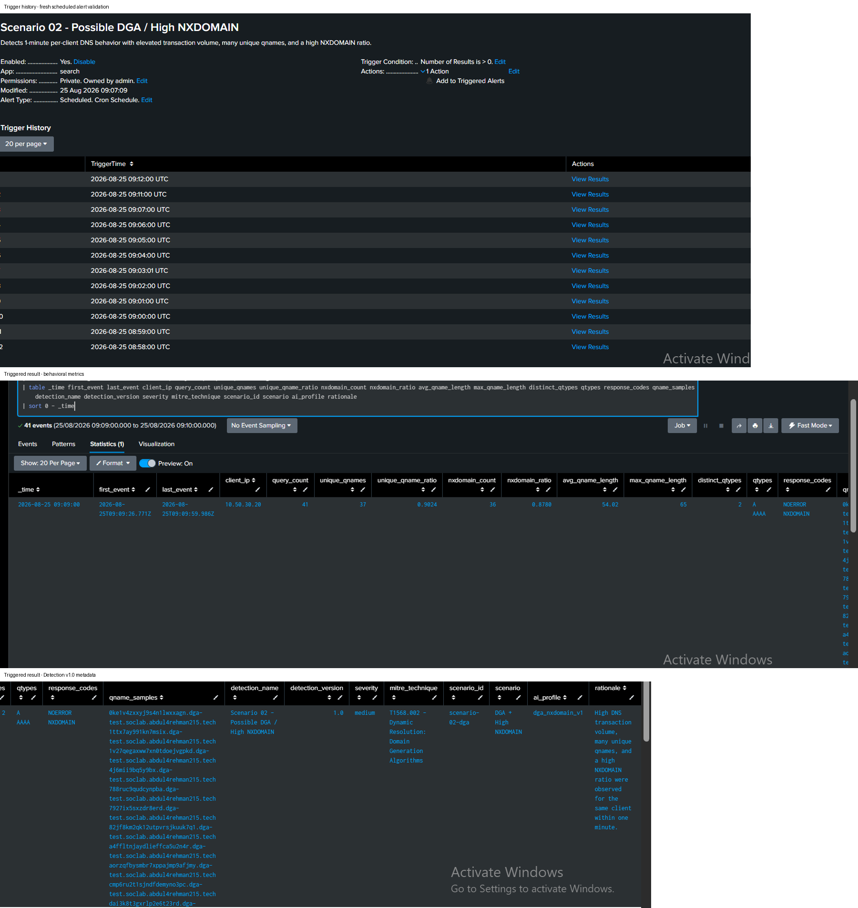

The exact alert configuration and reasoning are preserved in [`../spl/scheduled-alert.md`](../spl/scheduled-alert.md).

### Lesson

**A scheduled alert is part of the detection design. Cadence and lookback should be explained from measured ingestion behavior.**

---

## 15. Preserve direct raw-event drilldown

The alert row is a summary, not the original evidence.

Lubaba validated the exact resolver replies behind the detected `09:09–09:10` client/window.

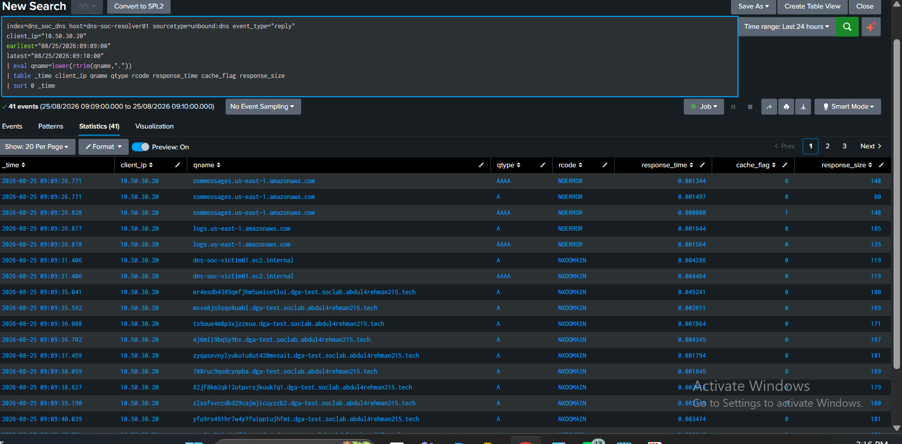

The analyst can pivot back to:

```text
_time
client_ip
qname
qtype
rcode
response_time
cache_flag
response_size
```

### Lesson

**An alert should shorten investigation, not replace evidence.**

---

## 16. Engineer one evidence contract for human and AI consumers

The shared AI bridge already existed in the Infrastructure repository. Scenario 02 did not need a new Flask service, AI container, HEC index or public port.

The detection result instead had to expose a stable common contract:

```text
alert_id
alert_name
scenario
severity
event_time
source
evidence_json
```

Inside `evidence_json`, the Scenario 02 result carries the rule evidence:

```text
scenario_id
ai_profile
detection_name / version
first_event / last_event
client_ip
query_count
unique_qnames
unique_qname_ratio
nxdomain_count
nxdomain_ratio
avg_qname_length
max_qname_length
qtypes
response_codes
qname_samples
mitre_technique
rationale
```

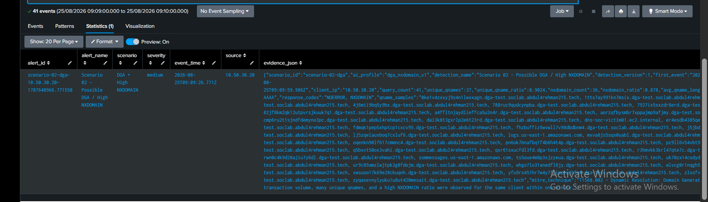

The final detection limits the AI copy of qname samples to the first 20 values while retaining the complete analyst-facing multivalue field in the search result.

---

## 17. Troubleshooting case study — HTTP 400 was a schema failure, not a network failure

The first scheduled AI test reached the shared bridge but received:

```text
HTTP 400 BAD REQUEST
```

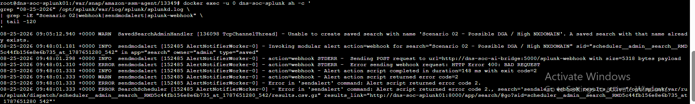

That result was useful: the transport path was alive.

Lubaba inspected the live bridge schema and confirmed it expected normalized fields such as:

```text
alert_id
alert_name
scenario
severity
event_time
evidence
```

For Splunk's native webhook envelope, the bridge builds `evidence` from the result field `evidence_json`.

The correct fix was therefore at the **result-contract layer**.

The final detection was extended to output the required common fields while preserving the exact same v1.0 threshold logic.

What did **not** change:

- DGA thresholds;
- ML model;
- Flask route;
- Docker topology;
- OpenAI integration;
- HEC architecture.

### Lesson

**Reachability proves transport, not schema compatibility. Isolate the failing boundary before redesigning a working system.**

---

## 18. Scenario 02 AI mapping — `dga_nxdomain_v1`

Once the alert fields were stable, Scenario 02 reused the shared AI foundation with this identity:

```text
scenario_id   = scenario-02-dga
scenario_name = DGA + High NXDOMAIN
ai_profile    = dga_nxdomain_v1
```

The runtime path is:

```text
Scheduled Splunk Alert
    → internal webhook
    → dns-soc-ai-bridge
    → OpenAI
    → internal HEC
    → index=dns_soc_ai
```

The deployed bridge is generic: `dga_nxdomain_v1` travels inside the evidence rather than existing as a separate Flask module.

The scenario-specific mapping is preserved in [`../ai/scenario-02-ai-mapping.md`](../ai/scenario-02-ai-mapping.md).

---

## 19. Validate the complete AI return path

After the evidence contract was corrected, a final controlled DGA retest exercised the full path.

The returned event was indexed into:

```text
index=dns_soc_ai
sourcetype=dns_soc:ai:triage
source=dns-soc-ai-bridge
```

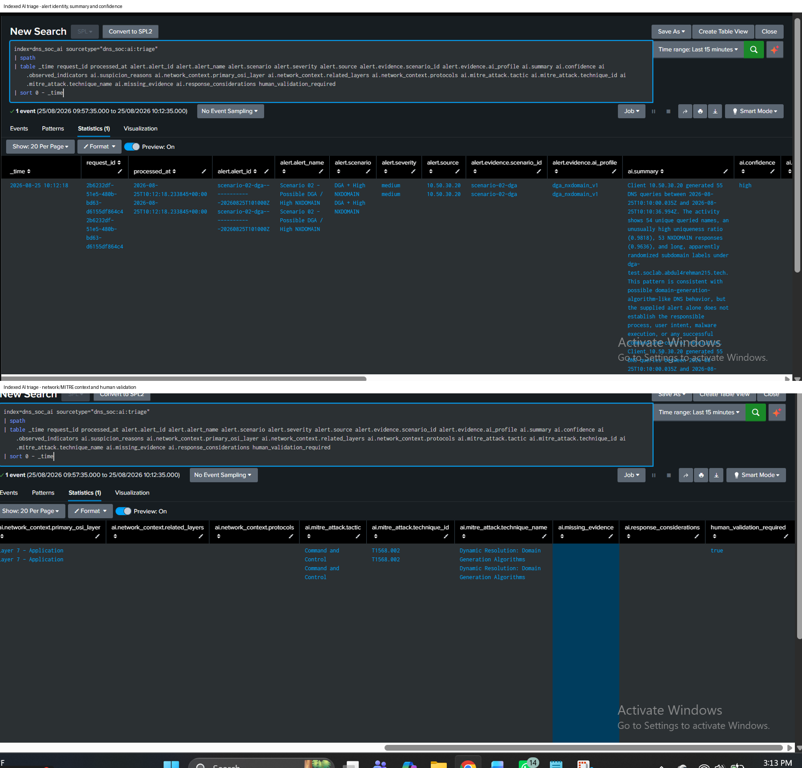

The structured result carried the correct Scenario 02 context, including:

```text
scenario_id = scenario-02-dga
ai_profile  = dga_nxdomain_v1
severity    = medium
source      = 10.50.30.20
MITRE       = T1568.002
Kill Chain  = Command and Control
human_validation_required = true
```

The AI also kept uncertainty around process identity, user intent, malware execution and successful C2 rather than converting unusual DNS behavior into a definitive compromise claim.

### AI role

AI may:

- summarize observed behavior;
- explain suspicion reasons;
- identify missing evidence;
- suggest investigation pivots;
- add framework context;
- suggest response considerations.

AI may not:

- prove malware execution;
- declare compromise from the alert alone;
- enable RPZ;
- isolate hosts;
- authorize Incident Response.

---

## 20. Final readiness check — compare AI with raw DNS

The final question was not:

> Did the AI produce text?

It was:

> **Were the AI's core factual claims defensible from the resolver evidence?**

The AI described approximately:

```text
55 DNS queries
54 unique qnames
unique_qname_ratio = 0.9818
53 NXDOMAIN responses
nxdomain_ratio = 0.9636
```

Lubaba ran a separate raw `dns_soc_dns` aggregation for the exact alert minute.

It returned:

```text
query_count        = 55
unique_qnames      = 54
unique_qname_ratio = 0.9818
nxdomain_count     = 53
nxdomain_ratio     = 0.9636
```

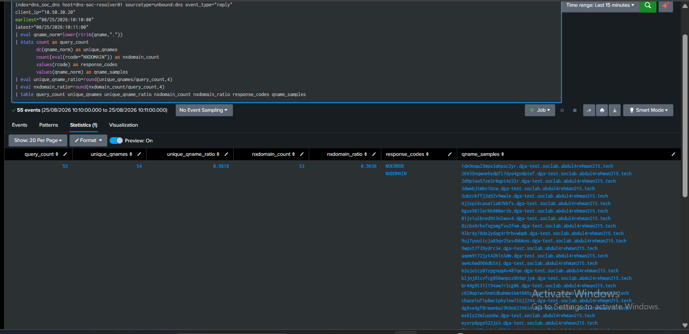

The core values matched exactly.

### Result

**Scenario 02 Detection Engineering technical readiness: PASS.**

The AI did not become the evidence source. Raw resolver telemetry remained authoritative.

---

## 21. Final engineering architecture

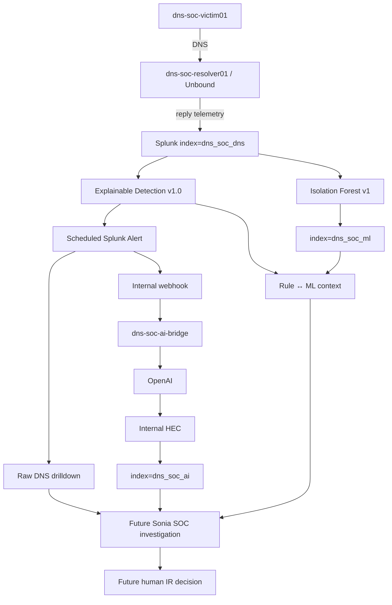

Detection, ML and AI are deliberately separate signals/layers. Human investigation remains the security decision point.

---

## 22. Engineering reflection

This assignment moved far beyond writing SPL.

Lubaba had to reason across:

```text
DNS transaction semantics
→ timing and baseline distributions
→ Dashboard Studio
→ hunting and threshold design
→ DNS caching effects
→ rule / ML time alignment
→ scheduled-search behavior
→ structured webhook contracts
→ AI output validation
```

Several failures looked like one kind of problem while the real cause lived in another layer. A benign burst looked large at the generator but was reduced by caching. A rule/ML join looked empty until event-time semantics were corrected. An alert reached the AI bridge but failed because the payload contract was incomplete.

The reusable method became:

```text
protect known-good logic
    → prove which layer still works
    → inspect the next boundary
    → change one thing
    → validate the result
```

That is the troubleshooting story worth preserving—not every failed command.

---

## 23. Lessons worth carrying forward

### Detection lessons

- Use the reply side when query + reply telemetry would double-count transactions.
- Measure normal behavior before inventing thresholds.
- NXDOMAIN is meaningful only in context; benign DNS can fail.
- High uniqueness and high volume can also occur in legitimate traffic.
- Keep v1 detection logic small and explainable.
- Freeze thresholds when testing supports them; do not chase perfect-looking outputs.

### Validation lessons

- Positive validation proves the rule can fire.
- Benign validation proves the rule means more than “DNS happened.”
- Check what the sensor actually received, especially when caching can alter test visibility.
- Keep a validation search that shows both passing and below-threshold windows.

### ML lessons

- ML is useful as a second opinion, not as an automatic verdict.
- Do not force rule/ML agreement.
- Correlate derived results by semantic behavior time.
- Preserve raw anomaly-score semantics rather than relabeling them for appearance.

### Operational lessons

- Alert cadence/lookback belongs to the observed ingestion path.
- A saved search is not an operational detection until a real scheduled trigger is proven.
- One alert row should be useful to both the human analyst and machine-to-machine integrations.
- Raw-event drilldown must remain available.

### AI lessons

- Transport success and schema success are separate checks.
- Reuse the shared bridge instead of creating scenario-specific infrastructure without need.
- Structured output is only useful when its facts can be validated against telemetry.
- AI assistance never owns containment authority.

---

## 24. Canonical artifacts

| Area | Final artifact |
|---|---|
| Baseline | [`../spl/baseline.spl`](../spl/baseline.spl) |
| Hunting | [`../spl/hunting.spl`](../spl/hunting.spl) |
| Detection | [`../spl/detection.spl`](../spl/detection.spl) |
| Validation | [`../spl/validation.spl`](../spl/validation.spl) |
| Scheduled alert | [`../spl/scheduled-alert.md`](../spl/scheduled-alert.md) |
| Supporting engineering searches | [`../spl/engineering-validation/`](../spl/engineering-validation/) |
| Dashboard | [`../dashboard/scenario-02-dga-investigation-dashboard.json`](../dashboard/scenario-02-dga-investigation-dashboard.json) |
| AI mapping | [`../ai/scenario-02-ai-mapping.md`](../ai/scenario-02-ai-mapping.md) |
| Acceptance record | [`detection-engineering-validation.md`](detection-engineering-validation.md) |
| Full output sample | [`../evidence/detection-v1-validation-output.csv`](../evidence/detection-v1-validation-output.csv) |
| Screenshot evidence | [`../screenshots/detection-engineering/`](../screenshots/detection-engineering/) |

---

## 25. What this work does not claim

Detection Engineering completion does **not** mean the full Scenario 02 exercise is complete.

This work does not claim:

- official adversary execution;
- Sonia's final SOC disposition;
- Abdul-Rehman's IR decision;
- official RPZ/sinkhole containment;
- official post-response verification;
- that ML or AI proves malware;
- that 6/6 controlled DGA results represent production accuracy.

The next phase is the synchronized information-separated exercise using the frozen engineering built here.

---

<div align="center">

[🏠 Scenario Home](../README.md) · [🚦 Detection Workspace](README.md) · [📊 Dashboard](../dashboard/README.md) · [🔎 SPL](../spl/README.md) · [🤖 AI](../ai/README.md) · [⬆ Back to top](#top)

<sub>DNSentinel Lab · Telemetry before theory · Evidence before verdict · Humans before automation</sub>

</div>
