<a id="top"></a>

<div align="center">


[🏠 Scenario Home](../README.md) · [📊 Dashboard](../dashboard/README.md) · [🔎 SPL Workspace](../spl/README.md) · [🤖 AI Mapping](../ai/README.md) · [🖼️ Evidence](../screenshots/README.md)

</div>


**Detection Engineer / AI Integrator:** [Lubaba](https://github.com/lubaba1513-pixel)  
**Status:** **✅ Detection Engineering complete**  
**Primary MITRE ATT&CK:** `T1568.002 — Dynamic Resolution: Domain Generation Algorithms`  
**Production rule:** `Scenario 02 - Possible DGA / High NXDOMAIN` · `v1.0`

Lubaba owned the Scenario 02 Detection Engineering lifecycle from trusted Unbound resolver telemetry to SOC-ready alerting. She validated the DNS transaction model, measured ingestion behavior, established the rule baseline, engineered the analyst dashboard, built the hunting and production SPL, challenged the rule with controlled DGA and benign traffic, compared the explainable rule with the existing Isolation Forest model, operationalized Detection v1.0 as a scheduled alert, and integrated the final evidence contract with the shared AI bridge.

> [!IMPORTANT]
> Detection Engineering validation traffic is **not** the official Scenario 02 adversary exercise. During the later official run, the frozen v1.0 rule was left unchanged and independently matched five consecutive fresh windows before SOC and IR completed the operational exercise.

## 🚦 Start here

| Artifact | What it contains |
|---|---|
| [`DETECTION-ENGINEERING.md`](DETECTION-ENGINEERING.md) | **Flagship engineering story** — question → observation → decision → action → validation → lesson, from resolver semantics to AI-vs-raw evidence validation. |
| [`detection-engineering-validation.md`](detection-engineering-validation.md) | **Acceptance record** — compact engineering gates used to declare Scenario 02 Detection Engineering ready. |
| [`../spl/README.md`](../spl/README.md) | Canonical baseline, hunting, production detection, validation and scheduled-alert artifacts. |
| [`../dashboard/README.md`](../dashboard/README.md) | Final Splunk Dashboard Studio investigation surface. |
| [`../ai/scenario-02-ai-mapping.md`](../ai/scenario-02-ai-mapping.md) | `dga_nxdomain_v1` evidence contract and shared-AI validation. |

## 🔁 Engineering path

```mermaid
flowchart LR

    %% =====================================================
    %% COLUMN 1
    %% =====================================================
    subgraph C1[" "]
        direction TB
        H1["📡 1 · Data Intake"]

        A["📡 Unbound<br/>Telemetry"]
        B["🔎 Reply-Side<br/>Semantics"]
        C["⏱️ Ingestion<br/>Timing"]

        H1 --> A --> B --> C
    end

    %% =====================================================
    %% COLUMN 2
    %% =====================================================
    subgraph C2[" "]
        direction TB
        H2["🛠️ 2 · Detection Prep"]

        D["📊 Clean<br/>Baseline"]
        E["🖥️ Dashboard<br/>+ Hunts"]
        F["🛡️ Detection<br/>v1.0"]

        H2 --> D --> E --> F
    end

    %% =====================================================
    %% COLUMN 3
    %% =====================================================
    subgraph C3[" "]
        direction TB
        H3["✅ 3 · Validation"]

        G["✅ Positive + Benign<br/>Validation"]
        H["🧠 Rule ↔ ML<br/>Comparison"]
        I["🚨 Scheduled<br/>Alert"]

        H3 --> G --> H --> I
    end

    %% =====================================================
    %% COLUMN 4
    %% =====================================================
    subgraph C4[" "]
        direction TB
        H4["🎯 4 · SOC Delivery"]

        J["📦 Raw Evidence<br/>+ Contract"]
        K["🤖 Shared AI<br/>Bridge"]
        L["🎯 SOC-Ready"]

        H4 --> J --> K --> L
    end

    %% =====================================================
    %% COLUMN-TO-COLUMN FLOW
    %% =====================================================
    C1 --> C2
    C2 --> C3
    C3 --> C4

    %% =====================================================
    %% HEADER STYLES
    %% =====================================================
    classDef head1 fill:#0b2239,stroke:#58a6ff,stroke-width:2px,color:#ffffff;
    classDef head2 fill:#10243f,stroke:#60a5fa,stroke-width:2px,color:#ffffff;
    classDef head3 fill:#24123a,stroke:#a371f7,stroke-width:2px,color:#ffffff;
    classDef head4 fill:#0f2a1d,stroke:#3fb950,stroke-width:2px,color:#ffffff;

    class H1 head1;
    class H2 head2;
    class H3 head3;
    class H4 head4;

    %% =====================================================
    %% NODE STYLES
    %% =====================================================
    classDef engineering fill:#161b22,stroke:#58a6ff,stroke-width:1.5px,color:#f0f6fc;
    classDef validation fill:#161b22,stroke:#a371f7,stroke-width:1.5px,color:#f0f6fc;
    classDef final fill:#161b22,stroke:#3fb950,stroke-width:2px,color:#f0f6fc;

    class A,B,C,D,E,F engineering;
    class G,H,I,J,K validation;
    class L final;

    %% =====================================================
    %% CONTAINER STYLES
    %% =====================================================
    style C1 fill:#0d1117,stroke:#30363d,stroke-width:1px
    style C2 fill:#0d1117,stroke:#30363d,stroke-width:1px
    style C3 fill:#0d1117,stroke:#30363d,stroke-width:1px
    style C4 fill:#0d1117,stroke:#30363d,stroke-width:1px

    %% =====================================================
    %% EDGE STYLE
    %% =====================================================
    linkStyle default stroke:#8b949e,stroke-width:2px
```



The finish line was not simply **"the SPL returned a result."** The rule had to survive both sides of validation, run automatically, preserve a raw-event path, correlate cleanly with ML, and send structured evidence to the existing AI bridge without giving Detection, ML or AI containment authority.

## 🎯 Final detection boundary

```text
1-minute window / client_ip
event_type="reply"

query_count >= 20
AND unique_qnames >= 15
AND nxdomain_ratio >= 0.75
```

<details>
<summary><strong>Why these conditions?</strong></summary>
<br/>

The known-clean 32-window baseline reached maximums of **14 queries**, **10 unique qnames** and **0.50 NXDOMAIN ratio**. A fresh controlled DGA run crossed the candidate rule in all six observed one-minute windows, while ordinary DNS, limited benign NXDOMAIN traffic and a high-volume/high-unique legitimate-name burst stayed below the full combined boundary. The provisional values therefore became Detection v1.0 without threshold chasing.

</details>

## ✅ What was validated

| Engineering gate | Result |
|---|---|
| Unbound field model + reply-side transaction semantics | ✅ Complete |
| DNS ingestion timing | ✅ Complete |
| Clean 32-window rule baseline | ✅ Complete |
| Dashboard Studio investigation surface | ✅ Complete |
| Threshold-free behavior hunt + raw pivot | ✅ Complete |
| Fresh controlled DGA positive validation | ✅ 6/6 windows crossed candidate |
| Benign / false-positive challenges | ✅ PASS |
| Detection `v1.0` | ✅ Frozen |
| Reusable [`validation.spl`](../spl/validation.spl) | ✅ Complete |
| Rule ↔ ML historical comparison | ✅ 6/6 agreement on controlled DGA windows |
| Scheduled alert + real trigger | ✅ Validated |
| Analyst evidence row + raw drilldown | ✅ Validated |
| `dga_nxdomain_v1` AI evidence mapping | ✅ Validated |
| Webhook → OpenAI → HEC → `dns_soc_ai` | ✅ Validated |
| AI numerical claims vs raw DNS | ✅ Exact core-metric match |

## 📊 Analyst-facing result


*The Dashboard Studio view brings NXDOMAIN behavior, unique-name activity, qname-length context, raw resolver evidence and ML supporting context into one investigation surface.*

## 🧩 Connected workspaces

```text
Detection Engineering
├── ../spl/          → baseline, hunts, v1.0 detection, validation, scheduled alert
├── ../dashboard/    → final analyst investigation surface
├── ../ai/           → Scenario 02 alert/AI evidence mapping
├── ../evidence/     → engineering acceptance + validation output
└── ../screenshots/  → curated successful and troubleshooting evidence
```

<details>
<summary><strong>🧰 Troubleshooting that shaped the engineering</strong></summary>
<br/>

Only reusable lessons are preserved publicly:

1. **Caching changed what the sensor saw.** A repeated benign burst looked large at the generator but resolver telemetry was smaller, so a unique legitimate-name burst was used to challenge the rule at the sensor.
2. **ML correlation needed semantic window time.** The first comparison returned no ML rows because Splunk `_time` did not represent the scored DNS minute; the final correlation used the ML `window_time` field.
3. **Webhook reachability did not equal schema compatibility.** The first AI trigger reached the bridge but returned HTTP 400; the fix was to add the common alert/evidence contract to the final detection result without changing Detection v1.0 or the Flask bridge.

See [`../screenshots/detection-engineering/troubleshooting/`](../screenshots/detection-engineering/troubleshooting/).

</details>

## ⏭️ What comes next

Detection Engineering is complete. The next stage is the **official information-separated Scenario 02 exercise**:

```text
Musfira — fresh adversary ground truth
        ↓
frozen Detection v1.0 + scheduled alert
        ↓
shared AI assistance
        ↓
Sonia — independent SOC investigation
        ↓
Abdul-Rehman — independent IR decision
        ↓
human-approved RPZ / sinkhole response if warranted
        ↓
before/after verification + ground-truth comparison
```

The detailed SOC and IR conclusions live in their own role workspaces. This folder preserves the Detection Engineering lifecycle and the fact that its frozen rule later operated successfully during the official run.


<div align="center">

**DNSentinel Scenario 02 · Evidence before verdict · Humans before automation**

[🏠 Scenario Home](../README.md) · [📖 Full Engineering Story](DETECTION-ENGINEERING.md) · [⬆ Back to top](#top)

</div>


