<a id="top"></a>


<div align="center">


[🏠 Scenario Home](../README.md) · [🧠 ML](../ml/README.md) · [🚦 Detection](../detection-engineering/README.md) · [🧬 Operator](../attacker/README.md) · [🔎 SOC](../soc/README.md) · [🛡️ IR](../ir/README.md)

</div>


# 🧾 Scenario 02 — Master Evidence Index

This folder is the cross-role evidence map for the completed Scenario 02 case. Detailed evidence stays with the role that produced it; this page links the layers into one auditable chain.

## 🔁 Evidence Chain

```mermaid
flowchart LR

    %% =====================================================
    %% STARTING EVIDENCE
    %% =====================================================
    ENG["🧠 Engineering<br/>Evidence"]

    %% =====================================================
    %% TWO INDEPENDENT EVIDENCE PATHS
    %% =====================================================
    OP["🧬 Operator<br/>Ground Truth"]

    SOC["🔎 SOC Evidence<br/>E01–E13"]
    IR["🛡️ IR Evidence<br/>E01–E21"]

    %% =====================================================
    %% FINAL COMPARISON
    %% =====================================================
    CMP["🎭 Final<br/>Comparison"]

    %% =====================================================
    %% EVIDENCE FLOW
    %% =====================================================

    ENG -. "Protected Ground Truth" .-> OP

    ENG -->|"Detection / Engineering Context"| SOC
    SOC -->|"Evidence-Backed Handoff"| IR

    OP -->|"Reveal After Decisions"| CMP
    IR -->|"Independent Findings"| CMP


    %% =====================================================
    %% NODE STYLING
    %% =====================================================

    classDef engineering fill:#172554,stroke:#60a5fa,stroke-width:3px,color:#ffffff;
    classDef groundtruth fill:#450a0a,stroke:#fb923c,stroke-width:3px,color:#ffffff;
    classDef soc fill:#083344,stroke:#22d3ee,stroke-width:3px,color:#ffffff;
    classDef ir fill:#052e16,stroke:#4ade80,stroke-width:3px,color:#ffffff;
    classDef comparison fill:#3b0764,stroke:#c084fc,stroke-width:3px,color:#ffffff;

    class ENG engineering;
    class OP groundtruth;
    class SOC soc;
    class IR ir;
    class CMP comparison;


    %% =====================================================
    %% EDGE STYLING
    %% =====================================================

    linkStyle 0 stroke:#fb923c,stroke-width:2px,stroke-dasharray:6 5
    linkStyle 1 stroke:#60a5fa,stroke-width:3px
    linkStyle 2 stroke:#22d3ee,stroke-width:3px
    linkStyle 3 stroke:#fb923c,stroke-width:3px
    linkStyle 4 stroke:#4ade80,stroke-width:3px
```



## 🧠 Engineering Evidence

| Area | Evidence |
|---|---|
| ML Engineering | [`ml-engineering-validation.md`](ml-engineering-validation.md) |
| Detection Engineering | [`../detection-engineering/detection-engineering-validation.md`](../detection-engineering/detection-engineering-validation.md) |
| Detection validation CSV | [`detection-v1-validation-output.csv`](detection-v1-validation-output.csv) |
| Detection screenshots | [`../screenshots/detection-engineering/`](../screenshots/detection-engineering/) |
| ML screenshots | [`../screenshots/ml/`](../screenshots/ml/) |

## 🧬 Official Operator Ground Truth

| Evidence | Location |
|---|---|
| Official command / wrapper | [`../screenshots/attacker/01-official-dga-execution-command.png`](../screenshots/attacker/01-official-dga-execution-command.png) |
| Generator completion / timing | [`../screenshots/attacker/02-official-dga-generator-complete.png`](../screenshots/attacker/02-official-dga-generator-complete.png) |
| Ground-truth summary | [`../screenshots/attacker/03-official-dga-ground-truth-summary.png`](../screenshots/attacker/03-official-dga-ground-truth-summary.png) |
| Operator record | [`../attacker/ground-truth-template.md`](../attacker/ground-truth-template.md) |

## 🔎 SOC Investigation Evidence

The curated SOC set is indexed in [`../soc/evidence/README.md`](../soc/evidence/README.md).

```text
E01/E02  Detection hit + five windows
E03/E04  raw DNS + qname structure
E05      same-client baseline
E06/E07  historical recurrence
E08      ML second opinion
E09/E10  AI review + human validation
E11      non-NXDOMAIN review
E12      dashboard
E13      final resolver-visible scope
```

## 🛡️ Incident Response Evidence

The curated IR set is indexed in [`../ir/evidence/README.md`](../ir/evidence/README.md).

```text
E02   independent core metrics
E04   qname examples
E08   recurrence
E10   pre-containment NXDOMAIN
E14   post-containment → 10.50.30.30
E17   end-to-end sinkhole HTTP 200
E18   unrelated DNS unaffected
E19   Splunk NXDOMAIN → NOERROR
E20   RPZ safe state restored
E21   post-reset NXDOMAIN
```

## 🎭 Final Comparison

The cross-role reveal and timing alignment are documented in [`../exercise/final-comparison.md`](../exercise/final-comparison.md).

## 📌 Evidence Rule

A screenshot is included because it proves a claim. Backend chat/progress screenshots, repeated views, wrong-time-range checks, and minor syntax corrections are not part of the public case narrative.


<div align="center">

**Evidence is role-owned, traceable, and promoted only when it proves a technical claim.**

[🏠 Scenario Home](../README.md) · [🔎 SOC Evidence](../soc/evidence/README.md) · [🛡️ IR Evidence](../ir/evidence/README.md) · [🎭 Final Comparison](../exercise/final-comparison.md) · [⬆ Back to top](#top)

</div>


