[🏠 Scenario Home](../README.md) · [🧬 Operator](../attacker/README.md) · [🔎 SOC](../soc/README.md) · [🛡️ IR](../ir/README.md) · [🧾 Evidence](../evidence/README.md)

# 🎭 Scenario 02 Exercise Closeout

This folder explains how the completed Scenario 02 exercise preserved realistic role separation and how private operator ground truth was compared with defender conclusions only after SOC and IR decisions were locked.

## 🧭 Information-Separation Model

```mermaid
flowchart TB

    %% ==========================================
    %% 1 — INVESTIGATION PATH
    %% ==========================================
    subgraph INVEST["🔎 1 · Investigation Path"]
        direction LR

        D["🚨 Frozen<br/>Detection"]
        S["🔎 SOC<br/>Investigation"]
        I["🛡️ IR Validation<br/>+ Decision"]
        L["✅ Decisions<br/>Locked"]

        D --> S --> I --> L
    end


    %% ==========================================
    %% 2 — HIDDEN GROUND TRUTH
    %% ==========================================
    subgraph TRUTH["🧬 2 · Ground Truth Control"]
        direction LR

        O["🧬 Operator<br/>Ground Truth"]
        X["🔒 Reveal<br/>Gate"]

        O -. "Hidden During Investigation" .-> X
    end


    %% ==========================================
    %% 3 — FINAL REVEAL
    %% ==========================================
    subgraph FINAL["🎭 3 · Final Reveal"]
        direction LR

        C["🎭 Final<br/>Comparison"]
    end

    L --> X
    O --> X
    X --> C


    %% ==========================================
    %% STYLING
    %% ==========================================

    classDef detect fill:#450a0a,stroke:#f87171,stroke-width:2px,color:#ffffff;
    classDef soc fill:#172554,stroke:#60a5fa,stroke-width:2px,color:#ffffff;
    classDef ir fill:#3b0764,stroke:#c084fc,stroke-width:2px,color:#ffffff;
    classDef locked fill:#052e16,stroke:#4ade80,stroke-width:2px,color:#ffffff;

    classDef truth fill:#3f2a0a,stroke:#f59e0b,stroke-width:2px,color:#ffffff;
    classDef gate fill:#1f2937,stroke:#fbbf24,stroke-width:2px,color:#ffffff;
    classDef compare fill:#083344,stroke:#22d3ee,stroke-width:3px,color:#ffffff;

    class D detect;
    class S soc;
    class I ir;
    class L locked;

    class O truth;
    class X gate;
    class C compare;

    style INVEST fill:#0d1117,stroke:#60a5fa,stroke-width:1px
    style TRUTH fill:#0d1117,stroke:#f59e0b,stroke-width:1px
    style FINAL fill:#0d1117,stroke:#22d3ee,stroke-width:1px

    linkStyle default stroke:#94a3b8,stroke-width:2px
```

> [!IMPORTANT]
> The operator did not use defender feedback to tune the official run. SOC and IR worked from defender-visible evidence, and private execution truth was compared only after their conclusions were recorded.

## 📚 Closeout Artifacts

| Artifact | Purpose |
|---|---|
| [`REALISTIC-EXERCISE-PROTOCOL.md`](REALISTIC-EXERCISE-PROTOCOL.md) | Information-separation rules, frozen-control rule and reveal gate |
| [`final-comparison.md`](final-comparison.md) | Operator vs telemetry vs Detection vs ML vs AI vs SOC vs IR comparison |
| [`../attacker/ground-truth-template.md`](../attacker/ground-truth-template.md) | Official private execution record revealed at closeout |
| [`../soc/SOC-TO-IR-HANDOFF.md`](../soc/SOC-TO-IR-HANDOFF.md) | Defender evidence handoff before ground-truth reveal |
| [`../ir/IR-FINAL-REPORT.md`](../ir/IR-FINAL-REPORT.md) | Independent IR closeout record |

## ✅ Why This Matters

The exercise tests more than whether a detection fires. It preserves the difference between **what actually happened**, **what the defender could observe**, **what automation suggested**, and **what humans could responsibly conclude from the evidence available to their role**.

**Ground truth explains the exercise. Defender evidence earns the decision.**

[🏠 Scenario Home](../README.md) · [🎭 Final Comparison](final-comparison.md) · [⬆ Back to top](#top)

