<a id="top"></a>

> 🧭 [Scenario 02](../README.md) › [IR](README.md) › **Incident Response**


# Incident Response — Abdul-Rehman

Sonia's SOC handoff arrived with a strong DNS anomaly and an intentionally limited conclusion: the behavior looked DGA-like and deserved response review, but the available defender evidence did not prove process identity, malware, endpoint compromise, user identity, intent, or authorization.

Abdul-Rehman's IR task was therefore not “activate the sinkhole.” It was:

> **Independently prove the behavior, decide whether a narrow control is proportionate, obtain human approval, and prove the control worked without breaking normal DNS.**

---

## 1. Reproduce the evidence before trusting the handoff

IR began with the exact SOC-reported UTC window and raw Unbound events.

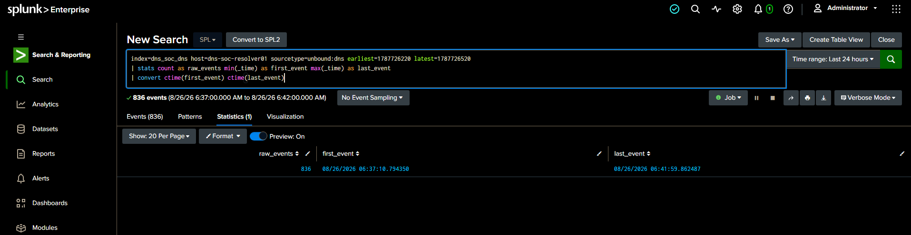

The first check returned **836 raw events**. Because Unbound recorded query and reply events, that count was not copied directly into the incident metrics. IR narrowed the evidence to `event_type="reply"` and rebuilt the core numbers.

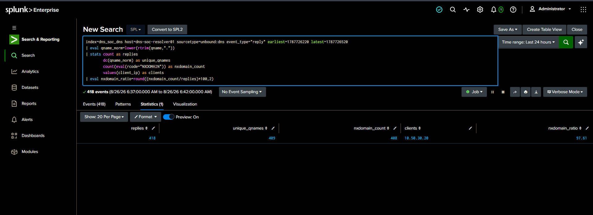

Independent IR result:

```text
418 DNS replies
409 unique qnames
408 NXDOMAIN replies
97.61% NXDOMAIN
client: 10.50.30.20
```

This matched the SOC handoff exactly.

---

## 2. Verify that the behavior persisted across the reported timeline

IR then rebuilt the one-minute windows.

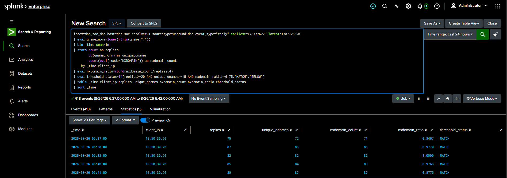

Five consecutive minutes from `06:37` through `06:41 UTC` independently met the frozen Detection v1.0 conditions.

That matters because a five-minute total can hide one short spike. The one-minute view showed sustained abnormal behavior across the entire latest cluster.

---

## 3. Inspect the actual names

Counts alone do not establish DGA-like structure. IR pulled raw NXDOMAIN qnames and calculated the first-label view.

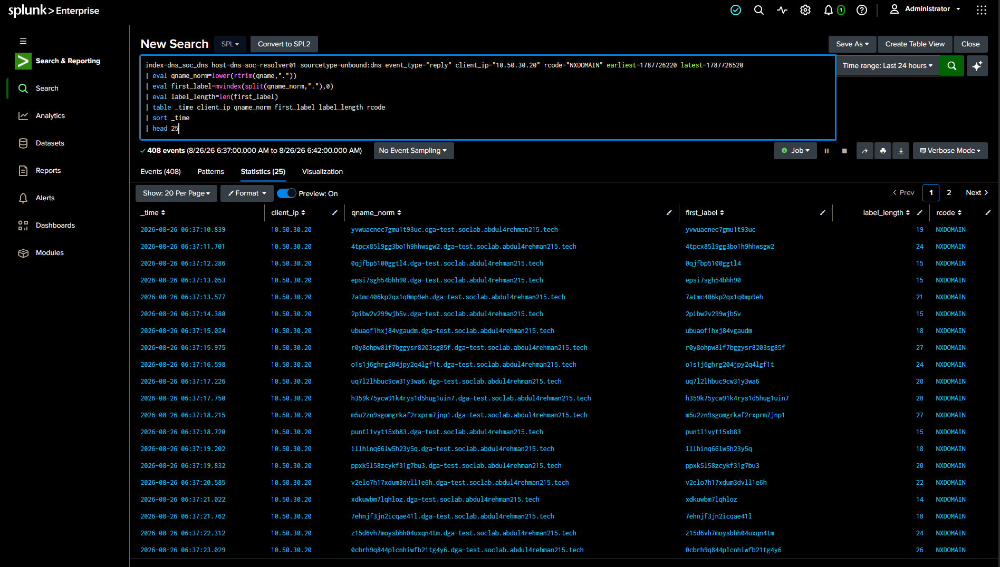

The evidence showed long, changing alphanumeric labels beneath:

```text
*.dga-test.soclab.abdul4rehman215.tech
```

That independently supported the generated-looking description. It still did not prove malware or intent.

---

## 4. Confirm resolver-visible scope

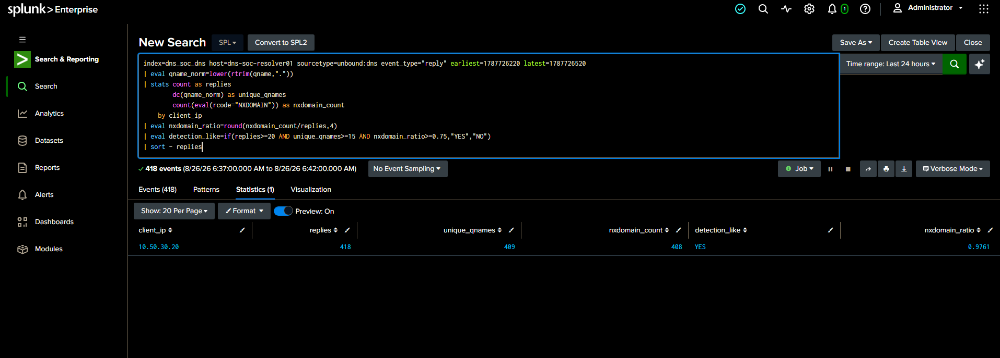

The latest five-minute cluster was associated with one resolver-visible client:

```text
10.50.30.20
```

IR preserved the same attribution boundary as SOC: this identifies the client seen by Unbound, not the initiating process or user.

---

## 5. Check what resolved and whether process attribution was available

IR reviewed non-NXDOMAIN replies from the same period.

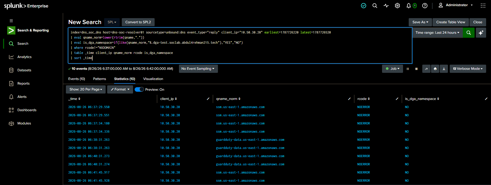

The successful replies were normal-looking AWS service names. No generated-looking Scenario 02 qname was observed successfully resolving in the investigated cluster.

IR then checked whether defender telemetry contained endpoint/process evidence suitable for linking the DNS to a process.

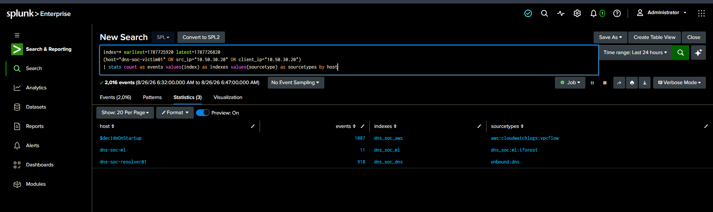

Useful process-to-DNS attribution was not available. IR therefore kept the following unknown:

```text
originating process/application
```

That prevented the DNS evidence from being overstated.

---

## 6. Establish recurrence and current state

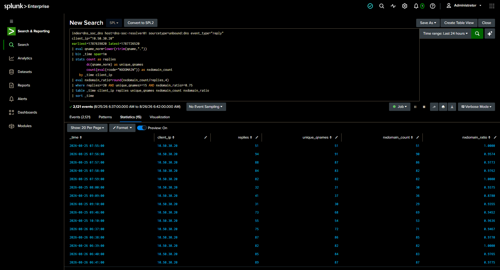

IR independently confirmed that matching DGA-like/high-NXDOMAIN behavior had occurred in earlier historical windows as well.

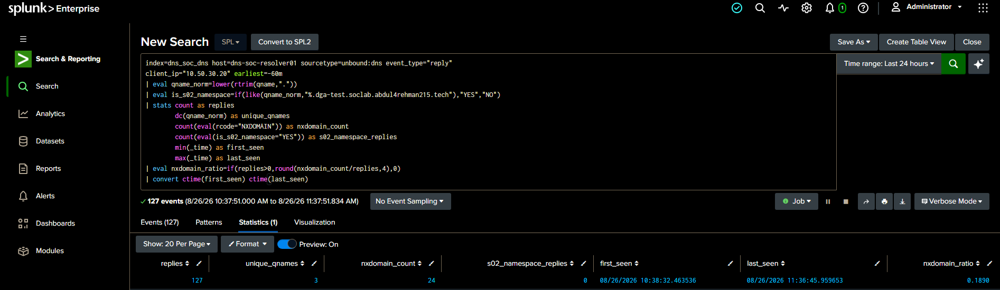

At the time of IR response review, the Scenario 02 generated namespace was not actively producing the same latest-hour pattern. This did not erase the recurrent evidence; it informed the proportional response decision.

---

## 7. Lock the IR classification before containment

IR could responsibly state:

> **Confirmed recurrent abnormal DGA-like / high-NXDOMAIN DNS behavior.**

IR could **not** responsibly state:

```text
malware identity:          unproven
endpoint compromise:       unproven
process identity:          unknown
user identity:             unknown
malicious intent:          unproven
authorization explanation: not established by defender telemetry
```

This is the decision point that separated incident response from automatic blocking.

---

## 8. Choose a proportionate control and obtain human approval

The response targeted the observed namespace rather than blocking the entire victim:

```text
*.dga-test.soclab.abdul4rehman215.tech
        →
10.50.30.30
```

The policy was applied only after explicit human approval from Abdul-Rehman.

The exact separate wall-clock approval timestamp was not preserved in command/Splunk evidence, so the repository does not invent one.

---

## 9. Preserve the before-state

A qname already observed in defender DNS telemetry was chosen as a reproducible control:

```text
ywvuacnec7gmul193uc.dga-test.soclab.abdul4rehman215.tech
```

Before any RPZ change:

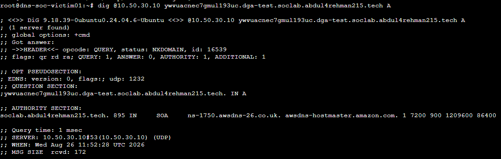

The resolver returned:

```text
NXDOMAIN
```

That image is the baseline against which the response was measured.

---

## 10. Stage the existing RPZ control

IR first confirmed the documented safe/non-enforcing state.

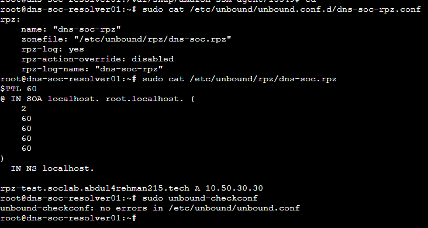

The Scenario 02 wildcard was then staged.

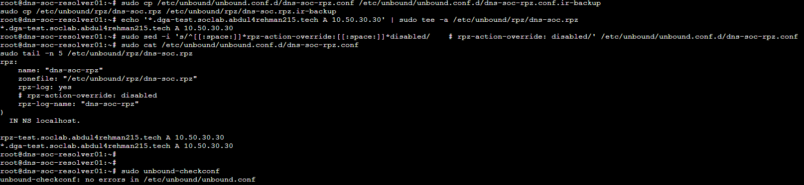

### Reusable troubleshooting lesson — a backup file was still live configuration

The first enforcement attempt looked correct in the primary file, but Unbound runtime logs still reported `rpz-disabled`.

The root cause was not the wildcard. A file named like a backup remained inside:

```text
/etc/unbound/unbound.conf.d/
```

That directory is actively included by Unbound, so the `.ir-backup` file still carried an active:

```text
rpz-action-override: disabled
```

The backup was moved outside the active include directory, Unbound was restarted, and the runtime state was re-checked.

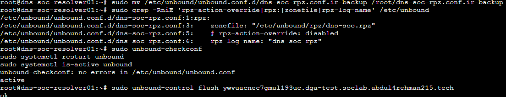

The reusable lesson is simple:

> **A backup stored inside an active include directory may still be production configuration. Runtime logs matter more than what one file appears to say.**

---

## 11. Prove the same qname is redirected

IR repeated the original DNS test after approved enforcement.

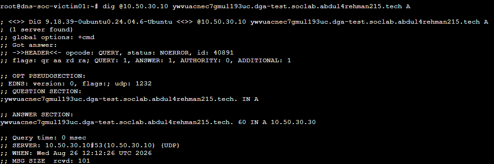

The exact same qname now returned:

```text
NOERROR
A 10.50.30.30
```

This is the strongest direct DNS containment proof in the scenario because the tested name did not change—only the resolver policy did.

---

## 12. Verify the sinkhole itself

A DNS redirect is incomplete if the destination service is unavailable.

IR confirmed the sinkhole host and service state.

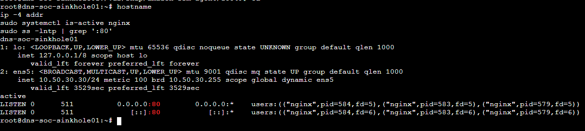

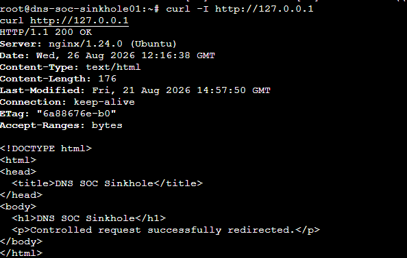

Then the victim reached the sinkhole end to end and received HTTP `200`.

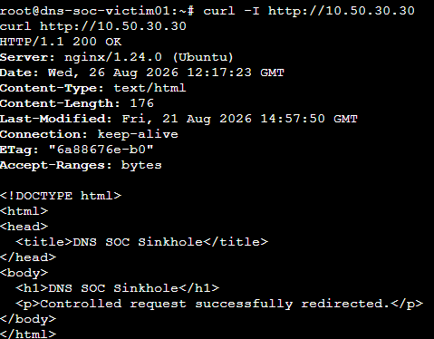

This closed the path:

```text
victim DNS
→ Unbound RPZ
→ 10.50.30.30
→ Nginx sinkhole
→ HTTP 200
```

---

## 13. Prove unrelated DNS was not broken

A defensive control is not successful if it disrupts unrelated name resolution.

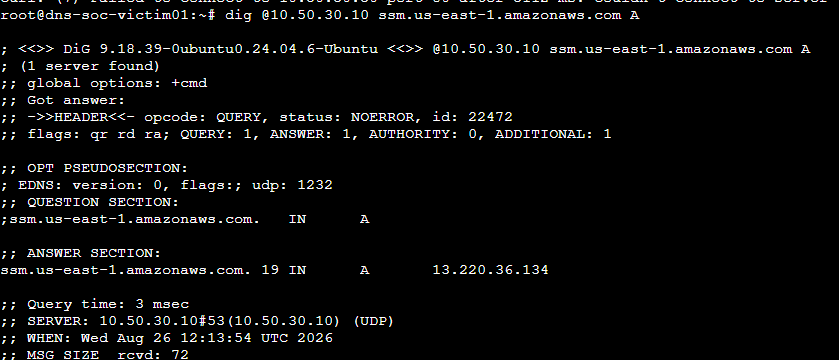

Normal AWS DNS continued resolving correctly while the Scenario 02 namespace was redirected.

---

## 14. Preserve Splunk before/after evidence

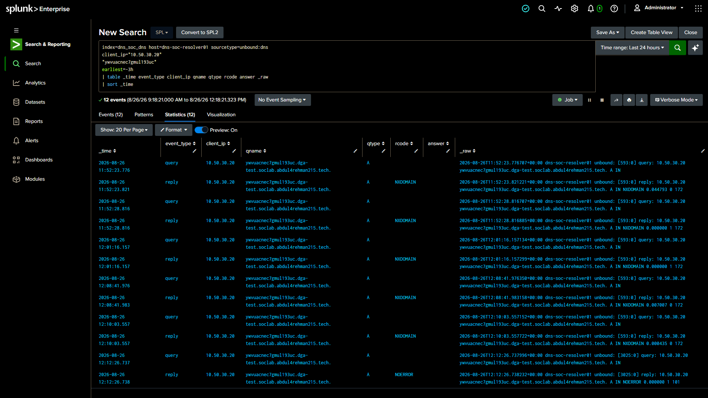

Resolver telemetry showed the selected qname changing from:

```text
NXDOMAIN
→
NOERROR
```

That confirmed the network behavior change in the same telemetry source used by SOC and IR.

---

## 15. Reset the resolver safely

Containment was temporary. After evidence was preserved, IR restored the documented safe/non-enforcing RPZ state.

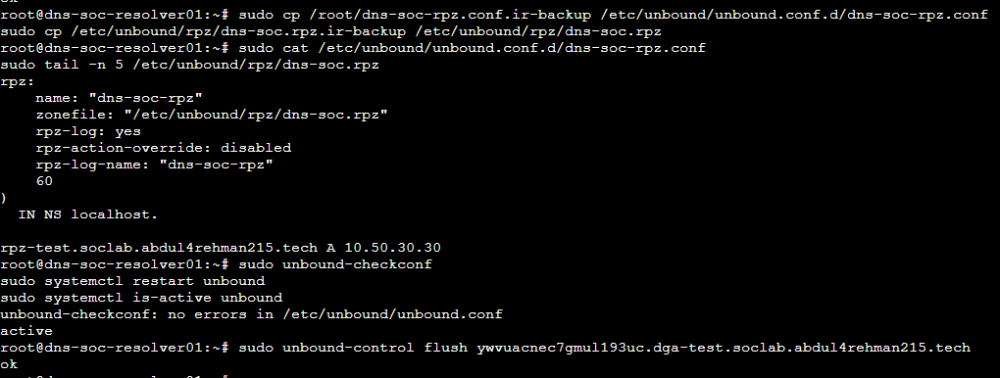

The same test qname returned to `NXDOMAIN`.

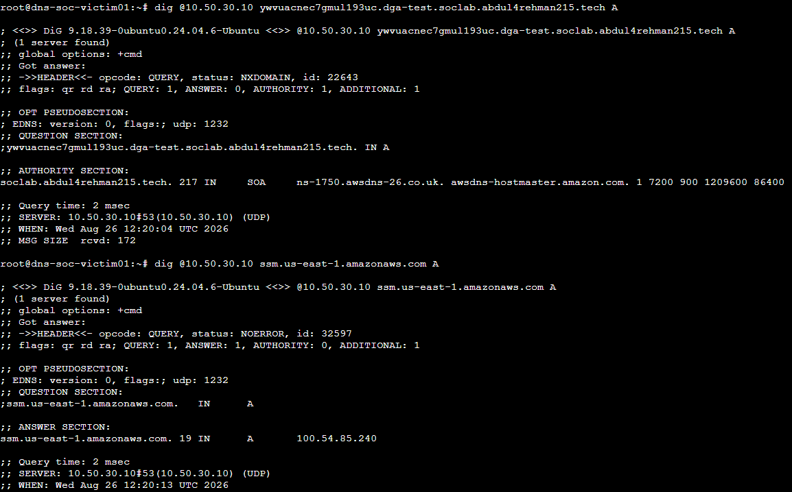

Normal AWS DNS remained healthy.

The reset completed the response lifecycle.

---

## 16. Final IR status

> ## **CLOSED — controlled containment validated and safe reset completed.**

### What IR confirmed

- recurrent abnormal DGA-like/high-NXDOMAIN DNS behavior;
- exact resolver-visible scope for the latest cluster;
- before/after RPZ behavior;
- sinkhole reachability;
- unrelated DNS safety;
- Splunk-visible response change;
- safe restoration.

### What remained unproven

- process identity;
- malware identity;
- endpoint compromise;
- user identity;
- malicious intent;
- authorization/business explanation.

---

## IR reflection

The most valuable part of this phase was not editing an RPZ file. It was proving each boundary in order:

```text
SOC claim
→ independent evidence
→ scoped classification
→ human approval
→ pre-change proof
→ technical action
→ post-change proof
→ safety check
→ reset
```

That sequence turns a containment command into an auditable incident-response decision.

---

## Reproducibility

- [IR final report](IR-FINAL-REPORT.md)
- [IR command ledger](IR-COMMAND-LEDGER.md)
- [Lessons learned](LESSONS-LEARNED.md)
- [IR SPL](spl/)
- [IR shell commands](shell/)
- [Curated evidence](evidence/)

---

<div align="center">

[🏠 Scenario Home](../README.md) · [📁 IR](README.md) · [⬆ Back to top](#top)

</div>
