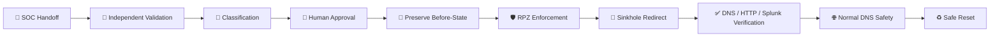

[🏠 Scenario Home](../README.md) · [🔎 SOC](../soc/README.md) · [🚦 Detection](../detection-engineering/README.md) · [📊 Dashboard](../dashboard/README.md) · [🤖 AI](../ai/README.md) · [🧾 Evidence](evidence/README.md)

# 🛡️ Incident Response / Defender Workspace — Scenario 02

**Incident Responder / Defender:** [_Abdul-Rehman_](https://github.com/abdul4rehman215)  
**Final IR status:** **CLOSED — controlled containment validated and safe reset completed**

This folder preserves the completed Incident Response phase that began from Sonia's formal SOC handoff. IR independently reproduced the critical DNS evidence before deciding whether the prepared RPZ/sinkhole response was justified.

## 🎯 Response Snapshot

| Field | IR record |
|---|---|
| **Input** | Sonia's evidence-backed SOC handoff |
| **Independent metrics** | `418` replies · `409` unique qnames · `408` NXDOMAIN · `97.61%` |
| **Resolver-visible client** | `10.50.30.20` |
| **Containment scope** | Narrow Scenario 02 namespace control |
| **Control** | Unbound RPZ |
| **Sinkhole** | `10.50.30.30` |
| **Verification** | DNS redirect + HTTP 200 + unrelated DNS safety + Splunk before/after |
| **Reset** | Safe RPZ state restored; same qname returned to NXDOMAIN |
| **Final status** | **CLOSED** |

## 🧭 Response Lifecycle

## 📚 Start Here

| Artifact | Purpose |
|---|---|
| [`INCIDENT-RESPONSE.md`](INCIDENT-RESPONSE.md) | Flagship end-to-end IR story |
| [`IR-FINAL-REPORT.md`](IR-FINAL-REPORT.md) | Concise final incident report |
| [`IR-COMMAND-LEDGER.md`](IR-COMMAND-LEDGER.md) | Exact investigation and response command ledger |
| [`LESSONS-LEARNED.md`](LESSONS-LEARNED.md) | Reusable operational lessons |
| [`AI-AND-AUTOMATION-NOTE.md`](AI-AND-AUTOMATION-NOTE.md) | Automation and authority boundary |
| [`spl/README.md`](spl/README.md) | IR Splunk validation sequence |
| [`shell/README.md`](shell/README.md) | Resolver / RPZ / sinkhole / reset command sequence |
| [`evidence/README.md`](evidence/README.md) | Curated E01–E21 response evidence |

## 🧾 Evidence Highlights

<table>
<tr>
<td width="33%"> <b>E10 · Before:</b> same qname returned NXDOMAIN before containment.</td>
<td width="33%"> <b>E14 · Redirect:</b> approved RPZ changed the answer to <code>10.50.30.30</code>.</td>
<td width="33%"> <b>E17 · Reachability:</b> victim-to-sinkhole HTTP path returned 200.</td>
</tr>
<tr>
<td width="33%"> <b>E18 · Safety:</b> unrelated DNS continued to work.</td>
<td width="33%"> <b>E19 · Telemetry:</b> Splunk preserved the NXDOMAIN → NOERROR transition.</td>
<td width="33%"> <b>E21 · Reset:</b> safe-state restoration returned the qname to NXDOMAIN.</td>
</tr>
</table>

## ⚖️ Response Boundary

IR confirmed recurrent abnormal DGA-like/high-NXDOMAIN behavior and a defensible narrow containment target. It did **not** claim malware, process identity, endpoint compromise, user identity, intent, or authorization when those facts were absent from defender telemetry.

**Validate independently. Contain narrowly. Verify technically. Reset safely.**

[🏠 Scenario Home](../README.md) · [📖 Flagship IR Story](INCIDENT-RESPONSE.md) · [🔎 IR SPL](spl/README.md) · [🧰 IR Shell](shell/README.md) · [⬆ Back to top](#top)

