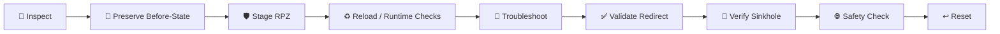

[🏠 Scenario Home](../../README.md) · [🛡️ IR Workspace](../README.md) · [📖 Incident Response](../INCIDENT-RESPONSE.md) · [🔎 IR SPL](../spl/README.md)

# 🧰 IR Shell & RPZ Command Map

This folder preserves the exact defensive shell workflow used to inspect resolver state, stage the approved Scenario 02 RPZ control, validate the sinkhole path, troubleshoot one reusable configuration issue, and return the resolver to its safe state.

## 🧭 Command Flow

## 📋 Command Index

| File | Purpose |
|---|---|
| [`01_pre_containment_and_rpz_inspection.sh`](01_pre_containment_and_rpz_inspection.sh) | Inspect resolver / RPZ state and preserve pre-containment conditions |
| [`02_stage_scenario02_rpz.sh`](02_stage_scenario02_rpz.sh) | Stage the narrow Scenario 02 RPZ rule |
| [`03_reload_and_runtime_checks.sh`](03_reload_and_runtime_checks.sh) | Reload and verify runtime state |
| [`04_fix_backup_loaded_as_config.sh`](04_fix_backup_loaded_as_config.sh) | Preserve the reusable backup-file configuration troubleshooting fix |
| [`05_post_containment_validation.sh`](05_post_containment_validation.sh) | Validate post-containment DNS behavior |
| [`06_sinkhole_health_checks.sh`](06_sinkhole_health_checks.sh) | Verify sinkhole service and HTTP path |
| [`07_reset_rpz_to_safe_state.sh`](07_reset_rpz_to_safe_state.sh) | Restore the resolver's safe RPZ state |
| [`08_troubleshooting_commands_used.sh`](08_troubleshooting_commands_used.sh) | Preserve supplementary troubleshooting commands used during IR |

> [!IMPORTANT]
> These files document a **human-approved defensive response** in the project-owned lab. They are preserved for reproducibility; the command ledger and Incident Response narrative remain the authoritative decision record.

[🛡️ IR Workspace](../README.md) · [📖 Command Ledger](../IR-COMMAND-LEDGER.md) · [⬆ Back to top](#top)

