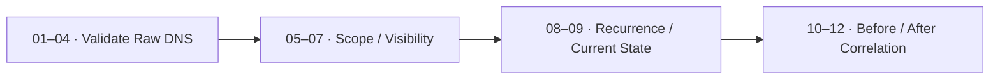

[🏠 Scenario Home](../../README.md) · [🛡️ IR Workspace](../README.md) · [📖 Incident Response](../INCIDENT-RESPONSE.md) · [🧾 Evidence](../evidence/README.md)

# 🔎 IR SPL Validation Map

This folder preserves the exact Splunk searches used by IR to reproduce the SOC handoff independently and to preserve current-state / before-after evidence around containment.

## 🧭 Query Flow

## 📋 Query Index

| Stage | Files | Purpose |
|---|---|---|
| 🔎 Independent validation | [`01_raw_dns_window_presence.spl`](01_raw_dns_window_presence.spl) → [`04_raw_qname_examples.spl`](04_raw_qname_examples.spl) | Reproduce raw events, core metrics, one-minute windows and qname structure |
| 🎯 Scope / attribution boundary | [`05_client_scope.spl`](05_client_scope.spl) → [`07_endpoint_telemetry_availability.spl`](07_endpoint_telemetry_availability.spl) | Confirm resolver-visible client scope and what endpoint telemetry was / was not available |
| 🕒 Recurrence / current state | [`08_historical_recurrence.spl`](08_historical_recurrence.spl), [`09_current_activity_check.spl`](09_current_activity_check.spl) | Establish recurrence and whether activity was still present |
| 🛡️ Before / after | [`10_before_after_exact_qname_attempt.spl`](10_before_after_exact_qname_attempt.spl) → [`12_namespace_broad_fallback.spl`](12_namespace_broad_fallback.spl) | Preserve containment-state comparison in Splunk |

[🛡️ IR Workspace](../README.md) · [🧰 IR Shell](../shell/README.md) · [⬆ Back to top](#top)

