<a id="top"></a>


<div align="center">


**Implementation owner:** [Musfira Zafar](https://github.com/MUSFIRA-ZAFAR)  
**Scenario role:** Project Lead / Adversary Operator + ML Implementation

[🏠 Scenario Home](../README.md) · [🧠 ML Workspace](README.md) · [🧾 Validation Record](../evidence/ml-engineering-validation.md)

</div>

---

# Scenario 02 Machine Learning Engineering

This was Musfira's first end-to-end hands-on ML implementation. The work did not begin with a model or a prepared CSV. It began with a harder engineering question:

> **Can the project learn the shape of normal DNS behavior from its own resolver evidence, then identify controlled DGA-style behavior as unusual and return that result to the SOC platform?**

The final implementation answered that question with a complete path from the victim's DNS activity to an Isolation Forest result searchable in Splunk.

The story is not “command → screenshot → command.” It is:

```text
question
  → prove the data path
  → protect access
  → establish normal behavior
  → engineer features
  → train
  → challenge with controlled DGA
  → score
  → return results
  → validate
  → record limits
```

---

## 1. Start with the data, not the model

Scenario 02 already had a real defender-controlled DNS path:

```text
dns-soc-victim01 / 10.50.30.20
        |
        | DNS
        v
dns-soc-resolver01 / 10.50.30.10
        | Unbound
        v
Splunk / index=dns_soc_dns
```

Before ML work started, normal DNS and NXDOMAIN behavior were already reaching Splunk from the team-controlled Unbound resolver.

That mattered because the model would be only as trustworthy as the data feeding it. The implementation therefore used the existing resolver evidence instead of generating fake ML rows directly inside Splunk or training from an unrelated Internet dataset.

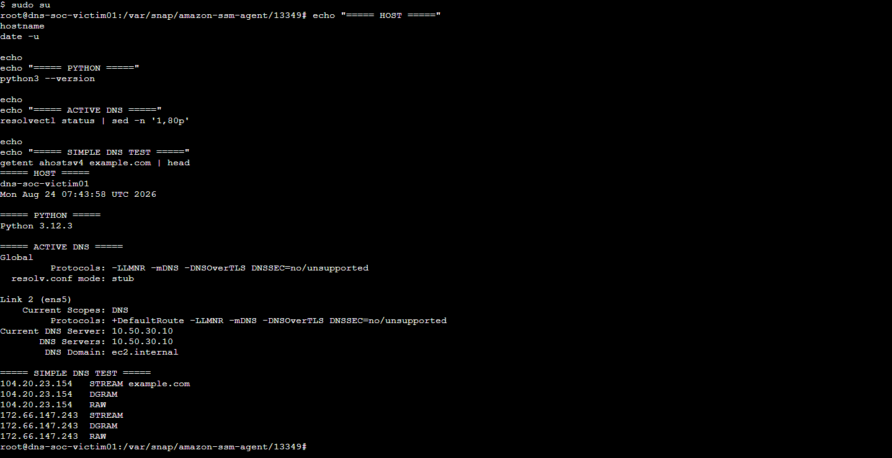

*The victim remained on the real lab DNS path through `10.50.30.10` before controlled baseline generation began.*

### Engineering decision

The ML dataset was derived from resolver events that had the required DNS fields available, including:

```text
client_ip
qname
qtype
rcode
```

This also avoided treating both query-side and reply-side log lines as two independent DNS transactions when reply context was required.

---

## 2. Keep ML separate from the LLM

The existing shared AI bridge and the new ML component solve different problems.

```text
Machine Learning
= scores whether DNS behavior looks unusual

Shared LLM
= later explains a stable alert to a human analyst
```

The new component was added as a third private Docker service on the existing Splunk host:

```text
dns-soc-splunk01
    |
    +-- dns-soc-splunk
    +-- dns-soc-ai-bridge
    +-- dns-soc-ml
```

No new EC2 was created. The ML service publishes no public API and no host ML port.

This keeps the architecture small while preserving a clear trust boundary.

---

## 3. Build a private read path and a separate write path

The model needed two different capabilities:

1. read resolver evidence from Splunk;
2. write model results back to Splunk.

Those were deliberately separated.

```text
READ PATH

dns-soc-ml
   |
   | restricted REST token
   v
Splunk :8089
   |
   v
index=dns_soc_dns

WRITE PATH

dns-soc-ml
   |
   | separate HEC token
   v
Splunk :8088
   |
   v
index=dns_soc_ml
```

The REST reader was scoped to the DNS data needed by the model instead of using the main Splunk administrator identity.

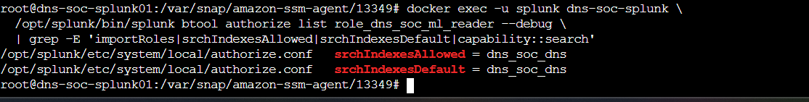

*The dedicated ML reader was created around the resolver dataset rather than broad administrative access.*

The write-back path used its own HEC input for the ML result index.

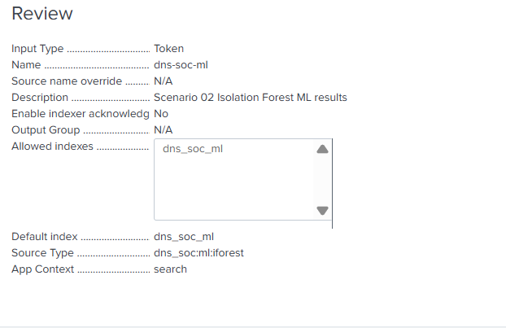

*The HEC destination was separated into `dns_soc_ml` with the ML-specific sourcetype.*

A small test event was written before the model path relied on HEC.

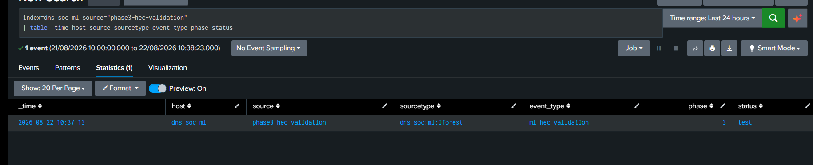

*The result index was proven independently before model scoring was connected to it.*

### Internal TLS note

The implemented v1 Python scripts communicate with Splunk over HTTPS inside the private `dns-soc-internal` Docker network. The current Splunk internal certificate is self-signed, so the working lab scripts use `verify=False` and suppress the resulting request warning.

That is documented as a **lab implementation limitation**, not a production recommendation. A hardened deployment should trust the Splunk CA/certificate and enable normal certificate verification rather than carrying `verify=False` forward.

### Security lesson

**A model service does not need administrator credentials just because it talks to the SIEM. Read and write privileges should be separated by purpose.**

Real token values are not present in this repository.

---

## 4. Establish known-benign DNS ground truth

Isolation Forest was used as an anomaly detector. That means the most important training material was not DGA traffic. It was normal traffic.

Musfira created two controlled benign DNS periods from the victim. The generator mixed:

- common resolvable names;
- `A` and `AAAA` queries;
- ordinary pauses;
- repeated and unique names;
- a small amount of deliberate benign NXDOMAIN behavior.

That last point was important. A baseline containing no benign DNS failures could accidentally teach the project that every NXDOMAIN event was suspicious.

### Benign run 1

```text
2026-08-24 07:46:46 UTC
        ↓
2026-08-24 08:01:49 UTC
```

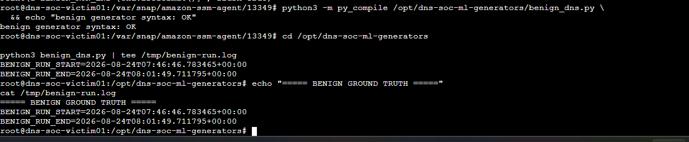

### Benign run 2

```text
2026-08-24 08:16:22 UTC
        ↓
2026-08-24 08:31:28 UTC
```

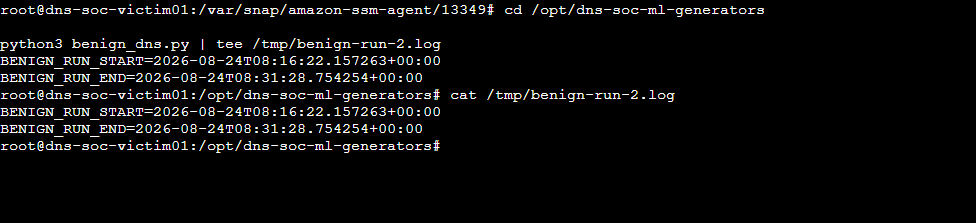

The exact UTC boundaries became reproducible ground truth for the later SPL searches and trainer.

Splunk was then checked to confirm that those runs actually reached the resolver dataset before feature engineering continued.

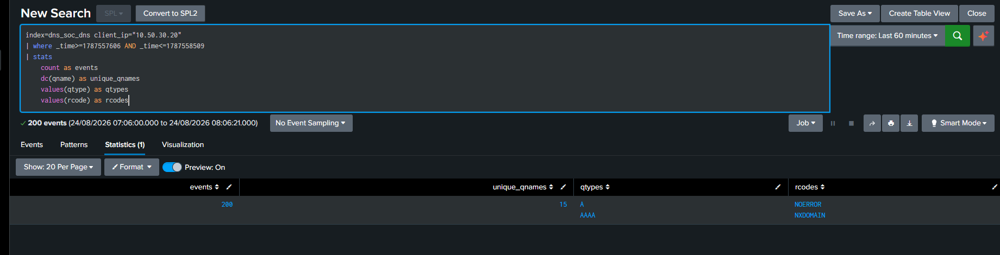

*The model was not trained merely because the generator finished; the resulting DNS evidence was first validated in Splunk.*

---

## 5. Convert raw DNS events into behavior windows

The model does not make a decision from one DNS name.

Its unit of analysis is:

> **one client during one minute of DNS behavior**

The real DNS events were aggregated in Splunk into one-minute feature rows.

The implemented v1 features are:

| Feature | What it represents |
|---|---|
| `query_count` | DNS transactions represented in the window |
| `unique_qnames` | distinct requested names |
| `nxdomain_count` | NXDOMAIN replies |
| `nxdomain_ratio` | NXDOMAIN share of the window |
| `avg_qname_length` | average full qname length |
| `max_qname_length` | longest full qname |
| `unique_tlds` | distinct final DNS labels counted by the implementation |
| `a_count` | A-query count |
| `aaaa_count` | AAAA-query count |

The original planning stage considered more features such as entropy and interarrival time. The implemented v1 was deliberately smaller and directly explainable. The repository records what actually ran rather than presenting planned features as finished work.

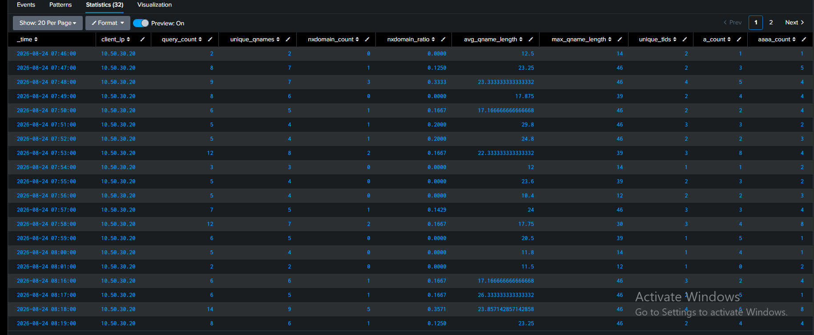

*The two benign periods produced 32 one-minute rows used by the training script.*

### Why SPL was useful here

Much of the feature shaping happened in Splunk before Python saw the data:

```text
raw resolver logs
      ↓
Splunk field extraction
      ↓
1-minute aggregation / feature rows
      ↓
Python / scikit-learn
```

That keeps the features easy to inspect and compare with the original DNS evidence.

---

## 6. Freeze the Python runtime before training

The ML service used a small pinned Python environment:

```text
Python 3.12 base image
requests==2.34.2
scikit-learn==1.9.0
joblib==1.5.3
```

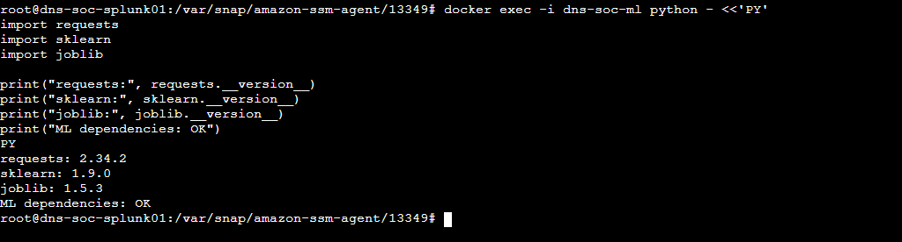

*The runtime versions were checked inside the ML container before declaring the model reproducible.*

The v1 implementation does not require a notebook, Flask API or deep-learning framework.

---

## 7. Train Isolation Forest on normal behavior

The trainer pulled the same feature rows through the restricted Splunk REST path and kept their order fixed.

The 32 benign rows were split temporally:

```text
first 24 rows  -> training
last 8 rows    -> held-out benign check
```

The fitted model used:

```python
IsolationForest(
    n_estimators=200,
    contamination=0.10,
    random_state=42,
)
```

Observed training output:

```text
feature_rows=32
training_rows=24
holdout_rows=8
train_anomalies=3
holdout_anomalies=2
model_path=/app/dns_iforest_v1.joblib
Isolation Forest training: OK
```

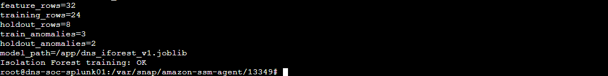

### What the benign anomalies mean

The presence of anomalous benign windows is not hidden.

It teaches the most important operational boundary:

```text
ANOMALY
!=
MALICIOUS
```

Anomaly detection tells the analyst that a behavior window differs from the learned baseline. It does not prove compromise.

---

## 8. Preserve the runtime model without turning it into a repository secret

The successful trainer generated:

```text
/app/dns_iforest_v1.joblib
```

The binary artifact is intentionally **not** committed to GitHub.

The repository keeps the trainer, pinned dependencies and exact training windows so the model can be reproduced from trusted lab data. See [`artifacts/README.md`](artifacts/README.md).

This is safer and more transparent than publishing an opaque serialized Python object.

---

## 9. Challenge the baseline with controlled DGA behavior

After normal training was complete, a separate five-minute controlled DGA run was generated from the victim.

Safety boundary:

- no malware was executed;
- no external victim was targeted;
- generated names stayed under the owned lab namespace;
- names were deliberately nonexistent so the real resolver path produced NXDOMAIN evidence.

Pattern:

```text
<random-label>.dga-test.soclab.abdul4rehman215.tech
```

Ground-truth period:

```text
2026-08-24 08:54:28 UTC
        ↓
2026-08-24 08:59:28 UTC
```

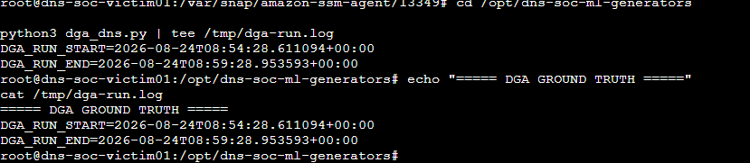

This was **ML engineering ground truth**, not the later official information-separated Scenario 02 adversary exercise.

---

## 10. Observe the feature shift before asking the model

The controlled DGA period produced six one-minute feature windows.

The feature rows showed the intended behavior clearly:

- high query volume;
- almost one unique qname per query;
- NXDOMAIN ratio around `0.976–1.000`;
- much longer average qnames, around `58–60` characters in the observed windows.

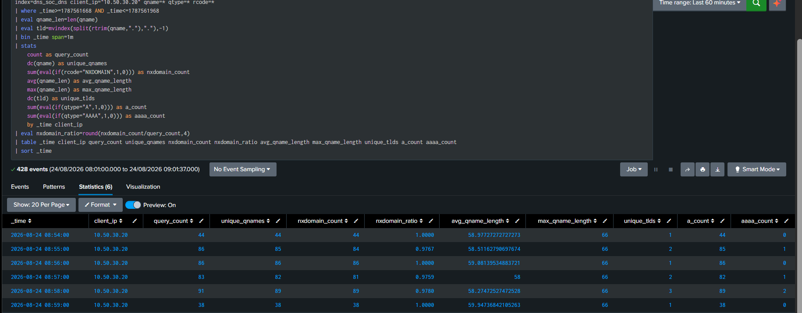

This is important because the model result is not presented as magic. The underlying DNS behavior already explains why these windows differ from the benign baseline.

### Simple comparison

| Behavior | Controlled benign | Controlled DGA |
|---|---|---|
| Query rate | moderate / paced | much faster |
| Unique names | repeated + varied | nearly every generated name unique |
| NXDOMAIN | small deliberate amount | almost all replies |
| Name length | ordinary domains | long generated labels / qnames |
| Pattern | normal user-like mix | repeated generated-domain behavior |

---

## 11. Score the DGA windows

The trained model was reloaded and the six DGA feature rows were scored.

Observed result:

```text
score_rows=6
anomalies=6/6
DGA scoring: OK
```

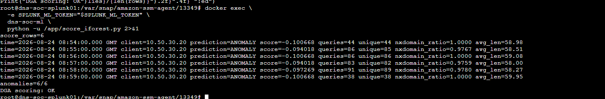

All six controlled DGA windows were classified as `ANOMALY` in this lab evaluation.

That is a strong validation result for the controlled test, but it is deliberately **not** described as “100% production detection accuracy.” The evaluation set is small and lab-specific.

---

## 12. Understand the score before using it in a dashboard

The current field named `anomaly_score` preserves the value returned by scikit-learn's `decision_function()`.

In the controlled DGA output, anomalous windows had negative values.

Therefore the v1 documentation does **not** claim:

```text
higher anomaly_score = more suspicious
```

A later Detection Engineering/dashboard phase can create a separate normalized analyst-facing score if that improves investigation. The original model output remains available for transparency.

---

## 13. Close the loop by writing ML results back to Splunk

A security model is much less useful if its result exists only in a terminal.

The final scoring script therefore created structured events and sent them through the dedicated HEC path:

```text
dns-soc-ml
     |
     | HEC :8088
     v
index=dns_soc_ml
sourcetype=dns_soc:ml:iforest
```

Each event contains the behavior evidence with the model result, including:

```text
event_type
model
scenario
client_ip
window_time
prediction
prediction_value
anomaly_score
query_count
unique_qnames
nxdomain_count
nxdomain_ratio
avg_qname_length
max_qname_length
unique_tlds
a_count
aaaa_count
```

The write-back returned HTTP 200 for every scored window.

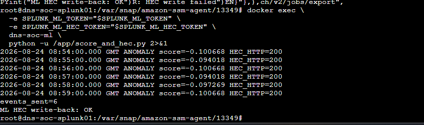

Observed result:

```text
events_sent=6
ML HEC write-back: OK
```

---

## 14. Validate the model result where the analyst will use it

The final acceptance check happened in Splunk, not only in Python.

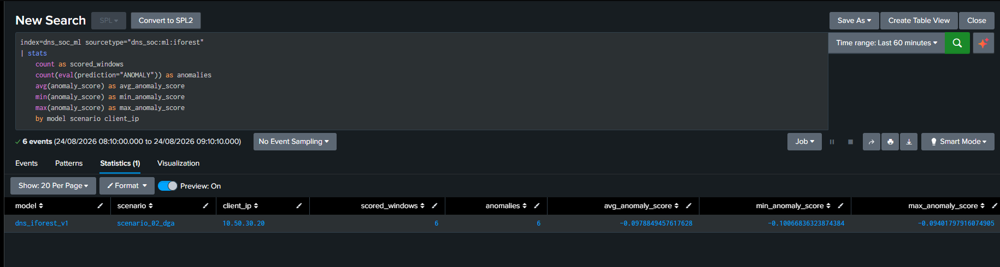

The indexed result confirmed:

```text
model          = dns_iforest_v1
scenario       = scenario_02_dga
scored_windows = 6
anomalies      = 6
```

The complete loop was therefore:

```text
victim DNS activity
      ↓
Unbound resolver evidence
      ↓
Splunk dns_soc_dns
      ↓
restricted REST read
      ↓
1-minute feature engineering
      ↓
Isolation Forest
      ↓
structured ML result
      ↓
HEC
      ↓
Splunk dns_soc_ml
```

---

## 15. Troubleshooting case study 1 — token creation exposed a shared platform failure

The first major ML blocker appeared while creating the restricted REST token.

### Symptom

Splunk token creation failed because KV Store was not ready.

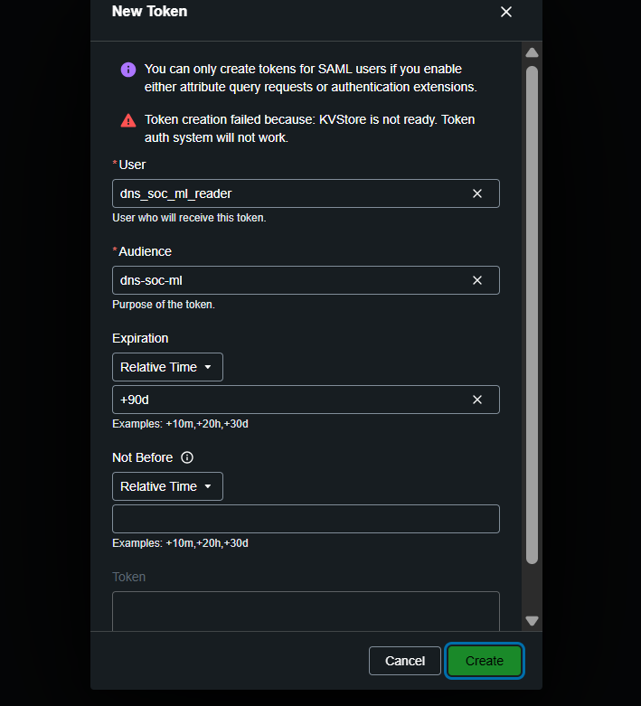

### Investigation

The problem was traced below the ML code. Splunk showed repeated KV Store/Mongo connection failures against `127.0.0.1:8191`.

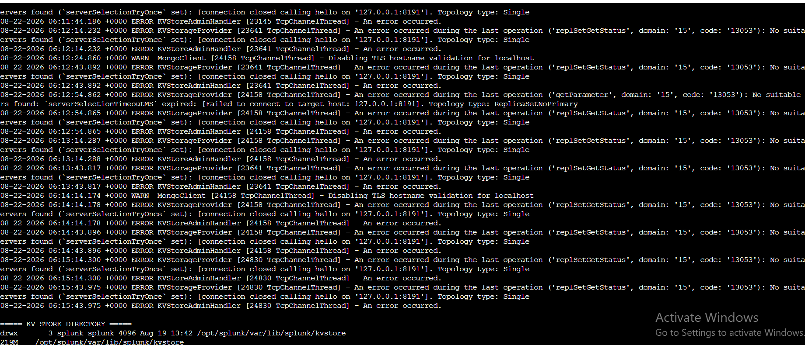

The engineering process then recovered the shared Splunk platform through a controlled kernel compatibility path. The important repository lesson is not every boot command; it is the diagnostic discipline:

```text
ML credential task fails
      ↓
prove shared Splunk dependency
      ↓
identify KV Store / Mongo failure
      ↓
recover platform safely
      ↓
return to ML work
```

### Engineering lesson

**Do not rewrite application code when the shared platform dependency is unhealthy. Trace the failure to the lowest proven layer first.**

The shared Infrastructure repository keeps the platform-level state; this scenario document records only the ML impact and reusable lesson.

---

## 16. Troubleshooting case study 2 — validate Compose before changing the running stack

Adding `dns-soc-ml` initially produced a Compose YAML parser error.

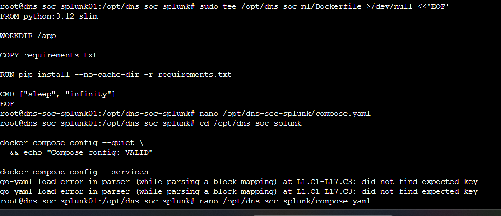

Instead of applying a broken service definition to the live Splunk stack, the Compose file was corrected and validated first.

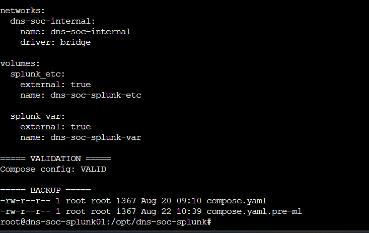

### Engineering lesson

**`docker compose config` is a change-control gate, not an optional cosmetic check.**

The working Splunk volumes and existing AI bridge were preserved while ML was added as another service.

---

## 17. Troubleshooting case study 3 — the REST identity could search, but could not see DNS fields

A subtler problem appeared after the restricted reader existed.

### Symptom

The REST search could reach Splunk, but the expected DNS fields were missing.

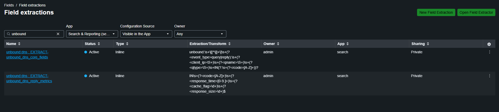

The field extractions were active in the administrative search context but were private knowledge objects.

The restricted namespace therefore returned no matching model fields.

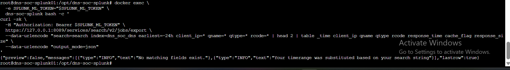

### Diagnosis and fix

The issue was not the resolver, the token transport or the model. It was knowledge-object visibility.

The required Unbound field extractions were made available to the application/search context used by the restricted ML reader.

Supporting evidence is preserved under [`../screenshots/ml/setup/`](../screenshots/ml/setup/).

### Engineering lesson

**Machine-to-machine analytics depends on the permissions of Splunk knowledge objects, not only index permissions. A service account can read events and still lack the fields an analyst sees.**

---

## 18. Evaluation — what worked and what did not

The small controlled evaluation is intentionally reported as counts rather than a marketing-style “accuracy” headline.

| Evaluation group | Windows | Classified anomalous | Classified normal |
|---|---:|---:|---:|
| Held-out benign | 8 | 2 | 6 |
| Controlled DGA | 6 | 6 | 0 |

If the controlled DGA windows are treated as positive cases and held-out benign windows as negative cases, this tiny evaluation corresponds to:

```text
true positives  = 6
false positives = 2
false negatives = 0
true negatives  = 6
```

Derived only for this small controlled set:

```text
precision = 0.75
recall    = 1.00
F1        ≈ 0.86
FPR       = 0.25
```

These values are **not production performance claims**. They show two useful facts:

1. the controlled DGA behavior separated strongly from the baseline in this run;
2. the model also flagged some benign behavior, so a human and explainable Detection Engineering remain necessary.

---

## 19. What this ML work contributes to Scenario 02

The completed Detection Engineering phase now compares two different kinds of evidence:

```text
                 dns_soc_dns
                     |
          +----------+----------+
          |                     |
          v                     v
Detection v1.0            dns_soc_ml
explainable behavior       Isolation Forest signal
          |                     |
          +----------+----------+
                     |
                     v
              SOC investigation
                     |
                     v
               human decision
```

ML gives the analyst a second opinion such as:

> **This one-minute DNS window is very different from the normal behavior used to train the model.**

The analyst still proves why by checking the client, qnames, NXDOMAIN ratio, query volume, timing and raw resolver evidence.

---

## 20. Boundaries and lessons worth carrying forward

### What the model does not prove

- It does not prove malware exists.
- It does not prove every anomalous DNS window is malicious.
- It does not replace the rule-based Detection v1.0.
- It does not replace raw resolver evidence.
- It does not replace the SOC Analyst.
- It does not authorize RPZ or sinkhole containment.
- It was trained on a small controlled lab baseline.
- It currently uses one-minute windows only.
- Its current `anomaly_score` is the raw decision-function style score, not a 0–100 threat score.

### ML engineering lessons

- Validate real telemetry before training.
- Keep the feature set small enough to explain.
- Separate training data from controlled anomaly evaluation data.
- Preserve time ranges as ground truth.
- A benign anomaly is useful evidence about model limits, not something to hide.
- Separate SIEM read and write privileges.
- Validate HEC independently before relying on it for model output.
- Splunk field-extraction permissions matter to REST consumers.
- Protect working Docker/Splunk services while adding a new component.
- Bring the result back into the analyst platform; do not leave ML isolated in a terminal.

---

## ML Engineering completion record

| Completion gate | Result |
|---|---|
| Real resolver data available in `dns_soc_dns` | ✅ Complete |
| Private Splunk REST path | ✅ Validated |
| Restricted ML reader | ✅ Validated |
| Dedicated `dns_soc_ml` HEC path | ✅ Validated |
| Controlled benign ground truth | ✅ Complete |
| 1-minute feature engineering | ✅ 32 windows |
| Temporal train/holdout split | ✅ 24 / 8 |
| Isolation Forest v1 training | ✅ Complete |
| Generated runtime model artifact | ✅ `/app/dns_iforest_v1.joblib` |
| Controlled DGA ground truth | ✅ Complete |
| DGA feature validation | ✅ 6 windows |
| DGA scoring | ✅ 6 / 6 anomalous |
| HEC model-result write-back | ✅ 6 / 6 HTTP 200 |
| Final Splunk result validation | ✅ Complete |
| Automatic containment | ✅ Not allowed / not implemented |
| Repository source-code preservation | ✅ Complete |

### Final responsibility boundary

**Scenario 02 Machine Learning Engineering is complete, and the later operational exercise is also complete.**

ML remained intentionally narrow throughout the final case: it supplied anomaly context beside Detection v1.0 and the shared AI evidence path, but it did not determine the SOC disposition or authorize containment. During the official information-separated exercise, the five latest Detection v1.0 windows had five corresponding ML `ANOMALY` windows; Sonia validated them against raw DNS, and IR independently completed the human-approved response and verification cycle.

---

<div align="center">

[🏠 Scenario Home](../README.md) · [🧠 ML Workspace](README.md) · [🧾 Validation Record](../evidence/ml-engineering-validation.md) · [🖼️ ML Screenshots](../screenshots/ml/) · [⬆ Back to top](#top)

<sub>DNSentinel Lab · Evidence-first DNS security engineering</sub>

</div>


---

## 21. Operational closeout — fresh minute scoring

The validated historical scorer originally used a fixed engineering time range. The model and feature schema were left unchanged, while a separate live wrapper was added to score the previous completed DNS minute automatically.

The closeout work also isolated four operational issues: persistent root-only credentials, the systemd writable state directory, Splunk `_time` string conversion to a numeric `window_epoch`, and a one-character `event` variable typo. After those boundaries were corrected, fresh current-time results were written successfully to `dns_soc_ml` with `HEC_HTTP=200`.

A benign validation still produced `ANOMALY` results in some windows. Rather than tuning that away, the team preserved it as evidence of the model's intended limitation: unusual does not automatically mean malicious.

See [`operations/README.md`](operations/README.md).
