[🏠 Scenario Home](../README.md) · [🚦 Detection](../detection-engineering/README.md) · [📊 Dashboard](../dashboard/README.md) · [🧠 ML](../ml/README.md) · [🤖 AI](../ai/README.md) · [🛡️ IR](../ir/README.md) · [🧾 Evidence](evidence/README.md)

# 🔎 SOC Analyst Workspace — Scenario 02

**SOC Analyst:** [_Sonia_](https://github.com/sonia11mansha415)  
**Scenario:** DGA + High NXDOMAIN  
**Final disposition:** **INCONCLUSIVE — escalation warranted**

This folder preserves the completed defender-side investigation. Sonia received defender telemetry rather than operator ground truth and worked from the frozen production detection back into raw resolver evidence before using ML or AI.

## 🎯 Case Snapshot

| Field | Defender record |
|---|---|
| **Resolver-visible client** | `10.50.30.20` |
| **Latest cluster** | `2026-08-26 06:37–06:41 UTC` |
| **DNS replies** | `418` |
| **Unique qnames** | `409` |
| **NXDOMAIN replies** | `408` |
| **NXDOMAIN ratio** | `97.61%` |
| **ML context** | Five corresponding `ANOMALY` windows |
| **SOC conclusion** | **INCONCLUSIVE — escalation warranted** |

> [!IMPORTANT]
> The DNS behavior was strongly abnormal, but defender telemetry did **not** prove the initiating process, malware, endpoint compromise, user identity, intent, or authorization.

## 🧭 Investigation Workflow

```mermaid
flowchart LR

    %% =====================================================
    %% PHASE 1 — EVIDENCE COLLECTION
    %% =====================================================
    subgraph EVIDENCE[" "]
        direction TB

        EH["📡 1 · Evidence Collection"]

        A["🚨 Detection<br/>v1.0"]
        B["📡 Raw Unbound<br/>DNS"]
        C["🧬 Qname<br/>Metrics"]

        EH --> A --> B --> C
    end


    %% =====================================================
    %% PHASE 2 — BEHAVIOR ANALYSIS
    %% =====================================================
    subgraph ANALYSIS[" "]
        direction TB

        AH["🔍 2 · Behavior Analysis"]

        D["📊 Same-Client<br/>Baseline"]
        E["🕒 Recurrence<br/>+ Scope"]
        F["🧠 ML<br/>Second Opinion"]

        AH --> D --> E --> F
    end


    %% =====================================================
    %% PHASE 3 — ANALYST DECISION
    %% =====================================================
    subgraph DECISION[" "]
        direction TB

        DH["🧭 3 · Analyst Decision"]

        G["🤖 AI Claim<br/>Validation"]
        H["🧭 5W1H<br/>Assessment"]
        I["📨 IR<br/>Handoff"]

        DH --> G --> H --> I
    end


    %% =====================================================
    %% CONNECT PHASES — GROUP TO GROUP
    %% Keeps each column layout intact
    %% =====================================================
    EVIDENCE --> ANALYSIS
    ANALYSIS --> DECISION


    %% =====================================================
    %% HEADER STYLING
    %% =====================================================
    classDef evidenceHeader fill:#083344,stroke:#22d3ee,stroke-width:2px,color:#ffffff;
    classDef analysisHeader fill:#312e81,stroke:#818cf8,stroke-width:2px,color:#ffffff;
    classDef decisionHeader fill:#052e16,stroke:#4ade80,stroke-width:2px,color:#ffffff;

    class EH evidenceHeader;
    class AH analysisHeader;
    class DH decisionHeader;


    %% =====================================================
    %% NODE STYLING
    %% =====================================================
    classDef detection fill:#450a0a,stroke:#f87171,stroke-width:2px,color:#ffffff;
    classDef telemetry fill:#083344,stroke:#22d3ee,stroke-width:2px,color:#ffffff;
    classDef metrics fill:#172554,stroke:#60a5fa,stroke-width:2px,color:#ffffff;

    classDef baseline fill:#134e4a,stroke:#2dd4bf,stroke-width:2px,color:#ffffff;
    classDef scope fill:#422006,stroke:#fbbf24,stroke-width:2px,color:#ffffff;
    classDef ml fill:#312e81,stroke:#818cf8,stroke-width:2px,color:#ffffff;

    classDef ai fill:#581c87,stroke:#e879f9,stroke-width:2px,color:#ffffff;
    classDef analyst fill:#3b0764,stroke:#c084fc,stroke-width:2px,color:#ffffff;
    classDef handoff fill:#052e16,stroke:#4ade80,stroke-width:3px,color:#ffffff;

    class A detection;
    class B telemetry;
    class C metrics;

    class D baseline;
    class E scope;
    class F ml;

    class G ai;
    class H analyst;
    class I handoff;


    %% =====================================================
    %% GROUP STYLING
    %% =====================================================
    style EVIDENCE fill:#0d1117,stroke:#22d3ee,stroke-width:1px
    style ANALYSIS fill:#0d1117,stroke:#818cf8,stroke-width:1px
    style DECISION fill:#0d1117,stroke:#4ade80,stroke-width:1px

    linkStyle default stroke:#94a3b8,stroke-width:2px
```

## 📚 Start Here

| Artifact | Purpose |
|---|---|
| [`SOC-ANALYST-INVESTIGATION.md`](SOC-ANALYST-INVESTIGATION.md) | Flagship readable investigation story |
| [`SOC-ANALYST-PLAYBOOK.md`](SOC-ANALYST-PLAYBOOK.md) | Detailed investigation workflow |
| [`SOC-TO-IR-HANDOFF.md`](SOC-TO-IR-HANDOFF.md) | Formal evidence handoff to Incident Response |
| [`5W1H.md`](5W1H.md) | Concise evidence-backed case framework |
| [`AI-ML-VALIDATION.md`](AI-ML-VALIDATION.md) | Human validation of ML and AI assistance |
| [`INVESTIGATION-TIMELINE.md`](INVESTIGATION-TIMELINE.md) | Defender-side timeline |
| [`SPL-QUERY-INDEX.md`](SPL-QUERY-INDEX.md) | Investigation query map |
| [`spl/README.md`](spl/README.md) | Exact SOC SPL sequence and workflow |
| [`evidence/README.md`](evidence/README.md) | Curated E01–E13 public evidence |

## 🧾 Evidence Highlights

<table>
<tr>
<td width="33%"> <b>E01 · Detection:</b> first live frozen-rule hit.</td>
<td width="33%"> <b>E03 · Raw DNS:</b> exact resolver evidence behind the alert.</td>
<td width="33%"> <b>E04 · Behavior:</b> qname uniqueness, label and NXDOMAIN measurements.</td>
</tr>
<tr>
<td width="33%"> <b>E08 · ML:</b> Isolation Forest as a second opinion.</td>
<td width="33%"> <b>E10 · AI:</b> automation claims checked against human evidence.</td>
<td width="33%"> <b>E13 · Scope:</b> final resolver-visible client boundary.</td>
</tr>
</table>

## ⚖️ Analyst Boundary

The conclusion is intentionally narrower than “malware.” Sonia established an abnormal, repeated DGA-like/high-NXDOMAIN pattern and enough evidence to justify independent IR review without upgrading DNS behavior into unsupported endpoint attribution.

**Alert is a lead. Raw telemetry is evidence. Human judgement owns the disposition.**

[🏠 Scenario Home](../README.md) · [📖 Flagship Investigation](SOC-ANALYST-INVESTIGATION.md) · [🔎 SOC SPL](spl/README.md) · [🛡️ IR Handoff](SOC-TO-IR-HANDOFF.md) · [⬆ Back to top](#top)

