<a id="top"></a>

> 🧭 [Scenario 02](../README.md) › [SOC](README.md) › **SOC Analyst Investigation**


# SOC Analyst Investigation — Sonia

Scenario 02 placed Sonia in the defender seat after Detection v1.0 had already been frozen. Her job was not to prove an expected exercise outcome. It was to determine what the resolver evidence actually supported.

The investigation therefore followed one rule from the beginning:

> **Start with raw DNS. Use ML and AI as support. Preserve what the evidence cannot prove.**

---

## 1. Establish that the alert is real

The first useful signal was a live Detection v1.0 hit for resolver-visible client `10.50.30.20`. Sonia then requested a clean view of all matching one-minute windows rather than treating one row as a full incident.

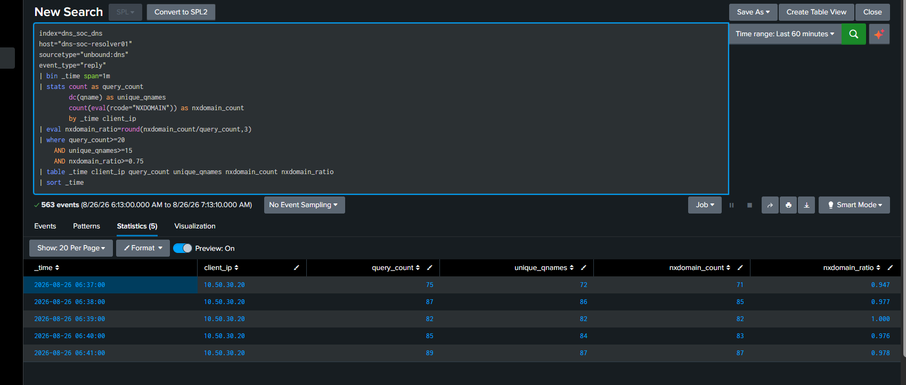

The live cluster contained five consecutive matches:

| UTC minute | Replies | Unique qnames | NXDOMAIN | NXDOMAIN ratio |
|---|---:|---:|---:|---:|
| 06:37 | 75 | 72 | 71 | 0.947 |
| 06:38 | 87 | 86 | 85 | 0.977 |
| 06:39 | 82 | 82 | 82 | 1.000 |
| 06:40 | 85 | 84 | 83 | 0.976 |
| 06:41 | 89 | 87 | 87 | 0.978 |

That established persistence across five minutes, but it still did not explain cause or intent.

---

## 2. Move from the alert back to raw resolver evidence

Sonia narrowed the search to the exact detection window and opened the underlying Unbound replies.

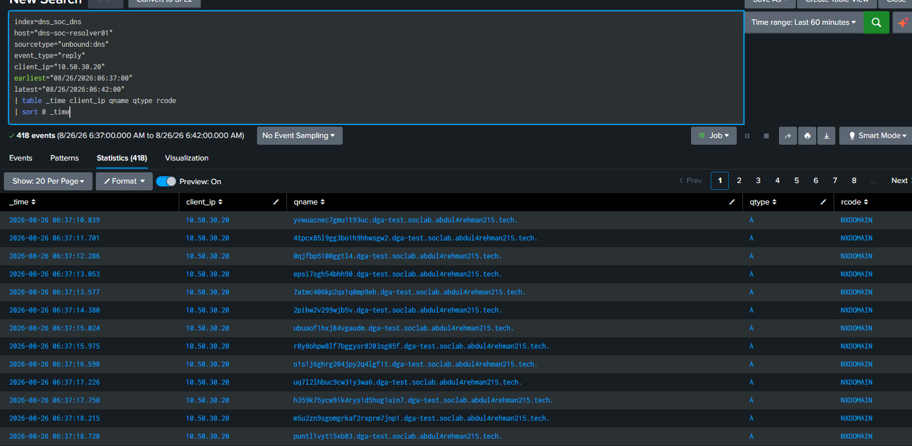

Across `06:37–06:41 UTC`, the resolver evidence showed:

```text
418 DNS replies
409 unique qnames
408 NXDOMAIN
97.61% NXDOMAIN
resolver-visible client: 10.50.30.20
```

The visible qnames contained long, rapidly changing alphanumeric first labels beneath the same controlled parent namespace.

This is the point where the investigation could responsibly say **generated-looking / DGA-like DNS behavior**. It still could not say which process generated it or whether the activity was authorized.

---

## 3. Measure the names instead of judging them by appearance

The qname search calculated first-label length, uniqueness, query types, and NXDOMAIN behavior per minute.

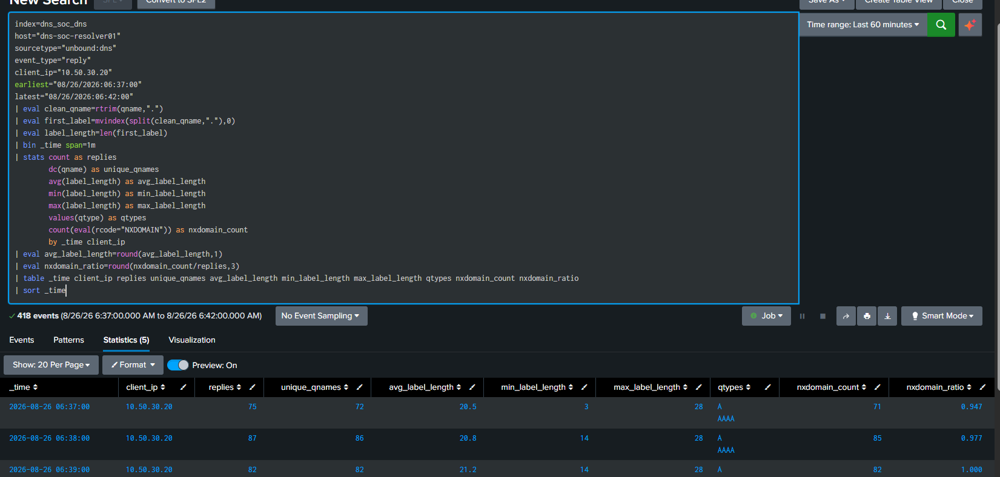

The pattern was measurable:

- almost one unique qname per reply in the live windows;
- average first-label lengths around the low twenties in visible live rows;
- generated-looking labels reaching the high twenties;
- A/AAAA query activity;
- NXDOMAIN ratios from roughly `0.947` to `1.000`.

One useful nuance was preserved: some minutes also contained ordinary background DNS. The investigation did not pretend every resolver event was part of the generated-name pattern.

---

## 4. Ask the most important SOC question: is this normal for this client?

A high number has little meaning without context. Sonia therefore compared the official windows with the same client's historical behavior.

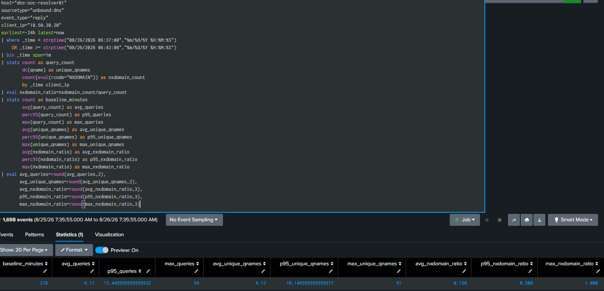

The baseline was dramatically lower:

| Metric | Historical baseline | Latest live cluster |
|---|---:|---:|
| Average queries/min | `6.11` | `75–89` |
| p95 queries/min | `~15.45` | `75–89` |
| Average unique qnames/min | `4.12` | `72–87` |
| p95 unique qnames/min | `~10.15` | `72–87` |
| Average NXDOMAIN ratio | `0.158` | `0.947–1.000` |
| p95 NXDOMAIN ratio | `0.508` | `0.947–1.000` |

That changed the question from “is the alert high?” to “how far does the observed behavior depart from normal?”

---

## 5. Scope recurrence, not just the latest burst

Sonia widened the frozen Detection v1.0 search across the previous 24 hours.

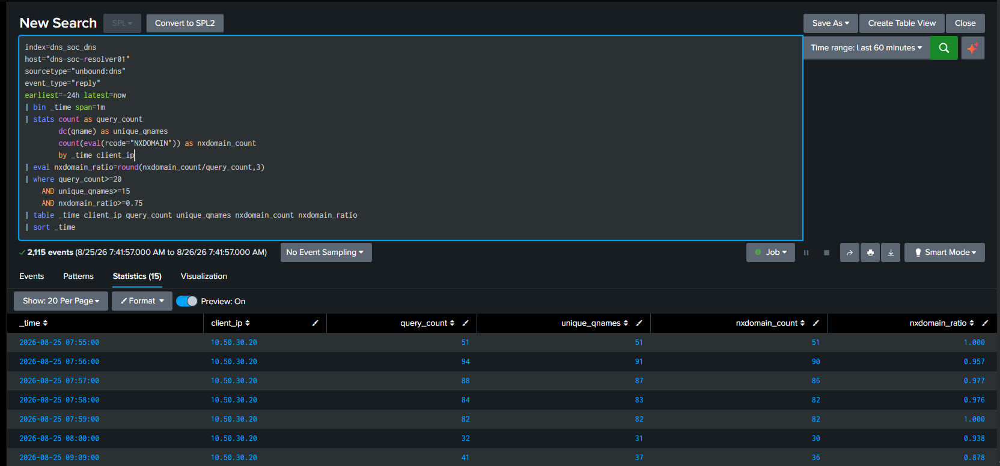

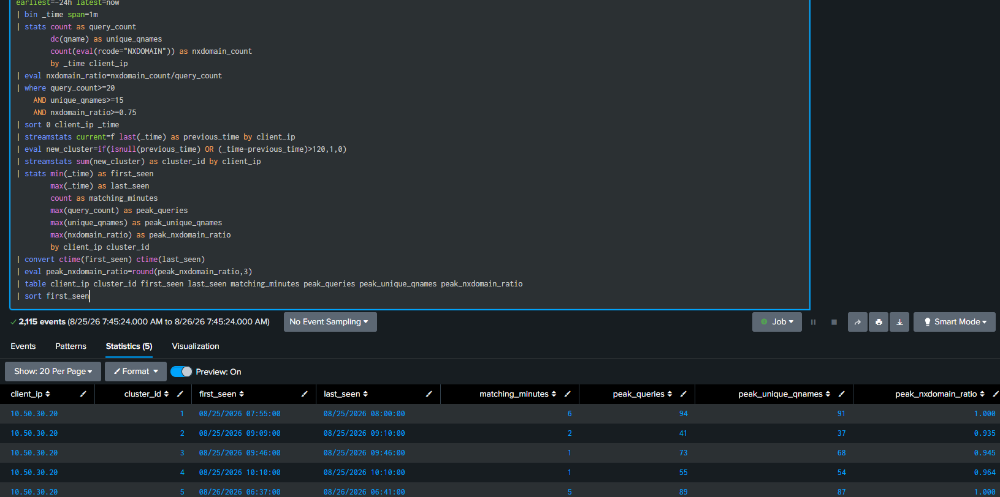

Similar matching behavior appeared in several separate historical clusters. The latest five-minute burst was therefore not a one-off anomaly in the available DNS history.

This finding increased defensive concern while still leaving authorization and process attribution unresolved.

---

## 6. Use ML as a second opinion

Only after understanding the raw behavior did Sonia inspect the Isolation Forest result.

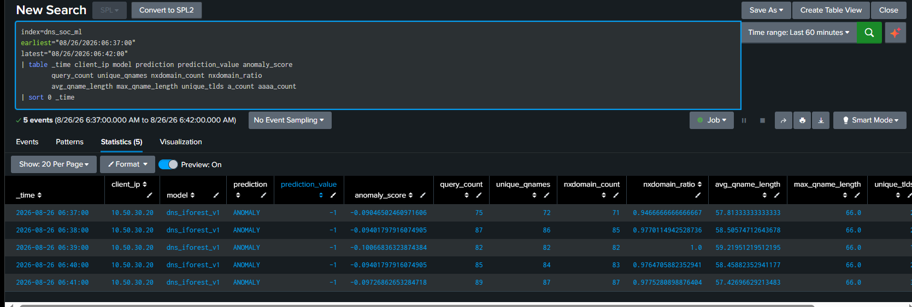

All five corresponding live windows were marked:

```text
ANOMALY
```

That reinforced the baseline comparison, but it did not become the verdict. The model had already shown that unusual benign bursts can also be anomalous.

> **ML answered:** “Does this look different from the normal windows used to train me?”  
> **Sonia still had to answer:** “What does the evidence prove?”

---

## 7. Review AI after the evidence, not before it

The Scenario 02 AI output summarized the defender evidence as possible DGA/high-NXDOMAIN behavior.

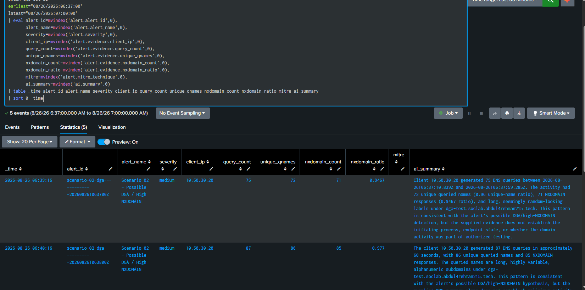

Sonia then compared the AI statements with the raw facts.

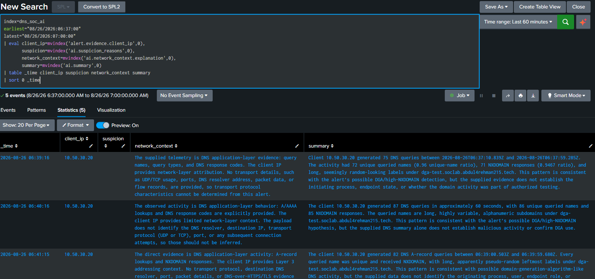

The useful pattern was:

```text
AI statement
→ find the raw evidence
→ supported / incomplete / unsupported
→ human conclusion
```

The AI description of unusual generated-domain behavior was supported by the DNS metrics. Claims that would require process, malware, or endpoint evidence were not upgraded into facts.

---

## 8. Check what actually resolved successfully

The non-NXDOMAIN review separated normal successful resolutions from the generated-looking namespace.

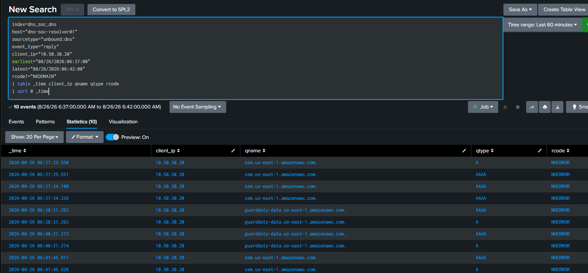

The successful replies in the exact window were normal-looking AWS service names. Sonia did not observe a generated-looking Scenario 02 qname successfully resolving in that five-minute cluster.

This narrowed the DNS story without claiming that the endpoint was clean or uncompromised.

---

## 9. Bring the case into one analyst surface

The final Dashboard Studio view brought the exact client/window into one investigation surface.

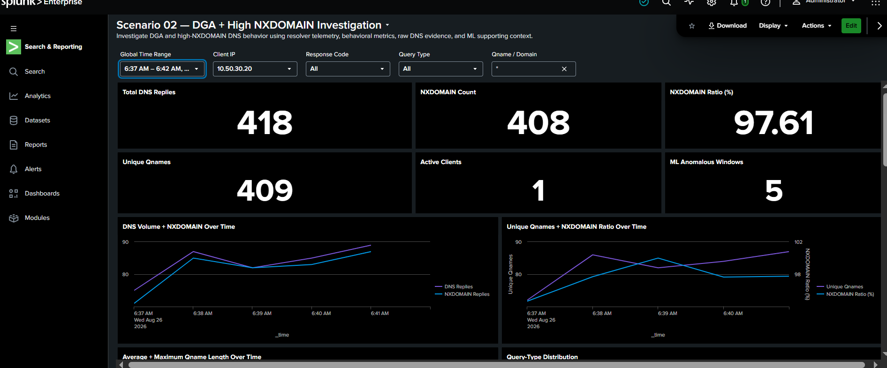

The dashboard supported pivots between:

- Detection v1.0 windows;
- query and NXDOMAIN volume;
- qname diversity;
- client behavior;
- raw resolver events;
- rule/ML context.

The dashboard was an investigation aid, not a replacement for the raw-event checks already completed.

---

## 10. Lock the resolver-visible scope

The final scope check kept the attribution language precise.

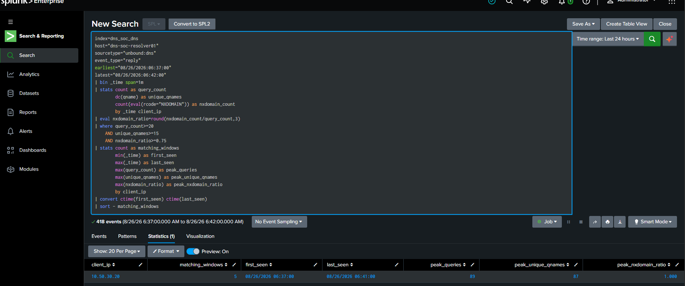

Within the latest cluster, the DGA-like/high-NXDOMAIN behavior was associated with resolver-visible client:

```text
10.50.30.20
```

That identifies the client seen by the resolver. It does **not** identify a process, malware family, user, or intent.

---

## 11. 5W1H — the case in one view

| Question | Evidence-backed answer |
|---|---|
| **Who** | Resolver-visible client `10.50.30.20` |
| **What** | Recurrent, high-volume, high-uniqueness, high-NXDOMAIN DNS behavior with changing generated-looking labels |
| **When** | Latest cluster `2026-08-26 06:37–06:41 UTC`, with similar earlier clusters in the prior 24 hours |
| **Where** | `dns-soc-victim01` → `dns-soc-resolver01` → `dns_soc_dns`, with ML/AI support in Splunk |
| **Why suspicious** | Live windows were far above the same-client baseline and matched the frozen DGA/high-NXDOMAIN detection repeatedly |
| **How observed** | Repeated DNS requests for many changing qnames through the victim's configured resolver |

What remained unknown:

```text
initiating process
malware identity
endpoint compromise
user identity
malicious intent
authorization/business explanation
```

---

## 12. Disposition and handoff

The final SOC conclusion was:

> ## **INCONCLUSIVE — escalation warranted**

This was not indecision. It was a deliberate separation between what the DNS evidence proved strongly and what the available telemetry could not prove.

Sonia's handoff asked IR to independently reproduce the evidence, examine any available endpoint/business context, preserve the unknowns, and decide whether the prepared RPZ/sinkhole control was proportionate.

See [`SOC-TO-IR-HANDOFF.md`](SOC-TO-IR-HANDOFF.md).

---

## Investigation reflection

The strongest part of this case was not the size of the NXDOMAIN ratio. It was the discipline of moving from **alert → raw evidence → baseline → scope → automation review → human judgement**.

Sonia avoided three common shortcuts:

- **alert = malware**;
- **ML anomaly = malicious verdict**;
- **AI summary = evidence**.

Instead, the investigation ended with a conclusion narrow enough to be defensible and strong enough to justify IR review.

---

## Evidence and reproducibility

- [Curated SOC evidence](evidence/)
- [Complete SOC SPL](spl/)
- [SPL query index](SPL-QUERY-INDEX.md)
- [5W1H](5W1H.md)
- [AI / ML validation](AI-ML-VALIDATION.md)
- [Investigation timeline](INVESTIGATION-TIMELINE.md)
- [Troubleshooting notes](TROUBLESHOOTING-NOTES.md)

---

<div align="center">

[🏠 Scenario Home](../README.md) · [📁 SOC](README.md) · [⬆ Back to top](#top)

</div>
