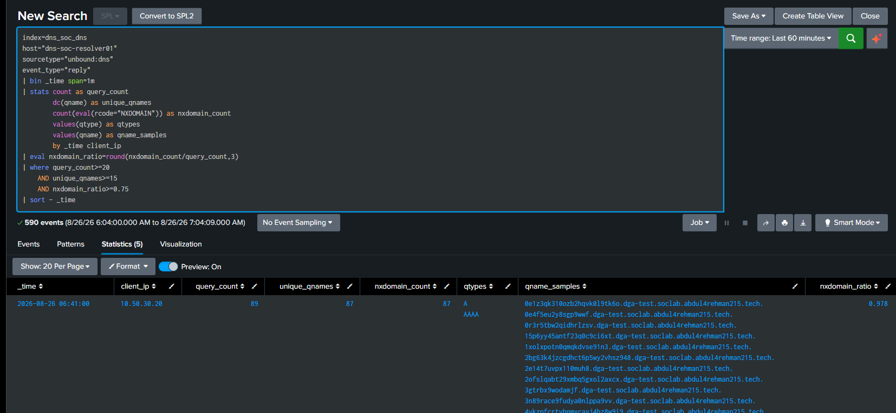

[🏠 Scenario Home](../../README.md) · [🔎 SOC Workspace](../README.md) · [📖 Investigation](../SOC-ANALYST-INVESTIGATION.md) · [🧾 Master Evidence](../../evidence/README.md)

# 🧾 Scenario 02 SOC — Curated Evidence

These images are the public evidence set for Sonia's completed SOC investigation. The full troubleshooting/progress screenshot archive remains outside the flagship story; only screenshots that answer an investigation question are promoted here.

## 🖼️ Evidence Highlights

<table>
<tr>
<td width="33%"> <b>E01:</b> first live Detection v1.0 hit.</td>
<td width="33%"> <b>E03:</b> raw resolver evidence.</td>
<td width="33%"> <b>E05:</b> same-client historical baseline.</td>
</tr>
<tr>
<td width="33%"> <b>E08:</b> ML second opinion.</td>
<td width="33%"> <b>E10:</b> AI claims checked by a human analyst.</td>
<td width="33%"> <b>E13:</b> final resolver-visible scope.</td>
</tr>
</table>

## 📋 Full Evidence Set

| Evidence | Purpose |
|---|---|
| `S02-SOC-E01_Detection-v1-Hit.png` | first live Detection v1.0 hit |
| `S02-SOC-E02_Detection-Windows.png` | five consecutive frozen-detection windows |
| `S02-SOC-E03_Raw-Unbound-Replies.png` | raw resolver evidence for the exact cluster |
| `S02-SOC-E04_Qname-Pattern-Metrics.png` | qname uniqueness/label/NXDOMAIN measurements |
| `S02-SOC-E05_Client-Historical-Baseline.png` | same-client historical baseline |
| `S02-SOC-E06_All-Detection-Windows-24h.png` | wider frozen-rule recurrence |
| `S02-SOC-E07_Detection-Activity-Clusters.png` | separate historical activity clusters |
| `S02-SOC-E08_ML-Anomaly-Assessment.png` | Isolation Forest second opinion |
| `S02-SOC-E09_AI-Summary-Review.png` | AI summary after raw-evidence investigation |
| `S02-SOC-E10_AI-vs-Human-Validation.png` | AI claims checked against human evidence |
| `S02-SOC-E11_Non-NXDOMAIN-Replies.png` | successful DNS response review |
| `S02-SOC-E12_Scenario02-Dashboard.png` | exact-window analyst dashboard |
| `S02-SOC-E13_Final-Client-Scope.png` | final resolver-visible scope |

> [!IMPORTANT]
> Evidence captions state exactly what each image proves and avoid upgrading DNS observations into process or malware attribution.

[🔎 SOC Workspace](../README.md) · [📖 Investigation](../SOC-ANALYST-INVESTIGATION.md) · [⬆ Back to top](#top)

