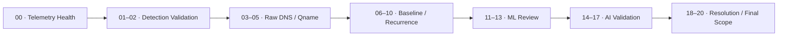

[🏠 Scenario Home](../../README.md) · [🔎 SOC Workspace](../README.md) · [📖 Investigation](../SOC-ANALYST-INVESTIGATION.md) · [🧾 Evidence](../evidence/README.md)

# 🔎 SOC SPL Investigation Map

This folder preserves the exact searches Sonia used during the completed investigation. The files are ordered by investigation purpose rather than presented as a flat query dump.

## 🧭 Query Flow

## 📋 Query Index

| Stage | Files | Purpose |
|---|---|---|
| 🩺 Telemetry health | [`00_preflight_live_dns_15m.spl`](00_preflight_live_dns_15m.spl) | Confirm current resolver visibility before case work |
| 🚨 Frozen detection | [`01_detection_v1_live.spl`](01_detection_v1_live.spl), [`02_detection_windows_clean.spl`](02_detection_windows_clean.spl) | Confirm the production detection and clean matching windows |
| 📡 Raw DNS | [`03_raw_unbound_broad_client.spl`](03_raw_unbound_broad_client.spl) → [`05_qname_pattern_metrics.spl`](05_qname_pattern_metrics.spl) | Recover resolver evidence and measure qname behavior |
| 📊 Baseline / recurrence | [`06_baseline_original_failed_test.spl`](06_baseline_original_failed_test.spl) → [`10_detection_activity_clusters.spl`](10_detection_activity_clusters.spl) | Compare the client to historical behavior and separate activity clusters |
| 🧠 ML | [`11_ml_raw_event_format.spl`](11_ml_raw_event_format.spl) → [`13_ml_clean_final.spl`](13_ml_clean_final.spl) | Inspect and clean Isolation Forest result context |
| 🤖 AI | [`14_ai_raw_event_format.spl`](14_ai_raw_event_format.spl) → [`17_ai_vs_human_validation.spl`](17_ai_vs_human_validation.spl) | Inspect AI output and validate claims against evidence |
| 🎯 Resolution / scope | [`18_non_nxdomain_replies.spl`](18_non_nxdomain_replies.spl) → [`20_final_client_scope.spl`](20_final_client_scope.spl) | Review successful DNS and lock final resolver-visible scope |
| 📦 Complete bundle | [`ALL_SOC_ANALYST_QUERIES.spl`](ALL_SOC_ANALYST_QUERIES.spl) | Combined query set for reproducibility |

> [!NOTE]
> [`06_baseline_original_failed_test.spl`](06_baseline_original_failed_test.spl) is intentionally retained as troubleshooting history; the corrected baseline path follows it.

[🔎 SOC Workspace](../README.md) · [📄 SPL Query Index](../SPL-QUERY-INDEX.md) · [⬆ Back to top](#top)

